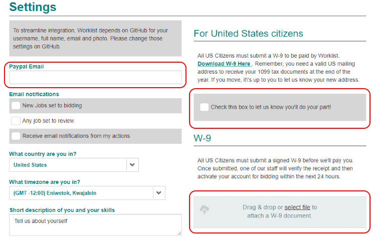
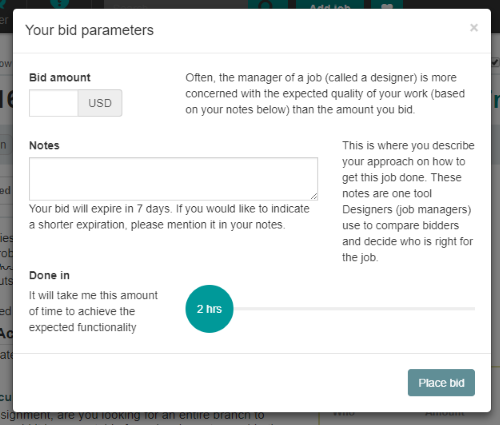
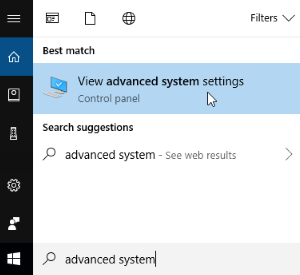
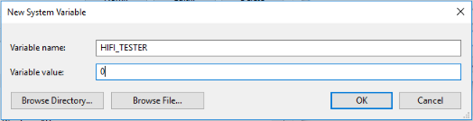

# Work for Us

High Fidelity is completely open source, so if you want to contribute to our current code, you can do so. We also pay contributors for the work they do through Worklist, our tool for tracking your contributions.

**On This Page**

* [Worklist: How It Works](#worklist-how-it-works)
* [GitHub Repository](#github-repository) 
* [Contributor License Agreement (CLA)](#contributor-license-agreement-cla)
* [Environment Variables](#environment-variables)

## Worklist: How It Works

Before you start using Worklist, ensure that you’ve [downloaded and installed High Fidelity](https://highfidelity.com/download/sandbox) or [built it through GitHub](../build-guide).

Worklist displays all available part-time jobs and projects at High Fidelity. If you’re interested in any of the projects listed here, you can bid on it by setting the amount you'd like to get paid. If we accept your bid, then you can begin development and get paid for the work you do. For more information, see our [Worklist FAQs](https://worklist.net/help).

The process for a Workflow project goes like this:
1. Open [Worklist](https://worklist.net) and log in using your GitHub credentials. You will need to confirm your email address.
2. To get paid, you need to verify your PayPal address and upload a completed W-9 form (US citizens only). Click on your username in the top-right corner and go to Settings. 
3. Click on 'Jobs' in the toolbar to view all of the available jobs. Available jobs are listed in the **Bidding** category. 
4. Click on the project you'd like to work on. 
5. In the page that opens, click 'Bid'. Enter the amount you'd like to get paid, any notes to justify your bid, and the amount of time you expect to work on the project. Click 'Place Bid'. 
6. Once your bid has been accepted, change the status of your project to 'In Progress'. 
7. Once you’ve completed the work, change the status to 'QA Ready'. At this point, we will check your code and test your solution to ensure that it works correctly. 
8. When you have a PR ready, change the status to 'Needs Review'. Mention your PR in a comment so that we can verify and pay you once we merge your work to the repository.

When we have verified your work and merged it into the main repository, we will change the status of your project to 'Merged' and process your payment. 

## GitHub Repository

High Fidelity's code repository is available on [GitHub](https://github.com/highfidelity/hifi). This repository contains the source to many of the components in our virtual world platform. The project embraces distributed development.

Interface and the servers are implemented as programs written in C++. When you execute a JavaScript program, your API calls are mapped to the objects in C++. The interface between C++ and JavaScript is provided by a cross-platform, open-source runtime environment called Qt.

## Contributor License Agreement (CLA)

Technology companies frequently receive and use code from contributors outside the company's development team. Outside code can be a tremendous resource, but it also carries responsibility. Best practice for accepting outside contributions consists of an Apache-type Contributor License Agreement (CLA). We have modeled the High Fidelity CLA after the CLA that Google presents to developers for contributions to their projects. This CLA does not transfer ownership of code, instead simply granting a non-exclusive right for High Fidelity to use the code you’ve contributed. In that regard, you should be sure you have permission if the work relates to or uses the resources of a company that you work for. You will be asked to sign our CLA when you create your first PR or when the CLA is updated. You can also [review it here](https://gist.githubusercontent.com/hifi-gustavo/fef8f06a8233d42a0040d45c3efb97a9/raw/9981827eb94f0b18666083670b6f6a02929fb402/High%2520Fidelity%2520CLA). We sincerely appreciate your contribution and efforts toward the success of the platform.

## Environment Variables
In order to work with us, we require that you set the `HIFI_TESTER` environment variable on your computer. This method will persist even if you continue to reinstall High Fidelity, delete your app data or change your IP address. It won't affect your local machine in any way.

1. Search for 'Advanced System Settings' and open the menu. 
2. Click the 'Environment Variables' button. 
3. Click 'New' under 'System Variables'.
4. Enter `HIFI_TESTER` as the 'Variable' name and set the 'Variable' value to `0`. Click 'OK'. 
5. Restart your computer for the changes to take effect.

**See Also**

+ [Install Your Sandbox](../../host/your-domain/install-domain#install-your-sandbox)