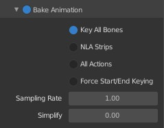
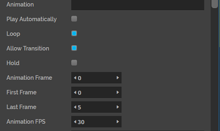

######################
Import Animations
######################

Enrich your Vircadia experience by having 3D models in your domain with animations. For example, you can import the 3D model of a flag that appears to flutter with the wind using this feature.

.. contents:: On This Page
    :depth: 2

---------------------
Prerequisites
---------------------

You need to be familiar with creating animations in 3D modeling tools such as Blender and Maya before importing an animation into Vircadia.

---------------------------------
Prepare a 3D Model Animation
---------------------------------

Before you import an animation into Vircadia, adjust some settings in the 3D modeling tool of your choice to ensure that it plays smoothly.

1. We recommend setting the framerate to 30 fps as a good compromise between smoothness and file size.
2. Bake your animation channels, key frames, and in-betweens to ensure that Vircadia reads everything. This is to ensure that your animation doesn't stop and start, but appears smooth and flows through each movement.
3. Prepare to export the skeleton and frames that are being used in the animation.
4. Disable any kind of keyframe reduction. In Blender, set the "simplify" setting to 0.00 when exporting an FBX file since this will cause the animation to not play properly.

5. Export your animation as an FBX file. (Reading animations from other formats like glTF is currently not supported.)
6. Upload this FBX file to a cloud server and copy the URL.

------------------------
Import an Animation
------------------------

Once you complete uploading your animation's FBX file, you can import the 3D model and it's animation into Vircadia.

1. In Interface, pull up your HUD or Tablet and go to **Create**.
2. Click on the 'MODEL' icon and enter your 3D model's URL. If you have saved your 3D model's FBX file with the animation, the model's URL and the animation's URL will be the same. Otherwise, your animation is saved as a separate FBX file.
3. In the 'Properties' tab, scroll down to 'Animation' and paste the animation's URL.

4. You can edit the following animation properties:

    +--------------------+------------------------------------------------------------------------------+
    | Property           | Description                                                                  |
    +====================+==============================================================================+
    | Play Automatically | Enable this to play your animation automatically when a user loads a domain. |
    +--------------------+------------------------------------------------------------------------------+
    | Loop               | Select this property to play your animation in a continuous loop.            |
    +--------------------+------------------------------------------------------------------------------+
    | Allow Transition   | Enable this to let the animation move through space. This means that the     |
    |                    | joints will not only rotate, but translate through three dimensions.         |
    +--------------------+------------------------------------------------------------------------------+
    | Hold               | Select to pause your animation at a particular frame.                        |
    +--------------------+------------------------------------------------------------------------------+
    | Animation Frame    | Enter the frame at which you want to pause or hold your animation.           |
    +--------------------+------------------------------------------------------------------------------+
    | First Frame        | This is the first frame from when your want your animation to start.         |
    +--------------------+------------------------------------------------------------------------------+
    | Last Frame         | This is the last frame where you want your animation to stop. It will not    |
    |                    | play beyond this specified frame.                                            |
    +--------------------+------------------------------------------------------------------------------+
    | Animation FPS      | This is the animation's framerate.                                           |
    +--------------------+------------------------------------------------------------------------------+

5. You can also control an animation's properties and when it starts playing with an :doc:`entity script <../../script/client-entity-scripts>`.

**See Also**

+ :doc:`Import Your 3D Model <import-model>`
