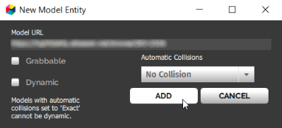

########################
Import a 3D Model
########################

You can import a 3D model into Vircadia that is hosted online or on your domain's Asset Server. Importing your model brings it into your domain and adds it to your virtual world.

.. contents:: On This Page
    :depth: 2

--------------------------------
Import Models from the Cloud
--------------------------------

If you want your model available to users in other domains, we recommend uploading it to a cloud hosting service of your choice.

1. Locate and copy the URL of the model you would like to import. The model should be an FBX, glTF, or OBJ file.
2. In Interface, pull up your HUD or Tablet and go to **Create**.
3. Select the 'Model' icon.
4. Paste the model's URL and click 'Add'.

-------------------------------------
Import Models from the Asset Server
-------------------------------------

The Asset Server hosts files or assets that can either be added as-is to a domain or that are referenced by existing entities and scripts already in a domain.
To import assets from the Asset Server, you must have permissions to "rez" entities in the domain that the Asset Server is running on.

1. In Interface, pull up your HUD or Tablet and go to **Create**.
2. Click 'Open this Domain's Asset Server'.
3. In the Asset Browser, browse to the model you would like to import.
4. Click 'Add to World'. Then click 'Add' on the confirmation window that opens.

**See Also**

+ :doc:`Create Tools <../tools>`
+ :doc:`Create New Entities <../entities/create-entities>`
