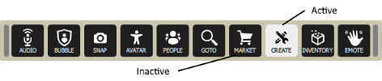
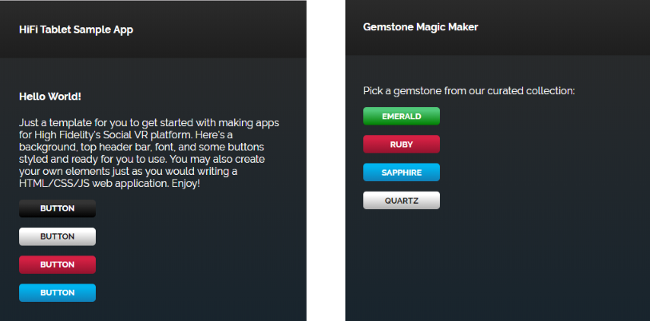

# Tablet Apps

Tablet apps (or simply "apps") in High Fidelity are customizable programs that expose functionality in an easy-to-use user interface. Apps let you take complex code from our [JavaScript API](https://apidocs.highfidelity.com) and simplify it into a window with controls for others to use. 

<div class="admonition note">
    <p class="admonition-title">Note</p>
    <p>To create custom apps, you must have a basic knowledge of web development (HTML, CSS and JavaScript) and be able to navigate our API. </p>
</div>

The steps involved in creating a tablet app are:

1. [Create icons to show up on the tablet and HUD](#1-create-icons-to-show-up-on-the-tablet-and-hud)
2. [Design your app's UI in HTML and CSS](#2-design-your-apps-ui-in-html-and-css)
3. [Add event handlers to your HTML file](#3-add-event-handlers-to-your-html-file)
4. [Write a JavaScript file that:](#3-write-a-javascript-file)
	* Adds a button to the tablet and HUD
	* Loads your app
	* Closes your app
	* Listens for events
	* Runs your code (in this case, [create some gemstones](#5-create-gemstones))

## Tutorial: Create Gemstone Switching Tablet App
In this tutorial, we will walk through the above steps to create an app called "Gemstone Magic Maker". This simple app lets you spawn colorful little gemstones in VR that you can share with your friends.  

### 1. Create icons to show up on the tablet and HUD
You need two icons to show up on the tablet and HUD: an SVG or PNG image to display on the app button when the app is active, usually named `<appName>-a.svg` and another to display when the app is inactive, usually named `<appName>-i.svg`.


We recommend the following specs for your icons:
* Size: 50px by 50px
* Color: White on a transparent background (for inactive icons) and black on a transparent background (for active icons)
* File format: SVG or PNG 

You can create your own icon using graphic design software or any other online resources. 

### 2. Design your app's UI in HTML and CSS
Your app's UI should provide text on how the app works and use familiar UI elements that a user knows how to interact with (such as buttons, scroll bars, and links). Keep in mind that the tablet screen dimensions are 480 x 720, so all of your UI should be confined to this space. 

To help you get started, we've put together a [quick start HTML template](https://hifi-content.s3.amazonaws.com/faye/tablet-sample-app/quick_start_template.html) that you can reuse. It contains the same layout, styling and font as the main menu screen, and has a header bar for your app title. With just a few simple modifications, you can create have a simple app UI within minutes. 


### 3. Add event handlers to your HTML file
The Tablet UI framework provides a communication channel called EventBridge. It allows you to send and receive events between the client script (gemstoneApp.js) and JavaScript in your web app (gemstoneMagicMaker.html). Use the EventBridge in the body of your HTML file to handle the button clicks:

```
<script>
	function main() {
		// Send an event to gemstoneApp.js when the page loads 
		// and is ready to get things rolling
		console.log("document ready");
		var readyEvent = {
			"type": "ready",
		};
		
		// The event bridge handles events represented as a string the best. 
		// So we first create a JavaScript object, then convert to string
		EventBridge.emitWebEvent(JSON.stringify(readyEvent));
		
		// Send an event when user click on each of the gemstone buttons
		$(".gemstone-button").click(function(){
			console.log(this.value + " button click");
			var clickEvent = {
				"type": "click",
				"data": this.value
			};
			EventBridge.emitWebEvent(JSON.stringify(clickEvent));
		});
	}
	$(document).ready(main);
</script>
```

### 4. Write a JavaScript file

Your JavaScript file will contain all of the core functionality of your app. At a minimum, we require that you have code that adds a button to the tablet and HUD, loads your app, closes your app gracefully, and listens for events. Below, you will find code samples to do each of these things. 

**Add buttons to the tablet and HUD**  

Use the AppUI module to automatically add your app’s button to the tablet and HUD, and to wire button click handlers: 

```
(function () { // BEGIN LOCAL_SCOPE
var AppUi = Script.require('appUi');

var ui;
function startup() {
    ui = new AppUi({
        buttonName: "APP-NAME", // The name of your app
		home: Script.resolvePath("app.html"), // The path to your app's UI
		graphicsDirectory: Script.resolvePath("./") // The path to your button icons
    });
}
startup();
}()); // END LOCAL_SCOPE
```

**Determine the app's startup behavior**   

If you want your app to do something specific when it is opened, use the AppUI module's `onOpened` functionality. For example, you could:
* Query a server to get a response and determine what to show on the UI
* Start displaying a 3D interface separate from the tablet 
* Determine the display mode (VR/Desktop) and change things to show on the UI

```
(function () { // BEGIN LOCAL_SCOPE
var AppUi = Script.require('appUi');

function onOpened() {
    console.log(“hello world!”);
}

var ui;
function startup() {
    ui = new AppUi({
        buttonName: "APP-NAME", // The name of your app
        home: Script.resolvePath("app.html"), // The home screen of your app that appears when clicking the app button
        graphicsDirectory: Script.resolvePath("./"), // Where your button icons are located
        onOpened: onOpened // See the simple function above
    });
}
startup();
}()); // END LOCAL_SCOPE
```

**Close the app gracefully**  

The AppUI module ensures that your app closes gracefully. However, if you want to do something else when you close the app, you can with the `onClosed` functionality built into the AppUI module. For example, you could:

* Remove 3D interfaces
* Stop secondary scripts

```
(function () { // BEGIN LOCAL_SCOPE
var AppUi = Script.require('appUi');

function onOpened() {
    console.log(“hello world!”);
}

function onClosed() {
    console.log(“hello world!”);
}

var ui;
function startup() {
    ui = new AppUi({
        buttonName: "APP-NAME", // The name of your app
        home: Script.resolvePath("app.html"), // The home screen of your app that appears when clicking the app button
        graphicsDirectory: Script.resolvePath("./"), // Where your button icons are located
        onOpened: onOpened // See the simple function above
		onClosed: onClosed // See the simple function above
    });
}
startup();
}()); // END LOCAL_SCOPE
```

**Listen for events**  

In step 3 above, we [added event handlers](#3-add-event-handlers-to-your-files) to your HTML file. Now, you need to add code to your JavaScript file to listen for the events:

```
function onWebEventReceived(event) {
   print("gemstoneApp.js received a web event: " + event);
}
tablet.webEventReceived.connect(onWebEventReceived);
```

### 5. Create gemstones
The final step is to code the behavior of your JavaScript file. In this case, we'll create gemstones using High Fidelity's API. Each gemstone will be created as an entity, and we can change the gemstone's properties using the `Entity` namespace. 

**Calculate the position of each new gemstone**  

The following code gives us a position right in front of the user:

```
// Helper function that gives us a position right in front of the user
function getPositionToCreateEntity() {
  var direction = Quat.getFront(MyAvatar.orientation);
  var distance = 0.3;
  var position = Vec3.sum(MyAvatar.position, Vec3.multiply(direction, distance));
  position.y += 0.5;
  return position;
}
```

**Set the gemstone's properties and add it**  

The gemstone will be created when gemstoneApp.js receives click events from each of the buttons. 

```
// Handle the events we're recieving from the web UI
function onWebEventReceived(event) {
    print("gemstoneApp.js received a web event:" + event);

    // Converts the event to a JavasScript Object
    if (typeof event === "string") {
        event = JSON.parse(event);
    }

    if (event.type === "click") {
        // Define the entity properties of for each of the gemstone, then add it to the scene
        var properties = {
            "type": "Shape",
            "position": getPositionToCreateEntity(),
            "userData": "{\"grabbableKey\":{\"grabbable\":true}}"
        };
        if (event.data  === "Emerald") {
            properties.name = "Emerald";
            properties.shape = "Dodecahedron";
            properties.color = {
                "blue": 122,
                "green": 179,
                "red": 16
            };
            properties.dimensions = {
                "x": 0.20000000298023224,
                "y": 0.26258927583694458,
                "z": 0.20000000298023224
            };
            Entities.addEntity(properties);
        } else if (event.data  === "Ruby") {
            properties.name = "Ruby";
            properties.shape = "Octagon";
            properties.color = {
                "blue": 160,
                "green": 52,
                "red": 237
            };
            properties.dimensions = {
                "x": 0.20000000298023224,
                "y": 0.24431547522544861,
                "z": 0.12547987699508667
            };
            Entities.addEntity(properties);
        } else if (event.data  === "Sapphire") {
            properties.name = "Sapphire";
            properties.shape = "Icosahedron";
            properties.color = {
                "blue": 255,
                "green": 115,
                "red": 102
            };
            properties.dimensions = {
                "x": 0.160745769739151,
                "y": 0.20000000298023224,
                "z": 0.23340839147567749
            };
            Entities.addEntity(properties);
        } else if (event.data  === "Quartz") {
            properties.name = "Quartz";
            properties.shape = "Octahedron";
            properties.color = {
                "blue": 245,
                "green": 142,
                "red": 216
            };
            properties.dimensions = {
                "x": 0.20000000298023224,
                "y": 0.339866042137146,
                "z": 0.20000000298023224
            };
            Entities.addEntity(properties);
        }
    }
}
```

Congratulations, you have successfully created an app in High Fidelity! To use your app, upload it to a cloud platform, such as Amazon S3, Google Cloud Storage, Microsoft Azure, Dropbox, etc. Once hosted, you can install it and use it:

1. In Interface, go to **Edit > Running Scripts**.
2. Under Load Scripts, click 'From URL' and enter the URL to your hosted JavaScript file. 
3. Click the app icon on the tablet or HUD to open the app. 


**See Also**

+ [Write Your Own Scripts](../script/write-scripts.html)
+ [API Reference: Entities](https://apidocs.highfidelity.com/Entities.html)
+ [API Reference: Script](https://apidocs.highfidelity.com/Script.html)
+ [API Reference: Quat](https://apidocs.highfidelity.com/Quat.html)
+ [API Reference: Vec3](https://apidocs.highfidelity.com/Vec3.html)