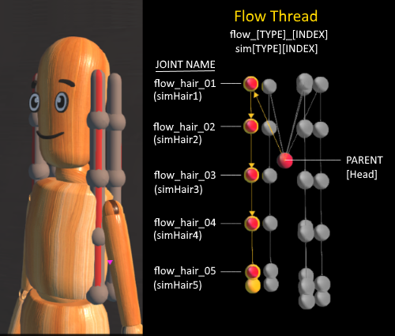
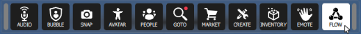
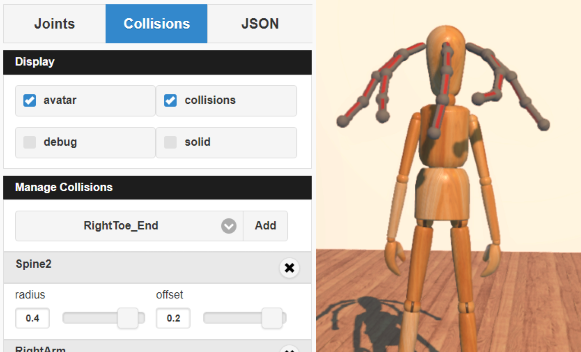

###############################
Add Flow to Your Avatar
###############################

You can simulate physics on your avatar's hair, clothes, and body parts with a little bit of scripting and the help of High Fidelity's *Flow  technology*. The concept of "Flow" simply mimics the natural movement of hair and other attachments on your avatar. You can easily change your avatar's flow settings using the `Flow App <https://highfidelity.com/marketplace/items/370b8ff7-d5ad-4410-9c5c-0ead86e69756>`_. In order to use the Flow App, your avatar must contain flow threads. 

.. contents:: On This Page
    :depth: 2

-----------------------
Prepare Your Avatar 
-----------------------

In order to use the Flow technology, your avatar must contain flow threads, which are sets of connected joints in your avatar. Each flow thread must comply with the following rules:

1. The first joint is connected to an existing avatar joint, such as "Hips".
2. Every joint in the thread should be named ``flow_[TYPE]_[INDEX]`` or  ``sim[TYPE][INDEX]``, where **TYPE** defines a group of joints that share a common physics setup and **INDEX** is an integer. For example, if the thread is used to simulate a skirt, all the "skirt" joints are named flow_skirt_01, flow_skirt_02, etc.

While experimenting, feel free to use `Mannequin with Hair <https://hifi-content.s3.amazonaws.com/jimi/avatar/Mannequin/hairTest/mannequinHairTest8.fst>`_, whose hair has flow threads already configured.

----------------------
Flow App
----------------------

Download and run the `Flow app <https://highfidelity.com/marketplace/items/370b8ff7-d5ad-4410-9c5c-0ead86e69756>`_ to configure your flow settings. 

The Flow app will show up as an icon on your HUD or tablet. Click this icon to open the Flow app.

^^^^^^^^^^^^^^^^^^^^^^^
Display Panel
^^^^^^^^^^^^^^^^^^^^^^^

The **Display** panel affects how your avatar looks while the Flow app is open. Using these options, you can choose to view meshes and collisions to help you determine what your final flow configuration will look like. 

.. image:: _images/flow-display.png

+------------+---------------------------------------------------------------+
| Option     | Description                                                   |
+============+===============================================================+
| Avatar     | Hides or displays the avatar mesh.                            |
+------------+---------------------------------------------------------------+
| Collisions | Activates or deactivates collisions.                          |
+------------+---------------------------------------------------------------+
| Debug      | Hides or displays the debug shapes.                           |
+------------+---------------------------------------------------------------+
| Solid      | Enables either a solid or wireframe display for debug shapes. |
+------------+---------------------------------------------------------------+

^^^^^^^^^^^^^^^^^^^^^^^
Joints Panel
^^^^^^^^^^^^^^^^^^^^^^^

The **Joints** panel lists all of the available flow threads, and lets you configure the behavior of your joints. 

.. image:: _images/flow-joints.png

+-----------+-----------------------------------------------------------------------------------------+
| Option    | Description                                                                             |
+===========+=========================================================================================+
| Radius    | Determines the thickness of segments and knots (needed for collision testing).          |
+-----------+-----------------------------------------------------------------------------------------+
| Gravity   | Sets the how each joint will respond to gravity. A positive value will lift your joints |
|           | in the air, while a negative value will respond to gravity and be pulled towards the    |
|           | ground. Larger values will cause the movement to happen more quickly.                   |
+-----------+-----------------------------------------------------------------------------------------+
| Stiffness | Defines how susceptible the flow threads are to movement.                               |
+-----------+-----------------------------------------------------------------------------------------+
| Damping   | Determines how easily the bones oscillate or move around the joints.                    |
+-----------+-----------------------------------------------------------------------------------------+
| Inertia   | Changes the rotational velocity of the bones.                                           |
+-----------+-----------------------------------------------------------------------------------------+
| Delta     | Controls the amount of time between each joint movement.                                |
+-----------+-----------------------------------------------------------------------------------------+

^^^^^^^^^^^^^^^^^^^^^^^^^^
Collisions Panel
^^^^^^^^^^^^^^^^^^^^^^^^^^

The **Collisions** panel controls the collision spheres that define the interactions between flow threads and the joints in your avatar. Each collision sphere is positioned using an existing avatar joint and offset: as you increase the radius of a collision sphere, you increase the distance between the flow thread and the joint. You can only have a maximum of 4 collisions defined for your avatar. 

+--------+---------------------------------------+
| Option | Description                           |
+========+=======================================+
| Radius | Controls the collision sphere radius. |
+--------+---------------------------------------+
| Offset | Controls the collision sphere offset. |
+--------+---------------------------------------+

^^^^^^^^^^^^^^^^^^^^^^^
Output Panel
^^^^^^^^^^^^^^^^^^^^^^^

The **Output** panel displays the resulting FST data for your avatar's flow configuration, based on what you entered in the `Joints Panel`_ and the `Collisions Panel`_. 

Copy this data directly into your avatar's FST file to complete the flow process. 

.. image:: _images/flow-fst.png

------------------------------
Resources
------------------------------

+---------------------+-------------------------------------------------------------+--------------------------------------------+
| File                | Description                                                 | URL                                        |
+=====================+=============================================================+============================================+
| Flow App            | This app lets users easily update Flow settings without     | `flowAppCpp.js <https://highfidelity.com   |
|                     | the need for scripting or advanced knowledge of avatars.    | /marketplace/items/370b8ff7-d5ad-4410-9c5c |
|                     |                                                             | -0ead86e69756>`_                           |
+---------------------+-------------------------------------------------------------+--------------------------------------------+
| Mannequin with Hair | This avatar is properly rigged to work with Flow. Use this  | `Mannequin with Hair <https://hifi-c       |
|                     | as an example for your own avatar models.                   | ontent.s3.amazonaws.com/jimi/avatar/       |
|                     |                                                             | Mannequin/hairTest/mannequinHairTest8.     |
|                     |                                                             | fst>`_                                     |
+---------------------+-------------------------------------------------------------+--------------------------------------------+

**See Also**

+ :doc:`Avatar Standards Guide <avatar-standards>`
+ `Package Your Avatar <create-avatars.html#package-your-avatar>`_
+ :doc:`Get Started with Scripting <../../script/get-started-with-scripting>`