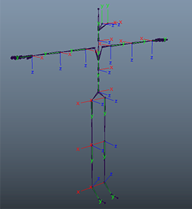
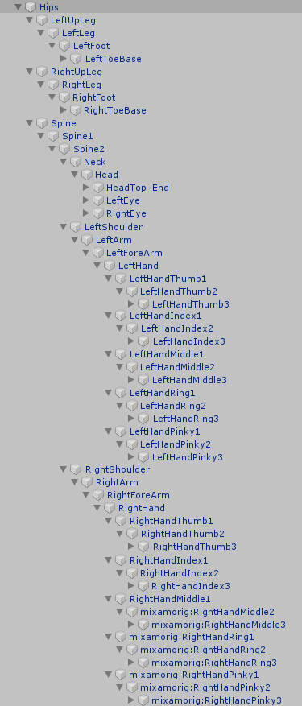
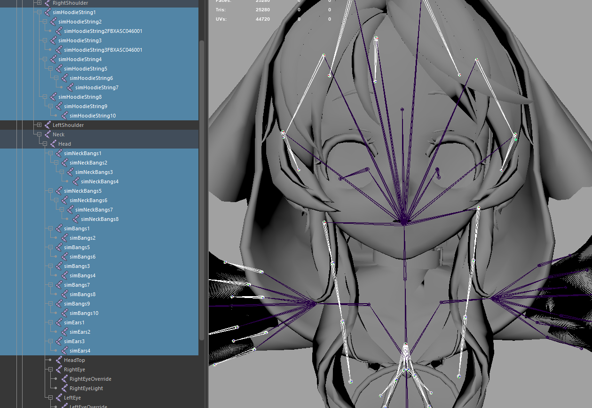

# Avatar Standards Guide

This document outlines the standards you should follow when [creating your avatar](create-avatars.html). Your avatar uses bones to animate the character's limbs and define the scale variable of limbs. You can add custom bones to further adjust the avatar's shape. Customization of your avatar can be fine-tuned using blendshapes to animate the face and scripting to define advanced behaviors.

**On This Page:**
* [Glossary](#glossary)
* [Reference Pose](#reference-pose)
* [Skeleton](#skeleton)
* [Flow Bones](#flow-bones)
* [Look-at Vectors](#look-at-vectors)
* [Blendshapes](#blendshapes)
* [Other Considerations](#other-considerations)

## Glossary
As we delve deeper into creating custom avatars, we may use terminology that you are unfamiliar with. Here are some terms you might come across:

* Avatar - A virtual representation of a person or NPC.
* Mesh - The collection of 3D vertices and triangles for the avatar model. Without this, the avatar is invisible.
* Bones - A component of a skeleton that defines a "limb" such as an arm, leg, etc. Each bone may be animated as a separate limb in your avatar.
* Skeleton - A hierarchy of joints.
* Rigging - The process of creating a skeleton of the avatar model.
* Blendshapes - Variations of the topology that defines how the mesh is modified to create various "shapes".
* FST file - The main avatar file, which contains information about the skeleton, blendshapes, FBX file and textures used by an avatar.

## Reference Pose
For the Reference pose, use a T-Pose which complies with the specifications below. You may wish to refer to the properly configured example avatar fbx with source files.
- The character must face along the positive direction of the Z-axis.
- The arms must be spread along the X-axis. The left arm should therefore be pointing along the positive direction of the X-axis.
- The top of the character's head must be up, in the positive direction of the Y-axis.
- The character's hands are flat, palms facing the ground, with the thumbs parallel to the X axis.
- The character's feet need to be perpendicular to the legs (with the toes pointing along the Z-axis as shown). The feet must not be rotated around the Y-axis (meaning the toes of the left foot should not point inward toward the right leg or outward away from the right leg).

You can download the standard High Fidelity skeleton [here](http://hifi-content.s3.amazonaws.com/Examples%20Content/skeleton/standard_hifi_skeleton.fbx). This skeleton conforms to the specifications above.

## Skeleton
The standard humanoid skeleton of your avatar should follow [HumanIK Skeleton](http://download.autodesk.com/global/docs/maya2014/en_us/index.html?url=files/GUID-945BCFFE-A772-4D52-87B8-FCFC50C974FB.htm) with some modifications made for Mixamo. This skeleton system will work with the input systems already in place in High Fidelity, and will allow users to use their input devices to control their avatar's arm and finger movements (if they have any). 

High Fidelity avatars should match the following standard skeletal structure. Each of these joints can be animated.

    
Note

    
Finger #1 is not the metacarpal; instead, it is the first joint between the <a href="https://en.wikipedia.org/wiki/Finger#/media/File:Scheme_human_hand_bones-en.svg">proximal and intermediate</a>. 

### Flow Bones

The  `sim` and `flow` prefixes are reserved for flow bones, such as clothing, hair and tails. These bones should _not_ be animated by an animator. 
(Many thanks to Akazukin for the model Ouka Miko(櫻歌ミコ) used in this diagram!)

For example, consider a full cape that surrounds the avatar: 

    simBackCape1 - first bone of the cape, center back   
    simBackCape# - additional bone(s) of the cape, center back   
    simFrontCape1 - first bone of the cape, center front   
    simFrontCape# - additional bone(s) of the cape, center front   
    simLeftCape1 - first bone of the cape, left   
    simLeftCape# - additional bone(s) of the cape, left   
    simRightCape1 - first bone of the cape, right   
    simRightCape# - additional bone(s) of the cape, right   

Alternatively, you can use the `flow` prefix, separating the name and joint number with an underscore. The same cape as above would look like:

    flow_BackCape_01   
    flow_BackCape_02   
    flow_FrontCape_01   
    flow_FrontCape_#   
    flow_LeftCape_01   
    flow_LeftCape_#   
    flow_RightCape_01   
    flow_RightCape_#   

## Look-at Vectors

The look-at vectors are driven by the z-vector of the eye joints.

The +z axis of the eye joints should go through the center of the pupil, and should continue to do so as the eye joint is rotated.

The eye joints are defined in the FST.

## Blendshapes

High Fidelity uses blendshapes to animate your avatar's face. Blendshapes allow you to specify a new state for your avatar's mesh, and facial positions are animated by moving between the different states of your avatar's expressions. Blendshape behaviors are defined in your avatar's FST file, and are added to the avatar mesh using a 3D modeling tool like Blender (Shape Keys) or Maya. Adobe's Fuse program and Mixamo pipeline allow you to export blendshapes as part of your FBX, but if you are modeling an avatar from scratch, you will likely need to specify your own facial expressions.

High Fidelity avatars support a number of blendshapes for creating different facial expressions.

**Basic Blendshapes**  

- `EyeBlink_L`:  Blinking action for the left eye.
- `EyeBlink_R`: Blicking action for the right eye.
- `JawOpen`: Opening of the jaw.

**Audio Blendshapes** 
 
These blendshapes are used when you speak. 

Your eyebrows are blendshapes that react to a change in volume. They will move upwards when your voice gets louder. These include:

- `BrowsU_C`: Center of the brow going up
- `BrowsU_L`: Outside corner of the left brow going up
- `BrowsU_R`: Outside corner of the right brow going up

Other audio blendshapes are randomly mixed when you speak. These include:

- `MouthSmile_L`: Left side of the mouth lifting up to a smile
- `MouthSmile_R`: Right side of the mouth lifting up to a smile
- `LipsFunnel`: Funneling of the lips, as when you say "Oh!"
- `LipsUpperClose`:  Upper lips rolled inwards

**Eyelid Offset**

To ensure that the top of the eyelid rests on the iris, blendshapes are used to track the current position of the eye along with your head orientation.  

- `EyeBlink_L`: Blinking action for the left eye
- `EyeBlink_R`: Blicking action for the right eye
- `EyeOpen_L`: Opening of left eye
- `EyeOpen_R`: Opening of right eye
- `BrowsD_L`: Outside corner of the left brow moving down
- `BrowsD_R`: Outside corner of the right brow moving down

We apply a small procedural offset to the blendshape coefficients to prevent sleepy or crazy eye lids:

- If you are looking straight ahead: The `EyeBlink` and `EyeOpen` coefficients will be `0`.
- If your eyes begin to look upward: `EyeBlink`, `EyeOpen`, and `BrowsU` start changing in value, reaching the values of `-1`, `1`, and `0.5` respectively at `16.3` degrees. This will have the effect of raising your lids and brows as you look upward.
- If your eyes begin to look downward: `EyeBlink` and `EyeOpen` start changing in value. `EyeBlink` reaches a value of `0.5` at `32` degrees. `EyeOpen` will reach a value of `0.5` at 27 degrees. This will have the effect of lowering your lids as you look downward.

Tweaks to your blendshapes can be made with a 3D modeling tool, or directly in your avatar's FST file. In the FST file, blendshapes are defined with the syntax: 

    bs = [blendshape constant] = [your key/blendshape name] = [value between 0 and 1]

Here is an example of modifying your blendshapes in your FST file:

    bs = BrowsU_L = head_BS_brow_up = 0.3   
    bs = BrowsU_C = head_BS_brow_up = 0.3   
    bs = BrowsU_R = head_BS_brow_up = 0.3   
    bs = BrowsD_R = head_BS_brow_down = 0.5   
    bs = BrowsD_L = head_BS_brow_down = 0.5   
    bs = EyeBlink_L = head_BS_L_eye_close = 1   
    bs = EyeBlink_R = head_BS_R_eye_close = 1   
    bs = EyeOpen_L = head_BS_L_eye_open = 1   
    bs = EyeOpen_R = head_BS_R_eye_open = 1   
    bs = JawOpen = JawOpen = 1   
    bs = MouthSmile_R = head_BS_L_smile = 0.6   
    bs = MouthSmile_L = head_BS_R_smile = 0.6   
    bs = LipsFunnel = head_BS_oo = 0.5   
    bs = LipsUpperClose = head_BS_mouth_down = 0.1   

## Other Considerations

### File Optimization
Content creators will have limited bandwidth on servers (read small print on any unlimited host plans) so optimization is important, for both the end users and content creators. The more polygons and larger textures you use, the more bandwidth you are using from your servers per load. Optimally, keep your avatar models under 20 MB.

### Textures
We recommend that you try to keep total size of all the textures per avatar below 8 MB. They should be always smaller than 1024x1024, unless all the textures are in a single file. If using multiple texture files, then smaller the better, especially if you can make the textures smaller. Remember that you can get a lot more detail through roughness and normal mapping, than just textures. It is suggested that you keep Albedo at a smaller size than your roughness for best detail through light reflection instead of color variation.

### Avatar Collision Hulls

When you wear different avatars, you'll notice that each avatar has a different collision shape or _collision hull_. The collision hull is the invisible area around your avatar that is used to used to detect when other avatars or entities collide with you. 

Depending on the avatar's design, the collision hulls can be very large or small. This occurs because High Fidelity analyzes the shape of the avatar's torso (from hips to head) and tries to find the best shape that encloses the mesh. For example, if your avatar has large hips or perhaps a fully extended tail, High Fidelity thinks that the tip of the tail is part of your hips, and makes a very large collision hull.  To reduce the size of the collision hull, you can add skeleton joints to your avatar's tail. 

**See Also**

+ [Create Your Own Avatar](create-avatars.html)
+ [Find and Use an Existing Avatar](find-avatars.html)
+ [Add Flow to Your Avatar](add-flow.html)