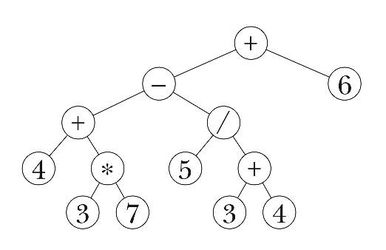

#####################################
Customize Avatar Animations
#####################################

You can express yourself by overriding High Fidelity's standard set of animations with your own custom animations such as dancing, juggling, or waving. Any custom animations you set up will be independent to each avatar you own and wear.

.. note:: We often update our process for importing custom animations to make it more user friendly. As you develop custom animations, keep in mind that you may need to modify them in the future as our custom animation support continues to improve.

.. contents:: On This Page
    :depth: 2

----------------------------------
Prerequisites
----------------------------------

As we delve deeper into creating custom animations, we may use terminology that you are unfamiliar with. Here are some terms you might come across:

+--------------------------+--------------------------------------------------------------------------------------------------+
| Term                     | Description                                                                                      |
+==========================+==================================================================================================+
| Avatar animations        | Avatar animations are FBX files that define how your avatar moves. For example, `turn_left.fbx <h|
|                          | ttps://github.com/highfidelity/hifi/blob/master/interface/resources/avatar/animations/turn_left.f|
|                          | bx>`_ is the standard animation file for your avatar turning left.                               |
+--------------------------+--------------------------------------------------------------------------------------------------+
| Animation roles          | Animation roles are triggers that map to an action that an avatar can perform.                   |
|                          | For example, turnLeft is an animation role that makes your avatar turn left                      |
|                          | while standing in place. This animation role is mapped to the turn_left.fbx                      |
|                          | file. You can see this in action by pressing the left arrow key or ``A`` in Desktop              |
|                          | mode or using your hand controllers in VR mode.                                                  |
+--------------------------+--------------------------------------------------------------------------------------------------+
| Avatar Animation JSON or | The standard animation system blends and layers a series of animations from                      |
| Animation Graph File     | FBX files using a JSON data file. This JSON file is called the Animation Graph file,             |
|                          | and it specifies exactly which animations to play and how they are blended.                      |
|                          | It also determines the order of operations, so that operations like Inverse Kinematics           |
|                          | occur after the rest of the body has been animated by traditional means.                         |
|                          | By default, every avatar uses the same `Animation Graph file <https://github.com/highfidelity/hif|
|                          | i/blob/master/interface/resources/avatar/avatar-animation.json>`_.                               |
+--------------------------+--------------------------------------------------------------------------------------------------+

----------------------------------
Prepare Your Custom Animation
----------------------------------

Before you replace the existing standard animations, you need to prepare your custom animation file. Use our :doc:`Avatar Standards Guide <avatar-standards>` and keep the following guidelines in mind:

- Animations must have standard joint names for High Fidelity.
- Animations must have standard joint orientations (y down the bone).
- Key frames must have key frames for every joint at a uniform interval of 30 frames per second.
- Locomotion animation phase has the left ankle in passing position on the first frame. Try to match this phase if you want your locomotion animation to blend with the default set.

Once you create your animation:

1. Export your animation from the external tool of your choice as an FBX file. 
2. Upload your animation FBX file to a cloud server and copy the URL. 

-----------------------------------
Replace Standard Animations
-----------------------------------

You can have your avatar use your custom animations by overriding the default animations. There are two different ways to do this:

+ `Override Using a Script`_: Write a script to override standard animations.
+ `Create a Custom Avatar Animation JSON file`_: You can modify this file or create a new data file. 

^^^^^^^^^^^^^^^^^^^^^^^^^^^^^^^^^^^^
Override Using a Script
^^^^^^^^^^^^^^^^^^^^^^^^^^^^^^^^^^^^

You can `write a script <../../script/write-scripts.html>`_ and use the `MyAvatar <https://apidocs.highfidelity.com/MyAvatar.html>`_ namespace to override an existing animation or animation role. 

We've listed the methods you can use to replace the standard animations on your avatar. 

+-------------------------------------+---------------------------------------------------------------------------------+
| Method                              | Description                                                                     |
+=====================================+=================================================================================+
| `MyAvatar.overrideAnimation         | This method can be used to play any animation on the current avatar. It will    |
| <https://apidocs.highfidelity.com/  | move smoothly from the current pose to the starting frame of the custom         |
| MyAvatar.html#.overrideAnimation>`_ | animation. For example, if your avatar is waving, this script will stop your    |
|                                     | avatar waving and play the custom animation provided.                           |
+-------------------------------------+---------------------------------------------------------------------------------+
| `AnimationCache.prefetch            | This method fetches a resource. You can use this to fetch a custom animation    |
| <https://apidocs.highfidelity.com/  | you've hosted on a cloud server. If you do not prefetch your animations before  |
| AnimationCache.html#.prefetch>`_    | playing them, you might see a t-pose appear briefly as the animation is         |
|                                     | downloaded.                                                                     |
+-------------------------------------+---------------------------------------------------------------------------------+
| `MyAvatar.restoreAnimation          | This method stops the override function from playing any custom animation.      |
| <https://apidocs.highfidelity.com/  | Your avatar will go back to playing the standard animations.                    |
| MyAvatar.html#.restoreAnimation>`_  |                                                                                 |
+-------------------------------------+---------------------------------------------------------------------------------+

.. note:: This process to replace an existing animation will take complete control of all avatar joints. Inverse Kinematics of the hands and head of HMD users will be disabled. 

You can also override an existing animation role mapping:

1. Use `MyAvatar.getAnimationRoles <https://apidocs.highfidelity.com/MyAvatar.html#.getAnimationRoles>`_ to view the list of roles for the current avatar. 
2. You can replace the animation for each role with a custom animation (FBX file) using `MyAvatar.overrideRoleAnimation <https://apidocs.highfidelity.com/MyAvatar.html#.overrideRoleAnimation>`_.

We've listed the animation roles and their description. These are frequently updated, so we recommend using ``MyAvatar.getAnimationRoles`` to get the latest animation roles before continuing. The standard animation FBX files for these roles can be found in the High Fidelity source code repository on `GitHub <https://github.com/highfidelity/hifi/tree/master/interface/resources/avatar/animations>`_.

+-------------------------------------------+----------------------------------------------------------------------+
| Animation Roles                           | Description                                                          |
+===========================================+======================================================================+
| rightHandGraspOpen                        | When hand controller trigger is not squeezed.                        |
+-------------------------------------------+----------------------------------------------------------------------+
| rightHandGraspClosed                      | When hand controller trigger is fully squeezed.                      |
+-------------------------------------------+----------------------------------------------------------------------+
| rightIndexPointOpen                       | Point gesture.                                                       |
+-------------------------------------------+----------------------------------------------------------------------+
| rightIndexPointClosed                     | Point gesture with trigger squeezed.                                 |
+-------------------------------------------+----------------------------------------------------------------------+
| rightThumbRaiseOpen                       | Thumbs up gesture.                                                   |
+-------------------------------------------+----------------------------------------------------------------------+
| rightThumbRaiseClosed                     | Thumbs up gesture with trigger squeezed.                             |
+-------------------------------------------+----------------------------------------------------------------------+
| rightIndexPointAndThumbRaiseOpen          | Simultaneous thumbs up and point gesture.                            |
+-------------------------------------------+----------------------------------------------------------------------+
| rightIndexPointAndThumbRaiseClosed        | Simultaneous thumbs up and point gesture, with trigger squeezed.     |
+-------------------------------------------+----------------------------------------------------------------------+
| leftHandGraspOpen                         | When hand controller trigger is not squeezed.                        |
+-------------------------------------------+----------------------------------------------------------------------+
| leftHandGraspClosed                       | When hand controller trigger is fully squeezed.                      |
+-------------------------------------------+----------------------------------------------------------------------+
| leftIndexPointOpen                        | Point gesture.                                                       |
+-------------------------------------------+----------------------------------------------------------------------+
| leftIndexPointClosed                      | Point gesture with trigger squeezed.                                 |
+-------------------------------------------+----------------------------------------------------------------------+
| leftThumbRaiseOpen                        | Thumbs up gesture.                                                   |
+-------------------------------------------+----------------------------------------------------------------------+
| leftThumbRaiseClosed                      | Thumbs up gesture with trigger squeezed.                             |
+-------------------------------------------+----------------------------------------------------------------------+
| leftIndexPointAndThumbRaiseOpen           | Simultaneous thumbs up and point gesture.                            |
+-------------------------------------------+----------------------------------------------------------------------+
| leftIndexPointAndThumbRaiseClosed         | Simultaneous thumbs up and point gesture, with trigger squeezed.     |
+-------------------------------------------+----------------------------------------------------------------------+
| idleStand                                 | Standing still, not talking.                                         |
+-------------------------------------------+----------------------------------------------------------------------+
| idleTalk                                  | Standing still, but avatar is talking.                               |
+-------------------------------------------+----------------------------------------------------------------------+
| walkFwdShort_c                            | Walking forward at 0.5 m/s.                                          |
+-------------------------------------------+----------------------------------------------------------------------+
| walkFwdNormal_c, walkFwdFast_c            | Walking forward at 1.8 m/s. Walking forward at 2.3 m/s.              |
+-------------------------------------------+----------------------------------------------------------------------+
| walkFwdJog_c, walkFwdRun_c                | Walking forward at 3.2 m/s. Walking forward at 4.5 m/s.              |
+-------------------------------------------+----------------------------------------------------------------------+
| idleToWalkFwd, idleSettle                 | Short transition from standing idle to walking forward.              |
|                                           | Transition from walk to idle.                                        |
+-------------------------------------------+----------------------------------------------------------------------+
| walkBwdShort_c                            | Walking backward at 0.6 m/s.                                         |
+-------------------------------------------+----------------------------------------------------------------------+
| walkBwdFast_c, jogBwd_c, runBwd_c         | Walking backward at 1.6 m/s. Jog backward at 2.3 m/s. Jog            |
|                                           | backward at 3.1 m/s.                                                 |
+-------------------------------------------+----------------------------------------------------------------------+
| turnLeft                                  | Standing turning in place animation.                                 |
+-------------------------------------------+----------------------------------------------------------------------+
| turnRight                                 | Standing turning in place animation.                                 |
+-------------------------------------------+----------------------------------------------------------------------+
| strafeLeftShortStep_c                     | Sidestep at 0.1 m/s.                                                 |
+-------------------------------------------+----------------------------------------------------------------------+
| strafeLeftStep_c, strafeLeftWalk_c,       | Sidestep at 0.5 m/s. Side walk at 1.0 m/s. Side walk at 2.6 m/s.     |
| strafeLeftWalkFast_c, strafeLeftJog_c     | Side jog at 3.0 m/s.                                                 |
+-------------------------------------------+----------------------------------------------------------------------+
| strafeRightShortStep_c, strafeRightStep_c | Sidestep at 0.1 m/s. Sidestep at 0.5 m/s.                            |
+-------------------------------------------+----------------------------------------------------------------------+
| strafeRightWalk_c, strafeRightFast_c,     | Side walk at 1 m/s. Sidewalk at 2.6 m/s Side jog at 3 m/s.           |
| strafeRightJog_c, stepLeftShort_c,        | HMD step left at 0 m/s. HMD step left at 0.5 m/s. HMD strafe         |
| stepLeft_c, strafeLeftAnim_c,             | left at 2.5 m/s. HMD step right at 0 m/s. HMD step right at 0.5 m/s. |
| stepRightShort_c, stepRight_c,            | HMD strafe right at 2.5 m/s.                                         |
| strafeRightAnim_c                         |                                                                      |
+-------------------------------------------+----------------------------------------------------------------------+
| fly                                       | Flying idle.                                                         |
+-------------------------------------------+----------------------------------------------------------------------+
| takeoffStand                              | Standing jump takeoff.                                               |
+-------------------------------------------+----------------------------------------------------------------------+
| TAKEOFFRUN                                | Running jump takeoff.                                                |
+-------------------------------------------+----------------------------------------------------------------------+
| inAirStandPreApex                         | Standing jump in air on the way upward towards the jump apex.        |
+-------------------------------------------+----------------------------------------------------------------------+
| inAirStandApex                            | Standing jump in air at apex of the jump.                            |
+-------------------------------------------+----------------------------------------------------------------------+
| inAirStandPostApex                        | Standing jump in air on the downward arc of the jump.                |
+-------------------------------------------+----------------------------------------------------------------------+
| inAirRunPreApex                           | Running jump in air on the way upward towards the jump apex.         |
+-------------------------------------------+----------------------------------------------------------------------+
| inAirRunApex                              | Running jump in air at apex of the jump.                             |
+-------------------------------------------+----------------------------------------------------------------------+
| inAirRunPostApex                          | Running jump in air on the downward arc of the jump.                 |
+-------------------------------------------+----------------------------------------------------------------------+
| landStandImpact                           | Standing land.                                                       |
+-------------------------------------------+----------------------------------------------------------------------+
| landStand                                 | Standing land.                                                       |
+-------------------------------------------+----------------------------------------------------------------------+
| LANDRUN                                   | Running land.                                                        |
+-------------------------------------------+----------------------------------------------------------------------+

^^^^^^^^^^^^^^^^^^^^^^^^^^^^^^^^^^^^^^^^^^^^^^^^^^
Create a Custom Avatar Animation JSON file
^^^^^^^^^^^^^^^^^^^^^^^^^^^^^^^^^^^^^^^^^^^^^^^^^^

If you're not comfortable using a script, you can edit or replace the existing Avatar Animation JSON file to override the standard animations. 

.. note:: If you create a custom JSON file for your avatar's animations, you will not inherit any updates made to the standard animations' JSON file. You can perform a text merge to the latest version at any time.

The JSON file shows which animation role is mapped to which animation FBX file. You can replace standard animation FBX files with your custom animation's FBX files. Or, you can write a new JSON file with the new mappings for each animation role. 

To replace standard animations:

1. Upload your custom JSON file to a cloud server and copy the URL.
2. In Interface, pull up your HUD or Tablet and go to **Avatar**.
3. Click on the Settings icon on the top-right corner. 
4. Under 'Avatar Animation JSON', paste the URL for your JSON file. 

OR

1. Open your avatar's FST file in a text editor. 
2. Add your Animation Graph file's URL.

.. note:: You will need to run your avatar's files through the `Avatar Packager <package-avatar.html#host-your-avatar>`_ to include the changes in your FST file. 

.. code::

    animGraphUrl = "URL"

^^^^^^^^^^^^^^^^
Examples
^^^^^^^^^^^^^^^^

+ Here is the current default `avatar-animation.json <https://github.com/highfidelity/hifi/blob/master/interface/resources/avatar/avatar-animation.json>`_ file.
+ This `scoot-animation.json <https://s3.amazonaws.com/hifi-public/tony/scoot-animation.json>`_ file replaces the idle and walk animations with a sitting pose. This example shows how you can replace some of an avatar's default animations.

^^^^^^^^^^^^^^^^^^^^^^^^^^^^^^^^^^
Advanced Topic: AnimNode System
^^^^^^^^^^^^^^^^^^^^^^^^^^^^^^^^^^

The Avatar Animation JSON file contains a hierarchical tree of nodes called the AnimNode System. The AnimNode system defines how an avatar moves and is described in the Animation Graph JSON file. 

The movement of an avatar is determined by a complex blend of procedural animation, pre-recorded animation clips, and inverse kinematics. This blend is calculated at every frame to ensure that the avatar body follows physics and controller input as rapidly as possible. It must handle animation for desktop users, HMD users, and users wearing a full set of HTC Vive trackers. It must be configured on the fly as sensors are added and removed from the system. It should also be open to extensions so unique animations and avatar configurations are possible. These functionalities are handled by the AnimNode system. 

We've listed some features of the system:

+ The AnimNode system is a graph of nodes. 
+ Some nodes are output only, such as pre-recorded animation clips.
+ Other nodes produce output by processing nodes below it in the graph and blending the results together. 
+ By manipulating the node hierarchy, certain animation actions will occur before or after other animation actions. 
+ The node parameters can be dynamically changed at runtime. This flexibility is necessary to achieve good visual results.
+ The system is in the default Animation Graph JSON file and is loaded during avatar initialization. 

**Key Concepts**

The AnimNode system operates like an expression parse tree.  For example the following expression: ``4 + 3 * 7 - (5 / (3 + 4)) + 6``, can be represented by the following parse tree.

This parse tree can then be evaluated at runtime to compute the actual value. In this tree, the leaf nodes are values and interior nodes are operations that combine two or more sub-trees and produce a new value. The tree is evaluated until there is a single value remaining, which should be the result of the entire expression: ``30.2957142``. 

In the expression case, the output value of each node is a floating point number, and operations can be implemented simply by evaluating each sub-tree, and then combining them with an arithmetic operation, such as addition or multiplication.

The AnimNode system works on a similar concept. Except the value of each node contains all of the avatar's joint translations and rotations. Leaf nodes can be static avatar poses, such as the T-pose or can be a single frame of an animation clip. Interior nodes can perform operations such as blending between two or more sub-trees, or combining the upper body of one animation with the lower body of another.

**See Also**

+ :doc:`Avatar Standards Guide <avatar-standards>`
+ :doc:`Script <../../script>`
+ `API Reference: MyAvatar <https://apidocs.highfidelity.com/MyAvatar.html>`_
