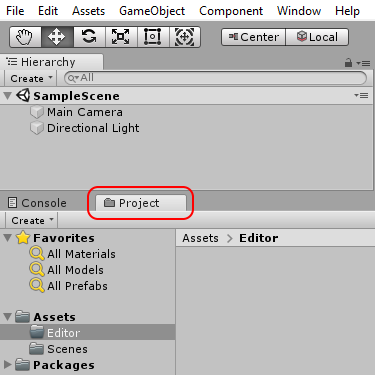
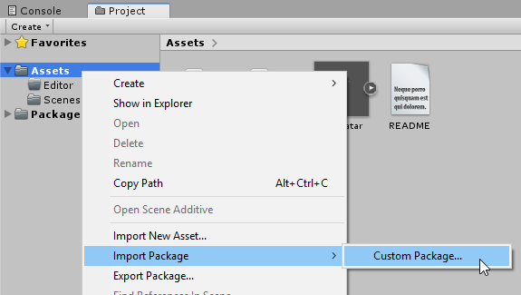
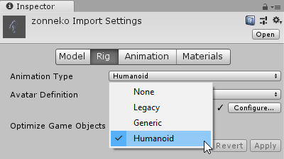
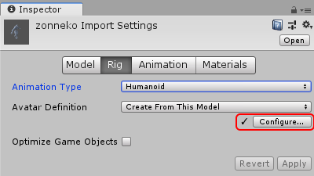
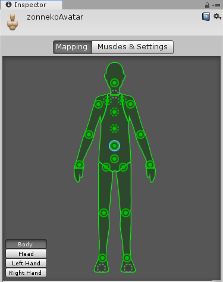
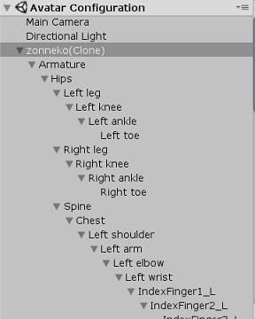
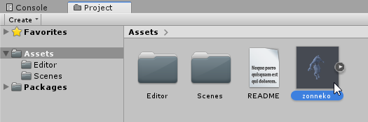
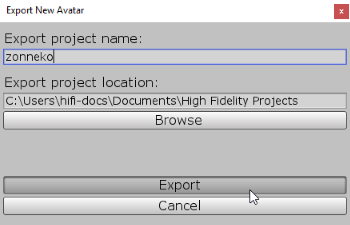
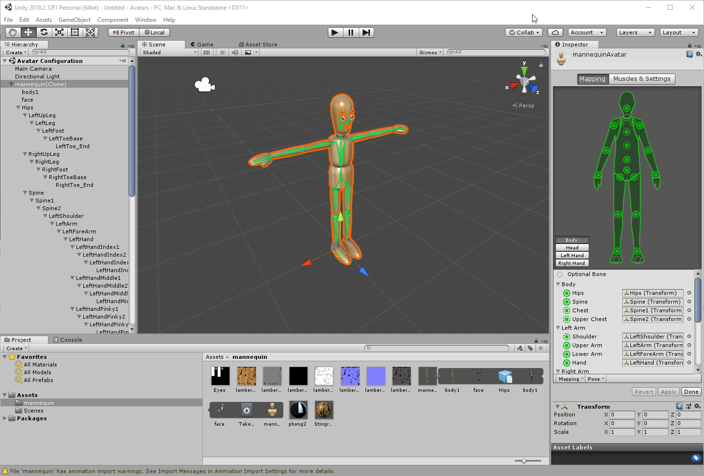

###################################
Find and Use an Existing Avatar
###################################

You can download avatars for use from external sources such as TurboSquid or CGTrader. Once you get the avatar, you will need to process it in Unity using the High Fidelity Avatar Exporter. This tool imports most avatars into Unity, maps their skeleton using Unity's humanoid tool, and exports them as FST and FBX files to import in-world.

.. contents:: On This Page
    :depth: 3

----------------------
Avatar Guidelines
----------------------

Many external sites like TurboSquid and CGTrader provide avatars that you can use. However, note that not all of the avatars you find may work in High Fidelity. To improve the chances that your downloaded avatar is compatible with High Fidelity, we've compiled a list of guidelines to help you "sanity check" it prior to use. 

You should ensure that: 

* You downloaded a `real-time models <https://blog.turbosquid.com/real-time-models>`_ (rigged for run-time, not rigged for render).
* You have the correct downloaded files

    * An FBX model for your avatar. We do not support other 3D model formats. 
    * (Optional) One or more image files to give your avatar color and texture. Sometimes, these are already embedded in your FBX model and you won't have any additional image files in your download.
* Your avatar is rigged. 

.. note:: If your avatar is not rigged, you can use :doc:`Mixamo <mixamo-tutorial>` to rig it. If you use Mixamo, you do not necessarily need to use Unity and the avatar exporter. Because Mixamo already uses a skeleton that we support, you can use our `Avatar Packager <create-avatars.html#package-your-avatar>`_ to import your avatar into High Fidelity. 

------------------------------------------
High Fidelity Avatar Exporter for Unity
------------------------------------------

High Fidelity supports only one standard type of rigging for avatars. Because many avatars do not match this skeleton, we created the High Fidelity Avatar Exporter for Unity (also known as the "avatar exporter") to convert human-like avatars with a humanoid bone structure (body, head, and limbs). The avatar exporter also automatically packages your avatar for use in High Fidelity.

.. note:: The avatar exporter was written to improve the process of rigging and mapping the skeleton rig. This will not affect the animations or materials in your avatar. To adjust the materials, you will need to use a 3D modeling tool such as Blender or Maya and make modifications to your avatar prior to using the avatar exporter in Unity.

You will need the following to use this tool: 

+ Unity (Recommended versions: 2017.4.17f1 - 2018.2.12f1)
+ High Fidelity (v0.77.0 or higher)
+ `High Fidelity Avatar Exporter for Unity <https://github.com/highfidelity/hifi/raw/57c3620587ae1ec4638a58988909b46602c14633/tools/unity-avatar-exporter/avatarExporter.unitypackage>`_ (v0.4.1)

Please note that the recommended version of Unity is not the latest version. If you are using a newer version of Unity, we recommend that you apply a T-Pose to your avatar. To do so, go to the 'Inspector', and click 'Pose' near the bottom of the panel. Select 'Enforce T-Pose' from the drop-down. Click 'Apply' and 'Done'. We recommend doing this after correcting any issues with remapping bones.

^^^^^^^^^^^^^^^^^^^^^^^^^^^^^^^
Install the Avatar Exporter
^^^^^^^^^^^^^^^^^^^^^^^^^^^^^^^

You need to install the extension for every Unity project that you have. Keep in mind, however, that you can import and export multiple avatars in a single Unity project.  

1. Download the `avatar exporter <https://github.com/highfidelity/hifi/raw/57c3620587ae1ec4638a58988909b46602c14633/tools/unity-avatar-exporter/avatarExporter.unitypackage>`_ from High Fidelity. 
2. In Unity, open the 'Project' window at the bottom.

3. Right-click the 'Assets' folder, then select **Import Package > Custom Package**. 

4. Navigate to the `avatarExporter` package (with a .unitypackage extension). Click 'Open'. You can also double-click the package on your computer to import it automatically.
5. In the 'Importing Package' window, review the list of files to be imported and check for conflicts with files already in your project. If a conflict exists, save any local changes somewhere outside of your project.
6. Click 'Import'. The package's files are added to the Assets folder. You should now have a 'High Fidelity' menu in Unity. 

.. image:: _images/hifi-menu.png

^^^^^^^^^^^^^^^^^^^^^^^^^^^^^^
Create an Avatar Package
^^^^^^^^^^^^^^^^^^^^^^^^^^^^^^

1. If you don't already have your model open in Unity, you need to import your model. Use any of the following methods:

   + Drag and drop the FBX file into the 'Assets' folder of your 'Project' window.
   + In the 'Project' window, right-click the 'Assets' folder, then select **Import Package > Import New Asset**. Navigate to the FBX file and click 'Import'.
   + In Unity, open the 'Assets' menu, then select **Import Package > Import New Asset**. Navigate to the FBX file and click 'Import'.
2. In the 'Project' window, select your avatar’s FBX file. In the 'Inspector', open 'Rig'. For 'Animation Type', choose 'Humanoid' and then click 'Apply'. 

.. raw:: html

    
    
3. Click 'Configure' to investigate and tweak the mapping of your avatar.  

4. All bones mapped in Unity are highlighted in green and can be selected. Check if anything is missing. Any errors will appear in red. The minimum required bones for mapping are Hips, Spine, Chest, and Head. If either of these are missing, you must manually add bones before continuing. You can do this by dragging the bones from the 'Avatar Configuration' panel to the 'Inspector' panel. 

.. note:: Avatars in High Fidelity must have a Chest bone. If your avatar does not have a chest bone, the avatar exporter may suggest a suitable alternative from the 'Avatar Configuration' panel. If the exporter doesn't suggest an alternative and Humanoid doesn't correctly map the Chest, then you will get an error and need to manually map a bone to the Chest from 'Avatar Configuration'. 

5. If you made any changes, click 'Done'. 
6. Click on the FBX file in the 'Assets' manager. 

7. Make sure that you have the `avatar exporter installed <#install-the-avatar-exporter>`_. Open the 'High Fidelity' menu in the top menu bar, then select 'Export New Avatar'.
8. Give your avatar project a name. The default project location is your local user's ``Documents\High Fidelity Projects`` directory, which is created automatically for you. Though we recommend that you keep your avatars in this directory, you can change it to another location on your computer. 

9. Click 'Export'. 

Your avatar package has been created! The File Explorer will open to your new avatar project.

.. image:: _images/exported-package.png

.. note:: If you are using any external textures with your avatar model, copy those textures to your local user's ``Documents\High Fidelity Projects\avatar\<project name>\textures`` directory. Otherwise, they may not show up on your avatar.

^^^^^^^^^^^^^^^^^^^^^^^
Test Your Avatar
^^^^^^^^^^^^^^^^^^^^^^^

We encourage you to "spot check" your avatar in Unity before exporting it with the `High Fidelity Avatar Exporter for Unity`_. Check for the following:

* Confirm that there are no extraneous objects attached to your model. For example, this `Mech avatar <https://www.cgtrader.com/free-3d-models/character/sci-fi/low-poly-construction-mech>`_ has a ground blue object included in the model. All extraneous objects will be imported into High Fidelity and may affect the rendering or animation of your avatar.
* Test your bone movements. In Unity's 'Inspector', open 'Rig'. For 'Animation Type', choose 'Humanoid' and then click 'Apply'. Go to 'Muscles & Settings' to test your avatar's bone configuration and ensure that it works as expected. 

After exporting your avatar package, you can also test it in High Fidelity using the `Marketplace Item Tester <../tools.html#marketplace-item-tester>`_ to ensure that it works before you host it. If something doesn't look right, tweak your avatar in Unity, then update it with the High Fidelity menu. 

If everything looks good, you need to `host your avatar <package-avatar.html#host-your-avatar>`_ then `change your avatar <../../explore/personalize/change-avatar.html#use-your-own-custom-avatar>`_ to wear it.

^^^^^^^^^^^^^^^^^^^^^^^^^
Troubleshooting Tips
^^^^^^^^^^^^^^^^^^^^^^^^^

Many of the errors you will encounter describe issues with the avatar’s skeleton. These are fully documented here: `Troubleshooting with the Avatar Packager <package-avatar.html#troubleshooting-with-the-avatar-packager>`_. Here are some other issues you may encounter after using a downloaded avatar and using the avatar exporter:

+---------------------------------------+--------------------------------------------------------------------------------------+
| Issue                                 | Troubleshooting Tip                                                                  |
+=======================================+======================================================================================+
| *You receive a warning in Unity:*     | Go to the 'Inspector', click 'Configure', and then select 'Pose' near the bottom of  |
|                                       | the panel. Select 'Enforce T-Pose' from the drop-down. Click 'Apply' and 'Done'. We  |
| "Character is not in T pose."         | recommend doing this after correcting any issues with remapping bones.               |
+---------------------------------------+--------------------------------------------------------------------------------------+
| In Unity, your avatar is a solid      | This suggests that the materials or shaders you are using are not supported.         |
| color.                                |                                                                                      |
|                                       | 1. Click and drag your model into the 'Scene' window.                                |
|                                       | 2. Select all of the unsupported materials. These will be one solid color,           |
|                                       |    such as pink.                                                                     |
|                                       | 3. In the 'Inspector', change the 'Shader' to one of the 'Standard' options. All     |
|                                       |    materials should now show up correctly.                                           |
+---------------------------------------+--------------------------------------------------------------------------------------+
| Your avatar is grey.                  | One of the following issues could have occurred:                                     |
|                                       |                                                                                      |
|                                       | 1. Make sure you copied your avatar's textures into the project’s textures folder    |
|                                       | 2. Verify that your textures are in a format that we support (either PNG or JPG)     |
|                                       | 3. If your textures are embedded in your avatar: select the FBX file, go to          |
|                                       |    'Inspector', and click 'Extract Textures'. Extract your textures into your asset's|
|                                       |    folder. You can do the same with Materials.                                       |
+---------------------------------------+--------------------------------------------------------------------------------------+
| Your avatar is tied up into knots     | This could mean that your skeleton is not right. Re-open your avatar in              |
| or laying down.                       | Unity and run through steps 2-5 of `Create an Avatar Package`_                       |
|                                       | again. Update your project in Unity (go to Update Existing Avatar,                   |
|                                       | then browse to your avatar package).                                                 |
|                                       |                                                                                      |
|                                       | If it still doesn't work, ensure that you are testing the correct file that          |
|                                       | the avatar exporter created.                                                         |
+---------------------------------------+--------------------------------------------------------------------------------------+
| Your avatar's skin doesn't move       | The avatar exporter was written to improve the process of rigging and mapping        |
| properly with animations.             | the skeleton rig. This will not affect the animations in your avatar. To             |
|                                       | adjust the animations, you will need to use a 3D modeling tool such as Blender       |
|                                       | or Maya and fix the skin weighting on the avatar prior to using the avatar           |
|                                       | exporter in Unity.                                                                   |
+---------------------------------------+--------------------------------------------------------------------------------------+

**See Also**

+ :doc:`Package and Host Your Avatar <package-avatar>`