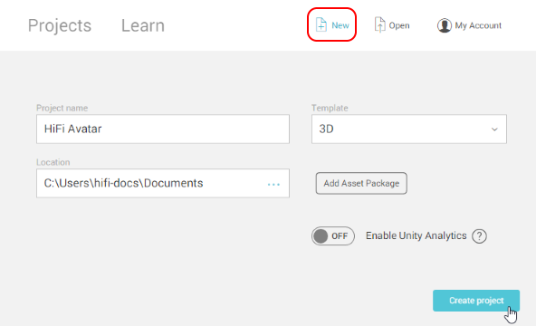
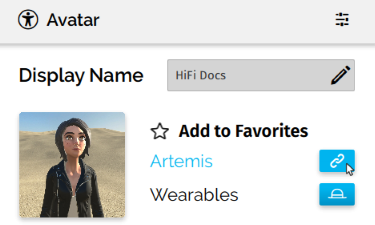

###################################
Find and Use an Existing Avatar
###################################

You can download avatars for use from external sources such as TurboSquid or CGTrader. Once you get the avatar, you will need to process it in Unity using the High Fidelity Avatar Exporter. This tool imports most avatars into Unity, maps their skeleton using Unity's humanoid tool, and exports them as FST and FBX files to import in-world.

.. contents:: On This Page
    :depth: 2

----------------------
Avatar Guidelines
----------------------

Many external sites like TurboSquid and CGTrader provide avatars that you can use. You can use avatars downloaded from these sites according to their terms of use. However, many of these may not work in High Fidelity. Be sure to find an avatar that fits these guidelines: 

* `Real-time models <https://blog.turbosquid.com/real-time-models>`_ (rigged for run-time, not rigged for render)
* Avatars in the FBX file format (we don't enforce a poly count limit, but we recommend using an avatar with a low poly count of around 40k)
* Rigged avatars

.. note:: If your avatar is not rigged, you can use :doc:`Mixamo <mixamo-tutorial>` to rig it. If you use Mixamo, you do not necessarily need to use Unity and the avatar exporter. Because Mixamo already uses a skeleton that we support, you can use our `Avatar Packager <create-avatars.html#package-your-avatar>`_ to import your avatar into High Fidelity. 

------------------------------------------
High Fidelity Avatar Exporter for Unity
------------------------------------------

High Fidelity supports only one standard type of rigging for avatars. Because many avatars do not match this skeleton, we created the High Fidelity Avatar Exporter for Unity (also known as the "avatar exporter") to convert human-like avatars with a humanoid bone structure (body, head, and limbs). The avatar exporter also automatically packages your avatar for use in High Fidelity.

.. note:: The avatar exporter was written to improve the process of rigging and mapping the skeleton rig. This will not affect the animations or materials in your avatar. To adjust the materials, you will need to use a 3D modeling tool such as Blender or Maya and make modifications to your avatar prior to using the avatar exporter in Unity.

You will need the following to use this tool: 

+ Unity (Recommended versions: 2017.4.17f1 - 2018.2.12f1)
+ High Fidelity (v0.77.0 or higher)
+ `High Fidelity Avatar Exporter for Unity <https://github.com/highfidelity/hifi/raw/a9895a90e59c8678a13cdc70be31077bcfe9578b/tools/unity-avatar-exporter/avatarExporter.unitypackage>`_ (v0.1)

.. note:: Please note that the recommended version of Unity is not the latest version. If you are using a newer version of Unity, we recommend that you apply a T-Pose to your avatar. To do so, go to the 'Inspector', and click 'Pose' near the bottom of the panel. Select 'Enforce T-Pose' from the drop-down. Click 'Apply' and 'Done'. We recommend doing this after correcting any issues with remapping bones.

^^^^^^^^^^^^^^^^^^^^^^^^^^^^
Create a Unity Project
^^^^^^^^^^^^^^^^^^^^^^^^^^^^

1. Launch Unity. 
2. On the Home screen, click 'New'. 
3. Enter a Project name and Template. Your models should be 3D. 
4. Click 'Create project'. 

^^^^^^^^^^^^^^^^^^^^^^^^^^^^^^^
Install the Avatar Exporter
^^^^^^^^^^^^^^^^^^^^^^^^^^^^^^^

.. note:: You need to install the extension for each Unity project that you have. Keep in mind, however, that you can import and export multiple avatars in a single Unity project.  

1. Download the `avatar exporter <https://github.com/highfidelity/hifi/raw/a9895a90e59c8678a13cdc70be31077bcfe9578b/tools/unity-avatar-exporter/avatarExporter.unitypackage>`_ from High Fidelity. 
2. In Unity, open the 'Project' window at the bottom.

.. image:: _images/project-window.png

3. Right-click the 'Assets' folder, then select **Import Package > Custom Package**. 

.. image:: _images/import-package.png

4. Navigate to the `avatarExporter` package (with a .unitypackage extension). Click 'Open'. You can also double-click the package on your computer to import it automatically.
5. In the 'Importing Package' window, review the list of files to be imported and check for conflicts with files already in your project. If a conflict exists, save any local changes somewhere outside of your project.
6. Click 'Import'. The package's files are added to the Assets folder. You should now have a 'High Fidelity' menu in Unity. 

.. image:: _images/hifi-menu.png

^^^^^^^^^^^^^^^^^^^^^^^^^^^^^^
Create an Avatar Package
^^^^^^^^^^^^^^^^^^^^^^^^^^^^^^

1. You can import the FBX model for your avatar into Unity using any of the following methods:

   + Drag and drop the FBX file into the 'Assets' folder of your 'Project' window.
   + In the 'Project' window, right-click the 'Assets' folder, then select **Import Package > Import New Asset**. Navigate to the FBX file and click 'Import'.
   + In Unity, open the 'Assets' menu, then select **Import Package > Import New Asset**. Navigate to the FBX file and click 'Import'.
2. In the 'Project' window, select your avatar’s FBX file. In the 'Inspector', open 'Rig'. For 'Animation Type', choose 'Humanoid' and then click 'Apply'. 

.. image:: _images/apply-humanoid-animation.png

.. raw:: html

    
    
3. Click 'Configure' to investigate and tweak the mapping of your avatar.  

.. image:: _images/configure-avatar.png

4. All bones mapped in Unity are highlighted in green and can be selected. Check if anything is missing. Any errors will appear in red. The minimum required bones for mapping are Hips, Spine, Chest, and Head. If either of these are missing, you must manually add bones before continuing. You can do this by dragging the bones from the 'Avatar Configuration' panel to the 'Inspector' panel. 

.. image:: _images/check-mesh.png
.. image:: _images/avatar-config.png

.. note:: Avatars in High Fidelity must have a Chest bone. If your avatar does not have a chest bone, the avatar exporter may suggest a suitable alternative from the 'Avatar Configuration' panel. If the exporter doesn't suggest an alternative and Humanoid doesn't correctly map the Chest, then you will get an error and need to manually map a bone to the Chest from 'Avatar Configuration'. 

5. If you made any changes, click 'Done'. 
6. Click on the FBX file in the 'Assets' manager. 

.. image:: _images/select-avatar-unity.png

7. Make sure that you have the `avatar exporter installed <#install-the-avatar-exporter>`_. Open the 'High Fidelity' menu in the top menu bar, then select 'Export New Avatar'.
8. Give your avatar project a name. The default project location is your local user's ``Documents\High Fidelity Projects`` directory, which is created automatically for you. Though we recommend that you keep your avatars in this directory, you can change it to another location on your computer. 

.. image:: _images/export-avatar.png

9. Click 'Export'. 

Your avatar package has been created! The File Explorer will open to your new avatar project.

.. image:: _images/exported-package.png

.. note:: If you are using any external textures with your avatar model, please copy those textures to your local user's ``Documents\High Fidelity Projects\avatar\<project name>\textures`` directory. Otherwise, they will not show up on your avatar in High Fidelity. We support textures in either PNG or JPG format.

^^^^^^^^^^^^^^^^^^^^^^^
Test Your Avatar
^^^^^^^^^^^^^^^^^^^^^^^

Test your avatar locally before you host and use it. This step lets you check your avatar for any issues and fix them before you host it online. 

.. note:: Using these steps will not actually change your avatar in the metaverse, and should only be used for testing. If you want to change your avatar to something others can see, you need to first publicly :doc:`host your avatar <host-avatar>` before you can `use your custom avatar <../../explore/personalize/change-avatar.html#use-your-own-custom-avatar>`_. 

1. Copy your avatar's textures into the project’s textures folder. We support textures in either PNG or JPG format.
2. Go to the folder where your avatar project is saved on your computer. Right-click the FST file and click copy. This will copy your FST file’s local path.
3. In Interface, pull up your tablet or HUD and click on **Avatar**.
4. In the Avatar window, click the link icon next to your current avatar. Paste the copied FST file's URL and click 'Confirm'.

5. Test your avatar by moving around and using the **Emote** app.

If something doesn't look right, you can tweak your avatar in Unity, then update it with the High Fidelity menu. If everything looks good, you need to :doc:`host your avatar <host-avatar>` then `change the URL <../../explore/personalize/change-avatar.html#use-your-own-custom-avatar>`_ to point to your hosted version.

^^^^^^^^^^^^^^^^^^^^^^^^^
Troubleshooting Tips
^^^^^^^^^^^^^^^^^^^^^^^^^

Use these troubleshooting tips if you notice any issues while packaging or testing your avatar:

+---------------------------------------+--------------------------------------------------------------------------------------+
| Issue                                 | Troubleshooting Tip                                                                  |
+=======================================+======================================================================================+
| *You receive a warning in Unity:*     | Go to the 'Inspector', click 'Configure', and then select 'Pose' near the bottom of  |
|                                       | the panel. Select 'Enforce T-Pose' from the drop-down. Click 'Apply' and 'Done'. We  |
| "Character is not in T pose."         | recommend doing this after correcting any issues with remapping bones.               |
+---------------------------------------+--------------------------------------------------------------------------------------+
| *You receive a warning in Unity:*     | Ensure that all bones that are mapped in Humanoid are under the same bone parent at  |
|                                       | the top of the 'Avatar Configuration' panel.                                         |
| "There is more than one bone at the   |                                                                                      |
| top level of the selected avatar's    |                                                                                      |
| bone hierarchy. Please ensure all     |                                                                                      |
| bones for Humanoid mappings are       |                                                                                      |
| under the same bone hierarchy."       |                                                                                      |
+---------------------------------------+--------------------------------------------------------------------------------------+
| *Error (red):*                        | Your avatar should not have any bones mapped to more than one place in Humanoid.     |
|                                       |                                                                                      |
| "The XXX bone is mapped to more       |                                                                                      |
| than one bone in Humanoid."           |                                                                                      |
+---------------------------------------+--------------------------------------------------------------------------------------+
| *You receive a warning in Unity:*     | There should be no asymmetrical bone mappings for the legs, arms, and hands.         |
|                                       |                                                                                      |
| "The number of bones mapped in        |                                                                                      |
| Humanoid for the left appendage       |                                                                                      |
| (#) does not match the number of      |                                                                                      |
| bones mapped in Humanoid for the      |                                                                                      |
| right appendage (#)."                 |                                                                                      |
+---------------------------------------+--------------------------------------------------------------------------------------+
| *You receive a warning in Unity:*     | The bone mapped to Spine (or Chest) is not a descendant of the bone mapped           |
|                                       | to Hips (or Spine) in Humanoid. Refer to the hierarchy in the 'Avatar                |
| "The bone mapped to Spine/Chest in    | Configuration' panel. You can ensure this is the case for your avatar when           |
| Humanoid (XXX) is not a child of      | your receive this warning.                                                           |
| the bone mapped to Hips/Spine in      |                                                                                      |
| Humanoid (YYY)."                      |                                                                                      |
+---------------------------------------+--------------------------------------------------------------------------------------+
| *You receive a warning in Unity:*     | Map the LeftEye/RightEye/Neck bone in Humanoid.                                      |
|                                       |                                                                                      |
| "There is no LeftEye/RightEye/Neck    |                                                                                      |
| bone mapped in Humanoid for the       |                                                                                      |
| selected avatar."                     |                                                                                      |
+---------------------------------------+--------------------------------------------------------------------------------------+
| *You receive a warning in Unity:*     | The avatar's Hips bone should not be at the bottom of your avatar.                   |
|                                       |                                                                                      |
| "The bone mapped to Hips in Humanoid  |                                                                                      |
| (XXX) should not be at ground level." |                                                                                      |
+---------------------------------------+--------------------------------------------------------------------------------------+
| *You receive a warning in Unity:*     | The Hips, Spine, and Chest bones should not be at the same position.                 |
|                                       |                                                                                      |
| "The bone mapped to Hips in Humanoid  |                                                                                      |
| (XXX), the bone mapped to Spine in    |                                                                                      |
| Humanoid (YYY), and the bone mapped   |                                                                                      |
| to Chest in Humanoid (ZZZ) should     |                                                                                      |
| not be coincidental."                 |                                                                                      |
+---------------------------------------+--------------------------------------------------------------------------------------+
| *You receive a warning in Unity:*     | The total number of bones in an avatar should be equal or under the                  |
|                                       | limit (256).                                                                         |
| "The total number of bones in the     |                                                                                      |
| avatar (#) exceeds the maximum bone   |                                                                                      |
| limit (256)."                         |                                                                                      |
+---------------------------------------+--------------------------------------------------------------------------------------+
| You receive an error when exporting   | Avatars in High Fidelity must have a minimum of 4 bones: the hips, spine,            |
| your avatar:                          | chest, and head. This error will occur if one or more of these bones are             |
|                                       | either a) incorrectly mapped by Unity or b) missing in your skeleton.                |
| "There is no <Spine                   |                                                                                      |
| | Hips | Chest | Head> bone in the    | If the bone is incorrectly mapped, open the Humanoid mapping using the               |
| selected avatar."                     | Configure button. In the Avatar Configuration hierarchy, locate the matching         |
|                                       | bones and drag them into the Humanoid mapping to manually assign the                 |
|                                       | bone mappings.                                                                       |
|                                       |                                                                                      |
|                                       | If the bones do not actually exist in the model, you need to modify the              |
|                                       | model outside of Unity to add missing bones.                                         |
+---------------------------------------+--------------------------------------------------------------------------------------+
| Your avatar is gray.                  | One of following issues could have occured                                           |
|                                       |                                                                                      |
|                                       | 1. Make sure you copied your avatar's textures into the project’s textures folder    |
|                                       | 2. Verify that your textures are in a format that we support (either PNG or JPG)     |
|                                       | 3. If your textures are embedded in your avatar: select the FBX file, go to          |
|                                       |    'Inspector', and click 'Extract Textures'. Extract your textures into your asset's|
|                                       |    folder. You can do the same with Materials.                                       |
+---------------------------------------+--------------------------------------------------------------------------------------+
| Your avatar is too small or too       | In Interface, go to the **Avatar** app and click on the settings icon. Move          |
| big.                                  | the Avatar Scale slider between 0.1x to 4x to make it smaller or bigger.             |
|                                       |                                                                                      |
|                                       | If that isn't sufficient, you can manually change the scale in your avatar's         |
|                                       | FST file in a text editor. Keep in mind that any changes to the scale will           |
|                                       | work only after using the packager, as the packager overwrites these changes.        |
+---------------------------------------+--------------------------------------------------------------------------------------+
| Your avatar is tied up into knots     | This could mean that your skeleton is not right. Re-open your avatar in              |
| or laying down.                       | Unity and run through steps 2-5 of `Create an Avatar Package`_                       |
|                                       | again. Update your project in Unity (go to Update Existing Avatar,                   |
|                                       | then browse to your avatar package).                                                 |
|                                       |                                                                                      |
|                                       | If it still doesn't work, ensure that you are testing the correct file that          |
|                                       | the avatar exporter created.                                                         |
+---------------------------------------+--------------------------------------------------------------------------------------+
| Your avatar's skin doesn't move       | The avatar exporter was written to improve the process of rigging and mapping        |
| properly with animations.             | the skeleton rig. This will not affect the animations in your avatar. To             |
|                                       | adjust the animations, you will need to use a 3D modeling tool such as Blender       |
|                                       | or Maya and fix the skin weighting on the avatar prior to using the avatar           |
|                                       | exporter in Unity.                                                                   |
+---------------------------------------+--------------------------------------------------------------------------------------+

**See Also**

+ :doc:`Host Your Avatar <host-avatar>`
+ `Package Your Avatar <create-avatars.html#package-your-avatar>`_