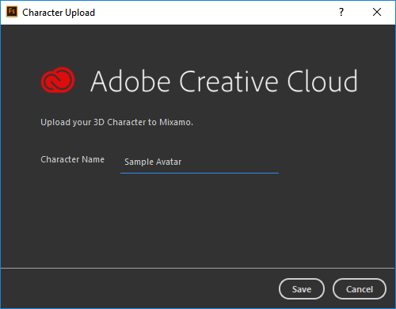
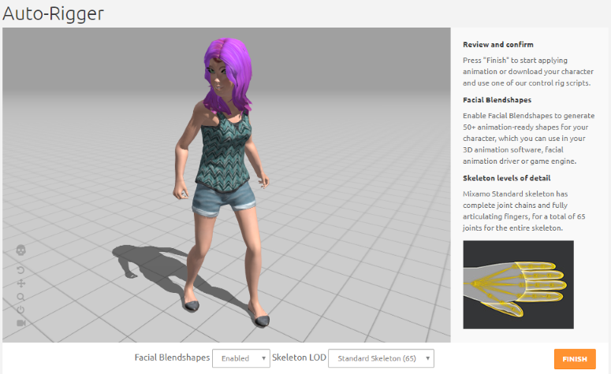
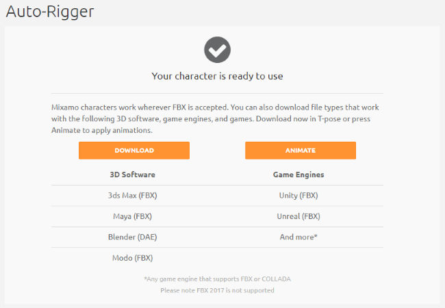

# Tutorial: Rig Avatars in Mixamo

Mixamo is a rigging system that will rig your model's skeleton automatically for you. You do not need any advanced knowledge of rigging to create simple animations for your avatar. 

In this tutorial, we will use the avatar that we [created in Adobe Fuse](fuse-tutorial). 

1. Open your avatar in Adobe Fuse.
2. Go to **File > Animate with Mixamo**.
3. Save your avatar with a name and wait while it is exported to the auto-rigger.

    
Note

    
Mixamo's auto-rigger will create a custom skeleton for your avatar so you can start animating. The auto-rigger algorithm can take up to 2 minutes, so be patient!

4. Once your avatar is processed, Mixamo's auto-rigger will show your animated avatar. Ensure that Facial Blendshapes are 'Enabled' and Skeleton LOD has been set to 'Standard'. These settings ensure that your avatar will work property in High Fidelity. 
5. If you made changes to your settings, click 'Update Rig'. Mixamo will re-process your avatar with these updates.
6. Click 'Finish' to start applying animation.
7. Once your avatar has been successfully rigged, you can download it and modify it further using a 3D software of your choice. When prompted, select Format as 'FBX' and Pose as 'T-pose'. 

**See Also**

+ [Tutorial: Create an Avatar with Fuse](fuse-tutorial)
+ [Tutorial: Modify Materials and Textures Using Blender](blender-tutorial)
+ [Create Your Own Avatar](create-avatars)