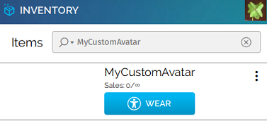

##################################
Package and Host Your Avatar
##################################

At a minimum, avatars in High Fidelity must have an FBX model and an associated FST file that includes information about how your avatar looks and behaves. Together, these two files (with any optional texture or script) form an "avatar package". There are two ways you can create an avatar package: by using the `Avatar Packager`_ in Interface or the `High Fidelity Avatar Exporter for Unity`_ in Unity.

Once you have packaged your avatar, you need to host it on the cloud so that High Fidelity can access it and correctly render your avatar for all users.

.. contents:: On This Page
    :depth: 2

---------------------------
Package Your Avatar
---------------------------

If you're reading this page, you likely already :doc:`built your own FBX model <create-avatars>` or :doc:`found and downloaded a model <find-avatars>` that you want to use in High Fidelity. Therefore, all that remains is to package your avatar and create the FST file. This file includes information about the skeleton, blendshapes, textures, and scripts used by your avatar.

We provide two ways to create an avatar package: either through Unity or through our Avatar Packager.

^^^^^^^^^^^^^^^^^^^^^^^^^^^^^^^^^^^^^^^^^^
High Fidelity Avatar Exporter for Unity
^^^^^^^^^^^^^^^^^^^^^^^^^^^^^^^^^^^^^^^^^^

In some cases, you will want to :doc:`download an avatar from an external website <find-avatars>` and use that avatar in High Fidelity. The High Fidelity Avatar Exporter for Unity (also known as the "avatar exporter") converts human-like avatars and packages them for use in High Fidelity. 

Once you have successfully used the :doc:`avatar exporter <find-avatars>` to package your avatar, you must host it somewhere on the cloud. You can host it on our servers (using the Avatar Packager), or simply copy the avatar package to your own servers. 

^^^^^^^^^^^^^^^^^^^^^^^^^^
Avatar Packager
^^^^^^^^^^^^^^^^^^^^^^^^^^

The **Avatar Packager** is a tool in Interface that identifies potential errors in your avatar's FBX model and then creates an FST file for you. Then, you can optionally use the Avatar Packager to upload your avatar to the Marketplace and host it on our servers. 

To package your avatar using the Avatar Packager:

1. In Interface, go to **Edit > Avatar Packager**. 
2. In the Avatar Packager window, click 'New Project'.
3. In the Create Project window, fill in the following details:

   * Name: The name you want for your avatar. 
   * Project Location: The folder path where your avatar's files are stored. The Avatar Packager will create a new folder for your project at this location. The package will contain your FBX model, an FST file, and any scripts/textures in your avatar.
   * Avatar Model: The location of your avatar's FBX model.
   * Texture Folder: If your avatar has textures in a separate folder, specify the folder location. If your avatar's textures are embedded in the FBX, you do not need to specify anything. 
4. Click 'Create'.

At this point, you have successfully packaged your avatar. If you choose to host your avatar on the cloud with your own servers (and not use High Fidelity's servers), you can close the Avatar Packager here and upload your FST file and FBX model to the cloud location of your choice. 

---------------------------
Host Your Avatar
---------------------------

Before you can use a custom avatar, you must first host its FST and FBX files in a place that is publicly accessible to High Fidelity. We recommend hosting them on our own servers using the **Avatar Packager**, but you can also use any cloud platform including Amazon S3, Google Cloud Storage, Microsoft Azure, Dropbox, etc.

If you want to upload it to High Fidelity's servers or sell your avatar on the Marketplace, use the Avatar Packager:

1. If this is a new avatar, first use the `Avatar Packager`_ to create an FST file. When you proceed with Step 3 below, you will upload this new project to our servers.
2. If you want to host an avatar that has already been packaged: 

    1. In Interface, go to **Edit > Avatar Packager**. 
    2. In the Avatar Packager window that opens, click 'Open Project'.
    3. Navigate to your FST file and click 'Open'.
3. Click 'Upload' to upload your avatar's files to High Fidelity's servers. The `Avatar Packager <#troubleshooting-with-the-avatar-packager>`_ will display any errors or warnings that you may want to resolve prior to uploading. View `Troubleshooting with the Avatar Packager`_ to determine whether a fix is required to have a usable avatar. 
4. Once your avatar is uploaded to the servers, click 'View in Inventory' to view your custom avatar. Unless you submit it for review, your custom avatar will remain in Draft mode, and will not be visible to others. To sell your avatar, you need to submit it for review on the Marketplace.

.. note:: If you make any changes to your custom avatar, you will need to update it through the Avatar Packager to see your changes. To update, select your project and click 'Open Project' in step 1. Follow the same steps to update your avatar.

-------------------------------------------
Troubleshooting with the Avatar Packager 
-------------------------------------------

The Avatar Packager will notify you of any errors or warnings that may affect the way your avatar looks and behaves in High Fidelity. This is a list of the errors you may encounter, along with basic instructions on how to fix your avatar. **Errors** (in red) must be fixed before you upload your avatar, while **Warnings** (in orange) may or may not affect whether your avatar will show up and behave correctly in High Fidelity.

.. note:: 

    Many of the errors you will encounter describe issues with the avatar's skeleton. The troubleshooting tips below will attempt to fix the errors in Unity. 
    
    However, if the bone structure of the model does not resemble a humanoid skeleton (with two legs, two arms, hips, chest, spine, and head), then it is likely not compatible with High Fidelity. You will not be able to fix these avatars in Unity alone. Instead, you will likely need advanced knowledge of building, rigging, and mapping bones in a 3D modeling tool such as Blender or Maya. 

.. raw:: html

    <table border="1" class="docutils">
        <colgroup>
            <col width="35%">
            <col width="65%">
        </colgroup>
        <thead>
            <tr>
                <th class="head">Error</th>
                <th class="head">How to Fix</th>
            </tr>
        </thead>
        <tbody>
            <tr>
                <td>
                    
<strong>Hips are not mapped</strong>

                    
This error occurs when there is no "hip" bone identified in your avatar's skeleton.

                </td>
                <td>
                    <ol class="first arabic simple">
                        <li>Import your FBX model into a Unity project.</li>
                        <li>Install the <a href="find-avatars.html#install-the-avatar-exporter">avatar exporter</a> for Unity.</li>
                        <li>Ensure that your avatar is 'Humanoid' (in Unity, go to <strong>Inspector > Rig > Animation Type > Humanoid</strong>).</li>
                        <li>Click 'Configure' to open the skeleton mapping configuration.</li>
                        <li>Click the 'Body' button next to the humanoid illustration.</li>                        
                        <li>Locate 'Hips' and drag the appropriate bone from the Hierarchy window to map it.</li>
                    </ol>
                    
If an appropriate bone does not exist, or this does not resolve the issue, you will need to fix the avatar's skeleton in a 3D modeling tool of your choice.

                </td>
            </tr>
            <tr>
                <td>
                    
<strong>Spine is not mapped</strong>

                    
This error occurs when there is no "spine" bone identified in your avatar's skeleton.

                </td>
                <td>
                    <ol class="first arabic simple">
                        <li>Import your FBX model into a Unity project.</li>
                        <li>Install the <a href="find-avatars.html#install-the-avatar-exporter">avatar exporter</a> for Unity.</li>
                        <li>Ensure that your avatar is 'Humanoid' (in Unity, go to <strong>Inspector > Rig > Animation Type > Humanoid</strong>).</li>
                        <li>Click 'Configure' to open the skeleton mapping configuration.</li>
                        <li>Click the 'Body' button next to the humanoid illustration.</li>                        
                        <li>Locate 'Spine' and drag the appropriate bone from the Hierarchy window to map it.</li>
                    </ol>
                    
If an appropriate bone does not exist, or this does not resolve the issue, you will need to fix the avatar's skeleton in a 3D modeling tool of your choice.
                
                </td>
            </tr>
            <tr>
                <td>
                    
<strong>Chest (Spine1) is not mapped</strong>

                    
This error occurs when there is no "chest" bone identified in your avatar's skeleton.
                    
                </td>
                <td>
                    <ol class="first arabic simple">
                        <li>Import your FBX model into a Unity project.</li>
                        <li>Install the <a href="find-avatars.html#install-the-avatar-exporter">avatar exporter</a> for Unity.</li>
                        <li>Ensure that your avatar is 'Humanoid' (in Unity, go to <strong>Inspector > Rig > Animation Type > Humanoid</strong>).</li>
                        <li>Click 'Configure' to open the skeleton mapping configuration.</li>
                        <li>Click the 'Body' button next to the humanoid illustration.</li>                        
                        <li>Locate 'Chest' and drag the appropriate bone from the Hierarchy window to map it.</li>
                    </ol>
                    
If an appropriate bone does not exist, or this does not resolve the issue, you will need to fix the avatar's skeleton in a 3D modeling tool of your choice.
                
                </td>
            </tr>
            <tr>
                <td>
                    
<strong>Head is not mapped</strong>

                    
This error occurs when there is no "head" bone identified in your avatar's skeleton.

                </td>
                <td>
                    <ol class="first arabic simple">
                        <li>Import your FBX model into a Unity project.</li>
                        <li>Install the <a href="find-avatars.html#install-the-avatar-exporter">avatar exporter</a> for Unity.</li>
                        <li>Ensure that your avatar is 'Humanoid' (in Unity, go to <strong>Inspector > Rig > Animation Type > Humanoid</strong>).</li>
                        <li>Click 'Configure' to open the skeleton mapping configuration.</li>
                        <li>Click the 'Head' button next to the humanoid illustration.</li>                        
                        <li>Locate 'Head' and drag the appropriate bone from the Hierarchy window to map it.</li>
                    </ol>
                    
If an appropriate bone does not exist, or this does not resolve the issue, you will need to fix the avatar's skeleton in a 3D modeling tool of your choice.
                
                </td>
            </tr>
            <tr>
                <td>
                    
<strong>Neck is not mapped</strong>

                    
This warning occurs when there is no "neck" bone identified in your avatar's skeleton.

                </td>
                <td>
                    <ol class="first arabic simple">
                        <li>Import your FBX model into a Unity project.</li>
                        <li>Install the <a href="find-avatars.html#install-the-avatar-exporter">avatar exporter</a> for Unity.</li>
                        <li>Ensure that your avatar is 'Humanoid' (in Unity, go to <strong>Inspector > Rig > Animation Type > Humanoid</strong>).</li>
                        <li>Click 'Configure' to open the skeleton mapping configuration.</li>
                        <li>Click the 'Head' button next to the humanoid illustration.</li>
                        <li>Locate 'Neck' and drag the appropriate bone from the Hierarchy window to map it.</li>
                    </ol>
                    
If an appropriate bone does not exist, or this does not resolve the issue, you will need to fix the avatar's skeleton in a 3D modeling tool of your choice.
                
                </td>
            </tr>
            <tr>
                <td>
                    
<strong>LeftEye is not mapped&nbsp;| RightEye is not mapped | Eyes are not mapped</strong>

                    
This warning occurs when there is one or more missing "eye" bones in your avatar's skeleton.

                </td>
                <td>
                    <ol class="first arabic simple">
                        <li>Import your FBX model into a Unity project.</li>
                        <li>Install the <a href="find-avatars.html#install-the-avatar-exporter">avatar exporter</a> for Unity.</li>
                        <li>Ensure that your avatar is 'Humanoid' (in Unity, go to <strong>Inspector > Rig > Animation Type > Humanoid</strong>).</li>
                        <li>Click 'Configure' to open the skeleton mapping configuration.</li>
                        <li>Click the 'Head' button next to the humanoid illustration.</li>
                        <li>Locate the faulty 'Eye' joint and drag the appropriate bone from the Hierarchy window to map it.</li>
                    </ol>
                    
If an appropriate bone does not exist, or this does not resolve the issue, you will need to fix the avatar's skeleton in a 3D modeling tool of your choice.
                                                
                </td>
            </tr>
            <tr>
                <td>
                    
<strong>Multiple top-level joints found</strong>

                    
High Fidelity's standard avatar skeleton has one root bone (typically the hips) that every other bone is connected to, either directly or indirectly. This bone is known as the "parent", "root", or "top-level" bone and it defines the center of your avatar. <a href="avatar-standards.html#skeleton">Click here to view our standard avatar skeleton.</a>

                    
This error occurs when you have more than one of these "top-level" bones defined in your avatar's skeleton. Rather than a hierarchy of joints, you will likely see many bones at the same root level in your skeleton.

                </td>
                <td>
                    
In Unity, check your avatar's skeleton in the Hierarchy window. In some cases, having multiple bones at the root level won't affect your avatar, especially if they are unimportant bones (for example, the tongue bone probably will not affect the overall appearance of your avatar). In these cases, you can simply ignore the error and proceed with packaging and hosting your avatar.

                    
If you have multiple "top-level" bones that are important (for example, if the hips and neck bone are at the same level), then you will need to fix the avatar's skeleton in a 3D modeling tool of your choice.

                    </td>
            </tr>
            <tr>
                <td>
                    
<strong>&lt;boneName&gt; is mapped multiple times</strong>

                    
This warning occurs when one of your avatar's bones is mapped multiple times in your skeleton. For example, a back bone may be mapped to both the spine and the hips. 

                </td>
                <td>
                    <ol class="first arabic simple">
                        <li>Import your FBX model into a Unity project.</li>
                        <li>Install the <a href="find-avatars.html#install-the-avatar-exporter">avatar exporter</a> for Unity.</li>
                        <li>Ensure that your avatar is 'Humanoid' (in Unity, go to <strong>Inspector > Rig > Animation Type > Humanoid</strong>).</li>
                        <li>Click 'Configure' to open the skeleton mapping configuration.</li>
                        <li>Locate the duplicate mapping in Humanoid and delete it. </li>
                        <li>If it is a required bone (such as hips, spine, chest, or head), then locate the correct bone in the Hierarchy window. Drag it to the Humanoid mapping.</li>
                    </ol>
                    
If an appropriate bone does not exist, or this does not resolve the issue, you will need to fix the avatar's skeleton in a 3D modeling tool of your choice.
                                                
                </td>
            </tr>
            <tr>
                <td>
                    
<strong>Asymmetrical arm/leg/hand bones</strong>

                    
We assume that the left and right appendages (arms, legs, and hands) have the same number of bones. This warning occurs if we detect a different number of bones on the left and rights sides of the body.

                </td>
                <td>
                    <ol class="first arabic simple">
                        <li>Import your FBX model into a Unity project.</li>
                        <li>Install the <a href="find-avatars.html#install-the-avatar-exporter">avatar exporter</a> for Unity.</li>
                        <li>Ensure that your avatar is 'Humanoid' (in Unity, go to <strong>Inspector > Rig > Animation Type > Humanoid</strong>).</li>
                        <li>Click 'Configure' to open the skeleton mapping configuration.</li>
                        <li>For arm and leg warnings, click the 'Body' button next to the humanoid illustration. For hand warnings, click the appropriate 'Hand' button next to the humanoid illustration.</li>
                        <li>Compare the left and right side. If the number of bones on the sides do not match, then locate and drag the appropriate bone from the Hierarchy window to map it. </li>
                    </ol>
                </td>
            </tr>
            <tr>
                <td>
                    
<strong>Spine is not a child of Hips</strong>

                    
High Fidelity's standard avatar skeleton has one root bone, and every other bone is a descendent of that bone (either directly or indirectly). In the standard skeleton, the spine must be a direct descendent of the hips. <a href="avatar-standards.html#skeleton">Click here to view our standard avatar skeleton.</a>

                    
This warning occurs when the spine is not a direct descendent of the hip bone. 
                    
                </td>
                <td>
                    <ol class="first arabic simple">
                        <li>Import your FBX model into a Unity project.</li>
                        <li>Install the <a href="find-avatars.html#install-the-avatar-exporter">avatar exporter</a> for Unity.</li>
                        <li>Ensure that your avatar is 'Humanoid' (in Unity, go to <strong>Inspector > Rig > Animation Type > Humanoid</strong>).</li>
                        <li>Click 'Configure' to open the skeleton mapping configuration.</li>
                        <li>Click the 'Body' button next to the humanoid illustration, and click on the 'Hips' mapping. This will highlight the mapped bone in the Hierarchy window.</li>
                        <li>Now click on the 'Spine' mapping. The highlighted bone should be directly below the Hips bone. If it is not, then locate and drag the appropriate bone from the Hierarchy window to map it. </li>
                    </ol>
                    
If the appropriate bones are mapped to the Hips and Spine, or this does not resolve the issue, you will need to fix the avatar's hierarchy in a 3D modeling tool of your choice.

                </td>
            </tr>
            <tr>
                <td>
                    
<strong>Spine1 is not a child of Spine</strong>

                    
High Fidelity's standard avatar skeleton has one root bone, and every other bone is a descendent of that bone (either directly or indirectly). In the standard skeleton, the chest bone (or Spine1) must be a direct descendent of the spine. <a href="avatar-standards.html#skeleton">Click here to view our standard avatar skeleton.</a>

                    
This warning occurs when the chest is not a direct descendent of the spine bone. 
                                        
                </td>
                <td>
                    <ol class="first arabic simple">
                        <li>Import your FBX model into a Unity project.</li>
                        <li>Install the <a href="find-avatars.html#install-the-avatar-exporter">avatar exporter</a> for Unity.</li>
                        <li>Ensure that your avatar is 'Humanoid' (in Unity, go to <strong>Inspector > Rig > Animation Type > Humanoid</strong>).</li>
                        <li>Click 'Configure' to open the skeleton mapping configuration.</li>
                        <li>Click the 'Body' button next to the humanoid illustration, and click on the 'Spine' mapping. This will highlight the mapped bone in the Hierarchy window.</li>
                        <li>Now click on the 'Chest' mapping. The highlighted bone should be directly below the Spine bone. If it is not, then locate and drag the appropriate bone from the Hierarchy window to map it. 
                    </ol>
                    
If the appropriate bones are mapped to the Spine and Chest (Spine1), or this does not resolve the issue, you will need to fix the avatar's bone hierarchy in a 3D modeling tool of your choice.

                </td>
            </tr>
            <tr>
                <td>
                    
<strong>Head is not a child of Spine1</strong>

                    
High Fidelity's standard avatar skeleton has one root bone, and every other bone is a descendent of that bone (either directly or indirectly). In the standard skeleton, the head bone must be a direct descendent of the chest (or Spine1). <a href="avatar-standards.html#skeleton">Click here to view our standard avatar skeleton.</a>

                    
This warning occurs when the head is not a direct descendent of the chest bone. 
                                        
                </td>
                <td>
                    <ol class="first arabic simple">
                        <li>Import your FBX model into a Unity project.</li>
                        <li>Install the <a href="find-avatars.html#install-the-avatar-exporter">avatar exporter</a> for Unity.</li>
                        <li>Ensure that your avatar is 'Humanoid' (in Unity, go to <strong>Inspector > Rig > Animation Type > Humanoid</strong>).</li>
                        <li>Click 'Configure' to open the skeleton mapping configuration.</li>
                        <li>Click the 'Body' button next to the humanoid illustration, and click on the 'Chest' mapping. This will highlight the mapped bone in the Hierarchy window.</li>
                        <li>Now click the 'Head' button, and click on the 'Head' mapping. The highlighted bone should be below the Chest bone. If it is not, then locate and drag the appropriate bone from the Hierarchy window to map it. 
                    </ol>
                    
If the appropriate bones are mapped to the Chest (Spine1) and Head, or this does not resolve the issue, you will need to fix the avatar's bone hierarchy in a 3D modeling tool of your choice.

                </td>
            </tr>
            <tr>
                <td>
                    
<strong>Hips are on ground</strong>

                    
This warning occurs when the bone mapped to the Hips is on the ground, rather than at hip level.

                </td>
                <td>
                    <ol class="first arabic simple">
                        <li>Import your FBX model into a Unity project.</li>
                        <li>Install the <a href="find-avatars.html#install-the-avatar-exporter">avatar exporter</a> for Unity.</li>
                        <li>Ensure that your avatar is 'Humanoid' (in Unity, go to <strong>Inspector > Rig > Animation Type > Humanoid</strong>).</li>
                        <li>Click 'Configure' to open the skeleton mapping configuration.</li>
                        <li>Click the 'Body' button next to the humanoid illustration.</li>
                        <li>Locate the 'Hips' mapping. This is the one with an incorrect mapping.</li>
                        <li>Drag the appropriate bone from the Hierarchy window to re-map it. </li>
                    </ol>
                    
If the appropriate bone is mapped to the Hips, or this does not resolve the issue, you will need to fix the avatar's bone placement in a 3D modeling tool of your choice.

                </td>
            </tr>
            <tr>
                <td>
                    
<strong>Hips/Spine/Chest Overlap</strong>

                    
High Fidelity's standard avatar skeleton requires that each bone is placed at different locations on the body. For example, the hips cannot be positioned at the same location as the chest. This error occurs when either the hips, spine, and/or chest bones have overlapping positions.

                </td>
                <td>
                    <ol class="first arabic simple">
                        <li>Import your FBX model into a Unity project.</li>
                        <li>Install the <a href="find-avatars.html#install-the-avatar-exporter">avatar exporter</a> for Unity.</li>
                        <li>Ensure that your avatar is 'Humanoid' (in Unity, go to <strong>Inspector > Rig > Animation Type > Humanoid</strong>).</li>
                        <li>Click 'Configure' to open the skeleton mapping configuration.</li>
                        <li>Click the 'Body' button next to the humanoid illustration, then click on the bone you want to reposition.</li>
                        <li>In the Scene window, arrows will appear around the bone you have selected. Make minor adjustments to the bone's position using these arrows, until each bone is at its own unique position on the avatar.</li>
                    </ol>
                    
If this does not resolve the issue, you will need to fix the avatar's bone placement in a 3D modeling tool of your choice.
                
                </td>
            </tr>
            <tr>
                <td>
                    
<strong>Avatar has over 256 bones</strong>

                    
This warning occurs when you have more than the maximum number of bones allowed (which is 256 bones).

                </td>
                <td>
                    
This warning cannot be resolved in Unity or High Fidelity. To fix it, you need to remove bones from your skeleton using a 3D modeling tool of your choice.

                </td>
            </tr>
            <tr>
                <td>
                    
<strong>Missing # texture(s)</strong>

                    
This warning occurs when High Fidelity cannot find textures for your avatar. This will affect the appearance of your avatar, and it may appear grey when you try to use it.

                </td>
                <td>
                    
After you package your avatar, copy all external textures to the 'Textures' folder that we create for you. Then, update your project using the Avatar Packager.

                </td>
            </tr>
             <tr>
                <td>
                    
<strong># unsupported texture(s) found</strong>

                    
This warning occurs when your textures are not supported by High Fidelity. Supported image formats include BMP, JPG, PNG, PBM, PGM, PPM, XBM, XPM, SVG, GIF, ICNS, JP2, MNG, TGA, TIFF, WPMB, and WEBP files.

                </td>
                <td>
                    <ol class="first arabic simple">
                        <li>Open your textures in an image editor of your choice.</li>
                        <li>Export the textures to a supported format.</li>
                        <li>Set the new texture to your avatar using Unity's <a href="https://docs.unity3d.com/Manual/Shaders.html">Material Editor</a> or a 3D modeling tool of your choice.</li>
                    </ol>
                </td>
            </tr>
            <tr>
                <td>
                    
<strong>No textures assigned</strong>

                    
This warning occurs when you do not have any textures embedded in your model or referenced in your FST file. If your avatar was intentionally designed without textures, this warning can be safely ignored.

                </td>
                <td>
                    <ol class="first arabic simple">
                        <li>Import your FBX model into a Unity project.</li>
                        <li>Install the <a href="find-avatars.html#install-the-avatar-exporter">avatar exporter</a> for Unity.</li>
                        <li>Go to <strong>Inspector > Materials</strong>.</li>
                        <li>Change the 'Location' to 'Use External Materials (Legacy)'. Click 'Apply'. This creates a Materials folder. </li>
                        <li>Copy your textures into the new Materials folder. 
                        <li>Select a material to view its shader in the **Inspector** window. Click and drag your textures to configure them. </li>
                    </ol>
                    
For more information, see Unity's help on their <a href="https://docs.unity3d.com/Manual/Shaders.html">Material Editor</a>. You can alternatively use a 3D modeling tool of your choice to assign materials and textures to your avatar.

                </td>
            </tr>
            <tr>
                <td>
                    
<strong>Model file cannot be opened</strong>

                    
This warning occurs when your avatar package is missing either an FBX or FST file. 

                </td>
                <td>
                    <ol class="first arabic simple">
                        <li>In a file explorer, open your avatar package folder.</li>
                        <li>
                            
Ensure that your avatar package has both an FST and FBX file.

                            <ul class="first arabic simple">
                                <li>If you are missing your FBX file, locate it and copy it back into this folder.</li>
                                <li>If you are missing an FST file, <a href="#package-your-avatar">re-package your avatar</a> using either the High Fidelity Exporter Avatar Exporter for Unity or the Avatar Packager.</li>
                            </ul>
                        </li>
                        <li>If both files are there and you still receive this error, open the FST file in a text editor of your choice. </li>
                        <li>Locate the line <code>filename = </code>, and ensure that the path to your FBX file is correct. </li>
                    </ol>
                </td>
            </tr>
            <tr>
                <td>
                    
<strong>Unsupported avatar model format</strong>

                    
This warning occurs when your avatar model is not a supported format. High Fidelity only supports FBX models for avatars.
                </td>
                <td>
                    
This warning cannot be resolved in Unity or High Fidelity. To fix it, you need to open your model in the 3D modeling tool of your choice, and export your model as an FBX model. 

                </td>
            </tr>
            <tr>
                <td>
                    
<strong>Avatar is possibly too short</strong>

                    
This warning occurs when High Fidelity detects that your avatar will appear very small when you use it.

                </td>
                <td>
                    <ol class="first arabic simple">
                        <li>Import your FBX model into a Unity project.</li>
                        <li>Install the <a href="find-avatars.html#install-the-avatar-exporter">avatar exporter</a> for Unity.</li>
                        <li>From the High Fidelity menu, click 'Export New Model'.</li>
                        <li>Slide the scale slider to the right to increase the size of your avatar.</li>
                    </ol>
                </td>
            </tr>
            <tr>
                <td>
                    
<strong>Avatar is possibly too tall</strong>

                    
This warning occurs when High Fidelity detects that your avatar will appear very large when you use it.
                    
                </td>
                <td>
                     <ol class="first arabic simple">
                        <li>Import your FBX model into a Unity project.</li>
                        <li>Install the <a href="find-avatars.html#install-the-avatar-exporter">avatar exporter</a> for Unity.</li>
                        <li>From the High Fidelity menu, click 'Export New Model'.</li>
                        <li>Slide the scale slider to the left to decrease the size of your avatar.</li>
                    </ol>
               </td>
            </tr>
            <tr>
                <td>
                    
<strong>Avatar has no rig</strong>

                    
This warning occurs when your avatar is not rigged.

                </td>
                <td>
                    
This warning cannot be resolved in Unity or High Fidelity. To fix it, we recommend running your avatar model through an auto-rigging tool such as Mixamo. 

                </td>
            </tr>
       </tbody>
    </table>

