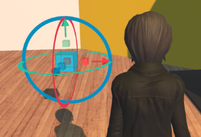

# Define Interactions with Avatars

In real life, you interact with objects on a daily basis. In High Fidelity, your avatar can also interact with objects (entities) in the metaverse. There are a number of ways you can define the interactions you have with objects: you can write scripts to change the properties of an entity. You can create entities that are unique to your avatar (we call these "avatar entities"). And don't forget that you can set an entity's behavior and collision properties, so that objects are grabbable, triggerable, or dynamic.

**On This Page:**
+ [Control Interactions with Entities using Scripts](#control-interactions-with-entities-using-Scripts)
+ [Create Avatar Entities](#create-avatar-entities)

## Control Interactions with Entities using Scripts

When your avatar comes in contact with an entity, you can control its interactions with the entity using simple scripts. 

An interaction between an avatar and an entity occurs when the avatar comes in contact with an entity's bounding box. The bounding box (or bounds) is the frame that is around the outside of the entity. In the case of a cube, the bounds are the exact size and shape as the entity. However, in the case of more complex objects, the bounds might be larger than the actual mesh model.  

There are two methods you can use to script these interactions. [`Entities.enterEntity()`](https://apidocs.highfidelity.com/Entities.html#.enterEntity) occurs when the avatar contacts the bounding box, not the model itself. Similarly, [`Entities.leaveEntity()`](https://apidocs.highfidelity.com/Entities.html#.leaveEntity) occurs when the avatar exits the bounding box.

### Tutorial: Enter a Box to Change Its Color

The following example walks you through the process of creating a simple entity, and scripting an interaction between the entity and your avatar. When your avatar comes in contact with the box, the box will change color. When your avatar moves away, the box will return to its original color. 

1. [Create a cube entity](create-entities.html).  
2. The following script changes the color of the cube as you approach (yellow) or leave (pink) its bounding box. Save it to a file called `interactions-example.js`.
    ```javascript
    (function(){
        this.enterEntity = function(entityID) {
            Entities.editEntity(entityID, {
                color: { red: 255, green: 64, blue: 64 },
            });
        };
        this.leaveEntity = function(entityID) {
            Entities.editEntity(entityID, { 
                color: { red: 255, green: 190, blue: 20}
            });
        };
    });
    ```
3. In the **Create** app, click on 'Properties' and scroll down to the 'Script' settings. Enter the path and file name to `interactions-example.js` that you created above. Press 'Enter'. 

A full range of entity parameters are controllable with these functions. Entities can be used as invisible sensors or expanded to cover an entire building with the functions running while you are inside, and stop when you walk out.


## Create Avatar Entities

Your avatar will also interact with avatar entities. Avatar entities are entities that are attached to your avatar, and unlike domain entities, they travel with your avatar when you go to other domains. Examples of avatar entities include wearables such as glasses or hats.

Avatar entities live on the [Avatar Mixer](../../explore/get-started/architecture.html#assignment-clients), so they are connected to (and move with) your avatar. We've listed the ways you can create avatar entities with some examples:

1. [Create a wearable:](../wearables.html) All wearables are avatar entities. 
2. [Clone as an avatar entity:](entity-behavior.html#make-an-entity-cloneable) When you clone an entity as an avatar entity, you make a copy of the entity and attach it to your avatar. Every copy of that entity will now leave with the avatar when they leave the domain. For example, if you have a coffee shop in your domain, you can set all coffee cups to be cloned as avatar entities. Any user who clones a coffee cup will take the avatar entity with them when they exit the domain. You can keep your domain free of clutter using this property.
3. Add an avatar entity using a script: You can add an avatar entity using scripts. For example, you can create a script to have a pet (avatar entity) follow you around as you explore High Fidelity. 

    This example script adds a cube as an avatar entity to your domain. 
    ```
    var entityID = Entities.addEntity({
        type: "Box",
        position: Vec3.sum(MyAvatar.position, Quat.getFront(MyAvatar.orientation))},
        "avatar");
    ```


**See Also**

+ [Define an Entity's Behavior](entity-behavior.html)
+ [Interact with Your Environment](../../explore/interact.html)
+ [API Reference: Entities](https://apidocs.highfidelity.com/Entities.html)
+ [Get Started with Scripting](../../script/get-started-with-scripting.html)
