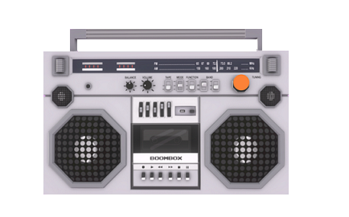

.. warning::
    This document is outdated.
    FIXME: Mentions HiFi hosted content, mentions Oculus Quest even though it is not supported yet

##############################
Tutorial: Create a Boombox
##############################

You can create a music player that plays all your favorite tracks and also syncs the audio for other users in your domain. 

.. contents:: On This Page
    :depth: 2

----------------------
Prerequisites
----------------------

- :doc:`Create New Entities <create-entities>`
- :doc:`Change How Entities Look <entity-appearance>`
- :doc:`Define an Entity's Behavior <entity-behavior>`
- :doc:`Get Started with Scripting <../../script/get-started-with-scripting>`
- :doc:`Client Entity Scripts <../../script/client-entity-scripts>`
- :doc:`Write Your Own Scripts <../../script/write-scripts>`

------------------------------
Create a Boombox Entity
------------------------------

Your BoomBox will consist of:

+ A boombox base model: A model entity that runs an entity server script.
+ An 'ON/OFF' button: A child entity runs a client entity script to allow users to interact with the boombox. 

The boombox will start playing when users click or trigger the ON/OFF button.

To create a boombox:

1. In Interface, pull up your HUD or Tablet and go to **Create**.
2. Use the **Create** app to :doc:`import the 3D model entity <../3d-models/import-model>`. You can create your own 3D model for the boombox base or `use one we've created <https://github.com/misslivirose/happy-boombox/blob/master/BoomBox.fbx>`_.
3. Next, :doc:`create the button entity <create-entities>` that users will interact with. This can be a cube entity.
4. Go to 'Properties' tab for the button entity. Change the 'Shape' property from 'Box' to 'Octagon' or 'Cylinder' depending on your aesthetic preferences.
5. Scroll down to the 'Behavior' section and ensure that 'Grabbable' and 'Triggerable' are checked. 
6. Scale, rotate, and move your button to align it to the desired position on the model. 

7. With the **Create** app open, select the 3D model of the boombox. Go to the 'Properties' tab and copy the 'ID' under 'Name'.
8. Select the cube entity you created, go to the 'Properties' tab, and paste the copied entity ID in the 'Parent' field. This makes your boombox model entity the parent of your button entity.

-----------------------------------
Add User Data to Your Boombox
-----------------------------------

The User Data property is a JSON object that can be customized to fit the needs of a script. User Data also helps in synchronizing and keeping variables the same for all users in a domain. In this case, User Data will contain:

+ Song List: All URLs of the songs you want played on your boombox. You can also use MP3 or WAV files stored on your local machine.
+ Music player volume information: You can change this as per your preference.

.. note:: 

    User Data can store information only up to a certain size. We recommend keeping the limit of 10 songs. We support the following formats:
    
    * WAV: 16-bit uncompressed WAV at any sample rate, with 1 (mono), 2(stereo), or 4 (ambisonic) channels.
    * MP3: Mono or stereo, at any sample rate.
    * RAW: 48khz 16-bit mono or stereo. Filename must include ".stereo" to be interpreted as stereo.

To add User Data to your boombox:

1. In Interface, pull up your HUD or Tablet and go to **Create**.
2. Select your boombox entity, not the button. 
3. Go to the 'Properties' tab. Scroll down to 'User Data' and paste the following JSON information. This JSON data consists of 10 songs and the volume setting. You can use your own songs and change the volume setting::

    {
      "grabbableKey": {
        "grabbable": false
      },
      "music": {
        "All That": "https://hifi-content.s3-us-west-1.amazonaws.com/liv/dev/BoomBox/music/bensound-allthat.mp3",
        "Country Boy": "https://hifi-content.s3-us-west-1.amazonaws.com/liv/dev/BoomBox/music/bensound-countryboy.mp3",
        "Cute": "https://hifi-content.s3-us-west-1.amazonaws.com/liv/dev/BoomBox/music/bensound-cute.mp3",
        "Happiness": "https://hifi-content.s3-us-west-1.amazonaws.com/liv/dev/BoomBox/music/bensound-happiness.mp3",
        "Happy Rock": "https://hifi-content.s3-us-west-1.amazonaws.com/liv/dev/BoomBox/music/bensound-happyrock.mp3",
        "High Octane": "https://hifi-content.s3-us-west-1.amazonaws.com/liv/dev/BoomBox/music/bensound-highoctane.mp3",
        "Hip Jazz": "https://hifi-content.s3-us-west-1.amazonaws.com/liv/dev/BoomBox/music/bensound-hipjazz.mp3",
        "Pop Dance": "https://hifi-content.s3-us-west-1.amazonaws.com/liv/dev/BoomBox/music/bensound-popdance.mp3",
        "Sci-Fi": "https://hifi-content.s3-us-west-1.amazonaws.com/liv/dev/BoomBox/music/bensound-scifi.mp3",
        "Sample": "sample.com"
      },
      "volume": 0.7
    }

--------------------------------
Write Music Player Scripts
--------------------------------

The boombox system contains the following scripts and files that allows a user to control audio playback:

+----------------------+---------------------------------------------------------+--------------------------------------+
| File                 | Description                                             | URL                                  |
+======================+=========================================================+======================================+
| Entity Server Script | This server script handles the state of the music       | `boomBoxEntityServerScript.js        |
|                      | player and plays audio back so that it is               | <https://raw.githubuser              |
|                      | synchronized across all users. Actions and behaviors    | content.com/misslivirose/            |
|                      | of entities that need to be in the same state for       | happy-boombox/master/boom            |
|                      | all users, should run on the server. The client         | BoxEntityServerScript.js>`_          |
|                      | script that runs on the button relays the requests      |                                      |
|                      | for each remotely callable function to execute on       |                                      |
|                      | the server, and the server script handles the audio     |                                      |
|                      | playback accordingly.                                   |                                      |
+----------------------+---------------------------------------------------------+--------------------------------------+
| Client Entity Script | This client script handles the interactions between     | `boomBoxEntityScript.js              |
|                      | users and displays the UI for controlling the boombox   | <https://raw.githubuser              |
|                      | via an HTML page using the Tablet Scripting Interface.  | content.com/misslivirose/            |
|                      | It listens for mouse clicks and controller triggers,    | happy-boombox/master/boom            |
|                      | displays the controls, and serves as a relay mechanic   | BoxEntityScript.js>`_                |
|                      | between the HTML page and the boombox entity server     |                                      |
|                      | script.                                                 |                                      |
+----------------------+---------------------------------------------------------+--------------------------------------+
| HTML and CSS         | The HTML page displays the controller UI for the        | `boomBoxController.html              |
|                      | boombox through the Tablet Scripting Interface and is   | <https://raw.githubusercontent       |
|                      | styled with CSS. It uses the `EventBridge` to send      | .com/misslivirose/happy-boom         |
|                      | the user input from the HTML elements to the boombox    | box/master/app/boomBoxControll       |
|                      | entity script, which in turns calls entity server       | er.html>`_                           |
|                      | methods depending on the `EventBridge` message          |                                      |
|                      | contents.                                               | `styles.css <https://raw.github      |
|                      |                                                         | usercontent.com/misslivirose/ha      |
|                      |                                                         | ppy-boombox/master/app/styles.css>`_ |
+----------------------+---------------------------------------------------------+--------------------------------------+

You can use the existing versions of our scripts, modify them, or :doc:`write your own scripts <../../script/write-scripts>`.

If you're using the existing versions of our scripts:

1. In Interface, pull up your HUD or Tablet and go to **Create**.
2. Select your boombox model and go to the 'Properties' tab. 
3. Scroll down to the 'Behavior' section and paste the `entity server script's URL <https://raw.githubusercontent.com/misslivirose/happy-boombox/master/boomBoxEntityServerScript.js>`_ into the 'Server Script' field. 
4. Select your button entity and go to the 'Properties' tab. 
5. Scroll down to the 'Behavior' section and paste the `client entity script's URL <https://raw.githubusercontent.com/misslivirose/happy-boombox/master/boomBoxEntityScript.js>`_ into the 'Script' field. 

If you're writing your own scripts or modifying the existing ones, and want to host these in the 'Asset Browser':

1. On your computer, create a folder called 'BoomBox'. You'll save your files here with the following structure. 

.. image:: _images/boombox-folder.png

2. Save the `entity server script <https://raw.githubusercontent.com/misslivirose/happy-boombox/master/boomBoxEntityServerScript.js>`_, `client entity script <https://raw.githubusercontent.com/misslivirose/happy-boombox/master/boomBoxEntityScript.js>`_, `HTML file <https://raw.githubusercontent.com/misslivirose/happy-boombox/master/app/boomBoxController.html>`_, and `CSS file <https://raw.githubusercontent.com/misslivirose/happy-boombox/master/app/styles.css>`_ to the folder in your computer.
3. In Interface, pull up your HUD or Tablet and go to **Create**.
4. In the **Create** app, click 'Open This Domain's Asset Server' to view the Asset Browser.
5. Create the same boombox directory in your 'Asset Browser' and upload your files.
6. Use the **Create** app and select your boombox model and go to the 'Properties' tab. 
7. Scroll down to the 'Behavior' section and paste the entity server script's URL into the 'Server Script' field. 
8. Use the **Create** app and select your button entity and go to the 'Properties' tab. 
9. Scroll down to the 'Behavior' section and paste the client entity script's URL into the 'Script' field. 

.. note:: 

    Some additional notes: 
    
    * The scripts linked above use relative paths to link to one another, so it’s important to preserve the folder structure given. If you want to move things around, make sure you also update the links in the scripts themselves to reference the new file location. 
    * If you want to make modifications to your script files, you will need to re-upload them to the asset browser. Reload all content and reload your entity server scripts to see changes take effect after modifying files.
    * Entity server scripts do not have access to mouse press or controller events, since these are all handled on the client side.
    * HTML pages will not render in the Oculus Quest, so only desktop users will be able to interact with the boombox controls.

**See Also**

- :doc:`Create New Entities <create-entities>`
- :doc:`Change How Entities Look <entity-appearance>`
- :doc:`Define an Entity's Behavior <entity-behavior>`
- :doc:`Get Started with Scripting <../../script/get-started-with-scripting>`
- :doc:`Client Entity Scripts <../../script/client-entity-scripts>`
- :doc:`Write Your Own Scripts <../../script/write-scripts>`
- :doc:`Interact with Your Environment <../../explore/interact>`