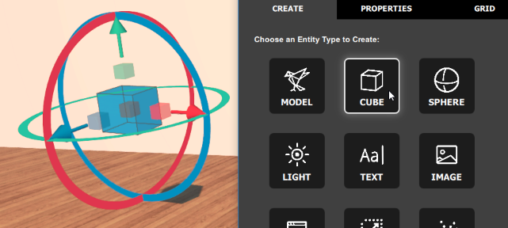

# Create New Entities

We are continually surprised by the ingenuity and creativity of the content creators in our community. You too can join this community by creating new entities. The easiest way to start building is to use Project Athena's **Create** app. 

    
Note

    
You can only use the <strong>Create</strong> app in domains where you have the permission to build. 

To add a new entity to your domain: 
1. In Interface, pull up your tablet or HUD and go to **Create**.
2. In the **Create** app, select the [type of entity](#types-of-entities) you want to create.
3. Depending on the entity type, the behavior will be different:  
	* For model and [material entities](material-entity.html), enter the URL that you want to import.  
	* For all other entities, an entity with the default settings will appear in front of your avatar.
4. Edit the properties of your entity so that it [looks](entity-appearance.html) and [behaves](entity-behavior.html) like you want it to.

## Types of Entities
You can choose from the following entity types:

(TODO: Each Entity should be explained in detail which each property. )
* **MODEL** entities are 3D models that you can import in-world.
* **CUBE** entities are used to create basic box shaped entities.
* **SPHERE** entities are used to create basic sphere shaped entities.
* **LIGHT** entities are balls or beams of light that are used to add local lighting effects and spotlights to an area.
* **TEXT** entities display text against a flat plane, similar to a whiteboard or blackboard.
* **IMAGE** entities display an image from a specified URL.
* **WEB** entities display a web page from a specified URL. Only 20 web entities can run at the same time in a domain. 
* **ZONE** entities are 3-dimensional areas that allow you to create a custom lighting environment.
* **PARTICLE** entities create dynamic effects that are made of many small parts, such as smoke clouds or falling water.
* **[MATERIAL](material-entity.html)** entities modify the existing materials on other entities and avatars.

**See Also**

+ [The Create App](../tools.html#the-create-app)
+ [Add a Material Entity](material-entity.html)
+ [Change How Entities Look](entity-appearance.html)
+ [Import Your 3D Model](../3d-models/import-model.html)
+ [Tutorial: Create a Gold Spotlight](create-spotlight.html)
+ [Tutorial: Display a YouTube Channel](display-youtube.html)
+ [Tutorial: Modify a Zone Entity's Properties](zone-tutorial.html)

  