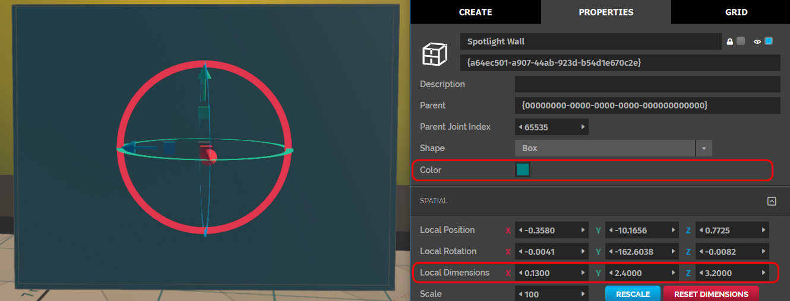
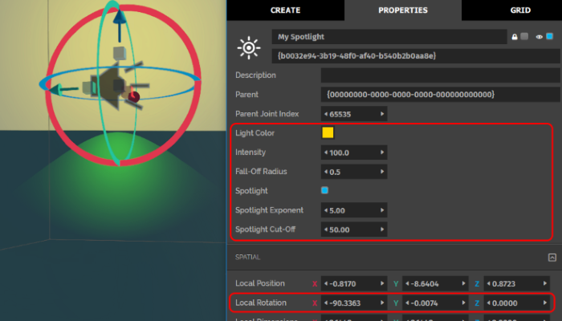
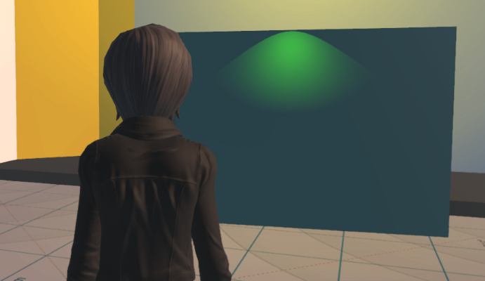

# Tutorial: Create a Gold Spotlight

In this tutorial, you will learn how light entities work by creating a gold spotlight that shines down a wall. A light entity behaves like a ball or a beam of light, and is used to add local lighting effects or spotlights to an area. 

**On This Page:**

+ [Prerequisites](#prerequisities)
+ [Create a Wall to Shine the Light On](#create-a-wall-to-shine-the-light-on)
+ [Create the Gold Spotlight](#create-the-gold-spotlight)

## Prerequisites

Consider getting familiar with the following concepts before starting this tutorial:

+ [Create New Entities](create-entities)
+ [Change How Entities Look](entity-appearance)

## Create a Wall to Shine the Light On

Your gold spotlight needs a surface to shine on. Create this surface or wall in the **Create** app:

1. In Interface, pull up your HUD or Tablet and go to **Create**.
2. Click the 'Cube' icon to create a cube entity.
3. Go to the 'Properties' tab and make the following changes: 
   1. Change the color of the cube to teal (Red = '0', Green = '128', Blue = '128'). 
   2. Change the dimensions of the cube to make it bigger and look more like a wall. We've used the following local dimensions:
		* X = '0.1300'
		* Y = '2.4000'
		* Z = '3.2000'

You've made your wall! 

## Create the Gold Spotlight

Create and edit the light entity to get a soft gold spotlight. 

    
Note

    
The domain sun shines from one side, so one side of the wall is already bright. Light from the light entity won't show up on the bright side of the wall.

1. In Interface, pull up your HUD or Tablet and go to **Create**.
2. Click the 'Light' icon to create the light entity.  
3. Grab and move the entity to the top and center of the wall. You'll notice there is a white light shining on the wall. The light is small because of low brightness. This type of light is a point light and it emanates in all directions equally. It is meant for general area lighting as it has a bright point in the middle and fades as it radiates out.
4. Go to the 'Properties' tab and modify the light entity to make a gold spotlight:
   1. Change the color of the light to gold (R = '255', G = '215', B = '0').
   2. You can make the light entity brighter by changing its intensity. Change the 'Intensity' to '100'. You'll see that the light is now covering a larger area and is much brighter. 
   3. You can modify the light entity's 'Fall-off Radius' so that the it dims gradually towards the edges. The 'Fall-off Radius' defines the shape of the light curve of a light. A larger radius will simulate a larger light, which will "fall-off", or dim, more gradually. It is the distance from the light at which the intensity is reduced by '25%'. Change this value to '0.5'.
   4. Select the 'Spotlight' checkbox to convert the light entity to a spotlight.  
   5. Change the 'Spotlight Cut-off' to '50'. This property determines the radius of the spotlight. A higher cut-off value corresponds with a larger spotlight radius. You should see the beam tighten get smaller.
   6. Change the 'Spotlight Exponent' to '5'. This property affects the softness of the beam. You should see the edge of the beam soften.
   7. Rotate the spotlight so that it's facing down the wall by changing the 'Local Rotation's' X value to '-90.0000'. A spotlight positioned like this can be used for a soft lighting effect over paintings or wall hangings in your world.
       

Congratulations! You've created a soft gold spotlight! You can experiment with different spotlight exponents, cutoff values, and intensity combinations for varied effects.

**See Also**

+ [Create New Entities](create-entities)
+ [Change How Entities Look](entity-appearance)
+ [Creator Tools](../tools)
