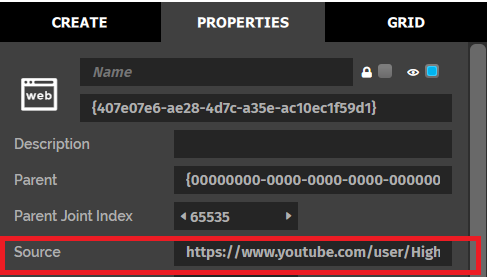
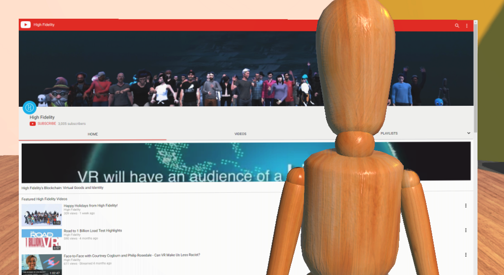

# Tutorial: Display a YouTube Channel

In this tutorial, you will learn how web entities work by creating one displaying a YouTube channel. You can watch videos in Vircadia using this web entity. 

**On This Page:**

- [Prerequisites](#prerequisities)
- [Create a Web Entity](#create-a-web-entity)
- [Display Vircadia's YouTube Channel](#display-vircadia-s-youtube-channel)

## Prerequisites

Consider getting familiar with the following concepts before starting this tutorial:

- [Create New Entities](create-entities.html)
- [Change How Entities Look](entity-appearance.html)

## Create a Web Entity

A web entity is a flat object on which you can view any website of your choosing. A web entity lets you access the internet from inside your domain. 

To create a web entity:

1. In Interface, pull up your HUD or Tablet and go to **Create**.
2. Click the 'Web' icon to create a web entity. By default, a web entity always displays Vircadia's home page.

    
Note

    
Currently, only 20 web entities can run at the same time in a domain to avoid performance issues. 

## Display Vircadia's YouTube Channel

You can make the web entity display Vircadia's YouTube channel.

1. In Interface, pull up your HUD or Tablet and go to **Create**. 
2. Select your web entity and go to the 'Properties' tab.
3. Scroll down until you see the 'Source URL' option. Enter the Vircadia YouTube channel URL: https://www.youtube.com/channel/UC5gVObAP0ANbXr-lNCjP3xg. You should see the new page as soon as you hit 'Enter'.

**See Also**

- [Create New Entities](create-entities.html)
- [Change How Entities Look](entity-appearance.html)
