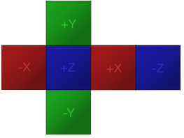

##########################
Add a Zone Entity
##########################

A Zone entity enables you to set properties in a specific area. These properties include: flying, ghosting,
key lighting, skybox, ambient lighting, haze, bloom, and avatar priorities.

.. contents:: On This Page
    :depth: 3

-------------------------
Explanation of Properties
-------------------------

The number of properties might seem intimidating at first. However, they all serve their own goals and have reason to exist:

+------------------------+---------------------------------------------------------------------------------------------+
| Property               | Description                                                                                 |
+========================+=============================================================================================+
| Flying Allowed         | Enables or disables flying for people inside the zone. This makes sense for game modes, or  |
|                        | if you just don't want people to break your immersion.                                      |
+------------------------+---------------------------------------------------------------------------------------------+
| Ghosting Allowed       | Enables or disables the ability to pass through entities by disabling the environment       |
|                        | collisions. Useful for creating labyrinths, for example.                                    |
+------------------------+---------------------------------------------------------------------------------------------+
| Filter                 | Filters are specialized JavaScript functions that prevent unwanted modifications to         |
|                        | entities inside the zone. This property takes the URL to such a script.                     |
|                        | See `Protect Your Domain’s Content <../../host/configure-settings/entity-filters.html>`_    |
|                        | for more information.                                                                       |
+------------------------+---------------------------------------------------------------------------------------------+
| Key Light              | This sets a directional light for the entire zone, e.g. this can simulate a sun casting     |
|                        | light.                                                                                      |
+------------------------+---------------------------------------------------------------------------------------------+
| Skybox                 | This lets you set a so called "Skybox". This is commonly used to apply a sky texture to     |
|                        | the zone.                                                                                   |
+------------------------+---------------------------------------------------------------------------------------------+
| Ambient Light          | This is used to apply light coming from the skybox. This is used if you have light coming   |
|                        | from more than just a sun. For example if you have multiple suns.                           |
+------------------------+---------------------------------------------------------------------------------------------+
| Haze                   | Creates fog or mist.                                                                        |
+------------------------+---------------------------------------------------------------------------------------------+
| Bloom                  | This enables a visual effect known as "bloom". A slight bloom effect could be used to make  |
|                        | zones appear bright.                                                                        |
+------------------------+---------------------------------------------------------------------------------------------+
| Avatar Priority        | This property changes the update priority of avatar movements by allocating more bandwidth  |
|                        | reserved by the avatar mixer. It is commonly used on live events to have entertainers'      |
|                        | avatar movements still be smooth, even with a huge crowd also being updated.                |
+------------------------+---------------------------------------------------------------------------------------------+
| Screen-share           | Enabling allows people to use screen-share inside the zone.                                 |
+------------------------+---------------------------------------------------------------------------------------------+

^^^^^^^^^
Key Light
^^^^^^^^^

Key lighting is used to illuminate a zone. You can think of the key light as a sun which illuminates a zone from a specific direction.
The following properties are available for key lighting:

+------------------------+---------------------------------------------------------------------------------------------+
| Property               | Description                                                                                 |
+========================+=============================================================================================+
| Key Light Color        | Sets the color of the key light. This could be used to simulate the color of a sunset.      |
+------------------------+---------------------------------------------------------------------------------------------+
| Light Intensity        | This changes the intensity of the key lighting.                                             |
+------------------------+---------------------------------------------------------------------------------------------+
| Light Horizontal Angle | Sets the rotation around the zone's y axis and starts in its -z direction.                  |
+------------------------+---------------------------------------------------------------------------------------------+
| Light Vertical Angle   | Sets the rotation around the zone's x axis and starts in its -z direction.                  |
+------------------------+---------------------------------------------------------------------------------------------+
| Cast Shadows           | This enables shadows, while still respecting the "Cast Shadows" property of other entities. |
+------------------------+---------------------------------------------------------------------------------------------+
| Shadow Bias            | This controls shadow bias and needs to be fine tuned. Too low values can cause so called    |
|                        | "shadow acne", while too high values can cause so called "peter panning".                   |
+------------------------+---------------------------------------------------------------------------------------------+
| Shadow Max Distance    | Sets the maximum distance in meters from your view at which shadows will be shown.          |
+------------------------+---------------------------------------------------------------------------------------------+

^^^^^^
Skybox
^^^^^^

Skyboxes are used to define the background of a zone. There are two types of skybox images that can be used.
The aspect ratio is used to define the type of image. Images with a differing aspect ratio or a resolution higher than 4096 pixels are not displayed.

Types:

* Cubemaps have an aspect ratio of 4:3 and consist of 6 sides, which are projected onto a cube.

* Equirectanglar images have an aspect ratio of 2:1 and are projected onto a sphere.

.. image:: _images/equirectanglar-skybox.jpg

Supported texture formats are PNG, JPG, JPEG, TGA, TIF and TIFF.
PNG-48 or PNG-64 are not supported.

^^^^^^^^^^^^^
Ambient Light
^^^^^^^^^^^^^

Ambient lighting illuminates the view according to the brightness and color of a texture.
Accepted properties are:

+------------------------+---------------------------------------------------------------------------------------------+
| Property               | Description                                                                                 |
+========================+=============================================================================================+
| Ambient Intensity      | This sets the intensity of the illumination.                                                |
+------------------------+---------------------------------------------------------------------------------------------+
| Ambient Source         | This takes the URL of a texture similar to the skybox. You                                  |
|                        | can also use the same URL as the skybox. One scenario where this could be useful            |
|                        | would be a space station that is illuminated my multiple suns and reflections from          |
|                        | different colored planets.                                                                  |
+------------------------+---------------------------------------------------------------------------------------------+

^^^^
Haze
^^^^

Haze creates fog inside a Zone. This can be used to make things look more atmospheric, but is also useful for hiding distant geometry.
Properties available for haze:

+------------------------+---------------------------------------------------------------------------------------------+
| Property               | Description                                                                                 |
+========================+=============================================================================================+
| Range                  | This sets how far the haze extends in meters. Use this to influence viewing distance and    |
|                        | thickness.                                                                                  |
+------------------------+---------------------------------------------------------------------------------------------+
| Use Altitude           | This changes the haze intensity depending on altitude. Higher altitude means more fog.      |
+------------------------+---------------------------------------------------------------------------------------------+
| Base                   | This is the base of the altitude range.                                                     |
+------------------------+---------------------------------------------------------------------------------------------+
| Ceiling                | This is the ceiling of the altitude range. Regardless of the name, the ceiling can be lower |
|                        | than the base to have the effect upside down; lower altitude meaning less fog.              |
+------------------------+---------------------------------------------------------------------------------------------+
| Haze Color             | Sets the color of the haze.                                                                 |
+------------------------+---------------------------------------------------------------------------------------------+
| Background Blend       | This controls how much of the skybox is visible through the haze. Higher values showing     |
|                        | more skybox.                                                                                |
+------------------------+---------------------------------------------------------------------------------------------+
| Glare                  | Glare can be used to show an effect for the direction that the key light is coming from.    |
|                        | This is mainly useful for making a sun look especially bright.                              |
+------------------------+---------------------------------------------------------------------------------------------+
| Glare Color            | Sets the color of the glare effect.                                                         |
+------------------------+---------------------------------------------------------------------------------------------+
| Glare Angle            | This changes the size of the glare effect.                                                  |
+------------------------+---------------------------------------------------------------------------------------------+

^^^^^
Bloom
^^^^^

The bloom effect is used to make bright areas and objects glow. For example, this effect could be used to make a streetlight at night appear like it is illuminating light.
It has the following properties:

+------------------------+---------------------------------------------------------------------------------------------+
| Property               | Description                                                                                 |
+========================+=============================================================================================+
| Bloom Intensity        | Sets the intensity or brightness of the bloom effect.                                       |
+------------------------+---------------------------------------------------------------------------------------------+
| Bloom Threshold        | This decides how bright something has to be to start glowing. The lower the value, the more |
|                        | areas start glowing.                                                                        |
+------------------------+---------------------------------------------------------------------------------------------+
| Bloom Size             | Sets the radius of the bloom effect. The higher the value, the larger the glowing effect.   |
+------------------------+---------------------------------------------------------------------------------------------+

**See Also**

+ :doc:`Create New Entites <create-entities>`
+ `The Create App <../tools.html#the-create-app>`_
+ :doc:`Define an Entity's Behavior <entity-behavior>`
+ :doc:`Change How Entities Look <entity-appearance>`
