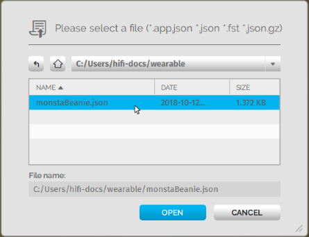
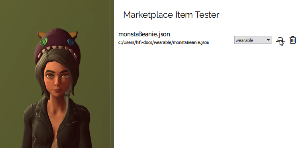

######################
Create Tools
######################

To build and create things in High Fidelity, you need to become familiar with the tools available to you. We've created our own custom tools (including the Create app and Shapes app). In addition, you can use many external tools to fine-tune your creations. These tools can help you create anything from a cool avatar or a baseball hat, to a magic themed domain.

.. contents:: On This Page
    :depth: 2

---------------------
The Create App
---------------------

Use the **Create** app to create any :doc:`type of entity <entities/create-entities>`. In Interface, pull up your HUD or Tablet and go to **Create** to get started. With the Create app, you can:

+ :doc:`Add any type of entity <entities/create-entities>` and import externally created :doc:`models <3d-models/import-model>` and :doc:`materials <entities/material-entity>`. 
+ Edit entity properties, such as its :doc:`appearance <entities/entity-appearance>`, `position <entities/entity-appearance.html#move-an-entity>`_, and :doc:`behavior <entities/entity-behavior>`.
+ Expose a grid that assists you with the layout and placement of entities.
+ Display the `Entity List`_, which lists all the entities in the domain. When you're using an HMD, the entity list will be an additional tab in the Create app. In Desktop mode, the Entity List is its own window.

.. note:: We have received reports that Interface may crash when using a laptop and external monitor with the Create app. If you experience the crash, we recommend that you either a) disable the Nahimic service on your laptop or b) always use the Create Tools on your primary monitor.

^^^^^^^^^^^^^^^^^^
Entity List
^^^^^^^^^^^^^^^^^^

The Entity List shows you all entities in the local domain. You can filter by entity type and by distance from the current location. 

At the top of the Entity List, you can switch between 'Local' and 'World' view. When set to 'Local', the position, size, and rotation settings for entities are set in reference to the parent entity. When set to 'World', these settings are set in reference to the world's default position.

When you select an entity in the Entity List, you can: 

+ Find an entity: You can double-click an entity on the list to view it in your domain. You will see the entity with a bounding box and arrows around it. 
+ Lock an entity: A locked entity cannot be edited. Select an entity and click the lock icon on the top of the window.  
+ Change visibility: You can hide or make an entity visible. Select an entity and click the eye icon on the top of the window.
+ Name an entity: Name an entity when you select it on the list.
+ Delete an entity: Delete an entity by clicking on the red bin icon on the top-right corner of the window. 

.. 
	------------------------
	Shapes: Create in VR
	------------------------

	The Shapes app is a Marketplace app that lets you :doc:`add and edit basic shapes (entities) <entities/create-entities>` in High Fidelity. You can use Shapes only in VR mode. 

	To get the Shapes app: 

	1. In Interface, pull up your HUD or Tablet and go to **Market**. 
	2. Search for 'Shapes' and hit 'Get' to get it for free. 
	3. Install the app. 

	^^^^^^^^^^^^^^^^^^^^^^^
	Use the Shapes app
	^^^^^^^^^^^^^^^^^^^^^^^

	1. In Interface, pull up your HUD or Tablet and go to **Shapes**. 
	2. A 'Tools' menu and 'Create' palette will be attached to your non-dominant hand. You can set your dominant hand on your Tablet or top menu bar by going to **Settings > Avatar > Dominant Hand**.  

	.. image:: _images/dom-hand.PNG

	3. In the 'Create' palette, click on one of the shapes to create and add that entity. 
	4. The entity will be created at your hand. You can `grab it <../explore/interact.html#grab-objects>`_ by pressing the trigger on your controller.
	5. In the 'Tools' Menu, you can edit an entity's properties. Activate a tool by clicking its button. You'll see an icon representing the tool you selected on your dominant hand. You can deactivate a tool by hovering over the title bar and clicking 'Back'.

    * **Color**: You can choose a color for your entity by pointing your laser at 'Color' in the 'Tools' menu and dipping your finger or stylus in the color of your choice. You can even create color swatches for yourself. 
    * **Stretch**: You can change the dimensions of your entity by stretching it. Select 'Stretch' to see the handles on your entity that you can pull using your controllers. 
    * **Clone**: You can clone your entity using the 'Clone' tool. Select 'Clone', point your laser at your entity, and pull out its clone. 
    * **Group**: You can group two or more entities together for easier editing. Select 'Group' and then select all the entities you want to group. 
    * **Physics**: You can modify the :doc:`physics (behavior of your entity in space) <entities/entity-physics>` using the 'Physics' tool. Select 'Physics' to see the variety of options available to you. 
    * **Delete**: You can delete an entity by selecting 'Delete' and then selecting the entity you want to delete. 

-----------------------------
Marketplace Item Tester
-----------------------------

Once you have created an item, you can test it prior to using it or :doc:`submitting it to Marketplace <../sell/add-item>`. The Marketplace Item Tester reviews all kinds of content, including tablet apps, avatars, content sets, entities, and wearables. Using it, you can verify that your item works the way you expected, and that it does not have any script errors.

To use the Marketplace Item Tester:

1. In Interface, open the menu from either the menu bar (in Desktop) or your Tablet (in VR mode). 
2. Go to **Menu > Settings > Developer menu** to enable the developer menu. 
3. Open the **Developer** menu and go to **Marketplace Item Tester**. 
4. You can load items in two different ways:

    * Click 'Load File' to load an item from your local computer or network. Browse to your file to open it. 
    * Click 'Load URL' to load an item hosted in the cloud.    

   
3. Next to the item you loaded, you will see an icon indicating the type of content. If it is incorrect (or we fail to identify it), you can change it using the dropdown list.
4. Click the icon to load your content in world. 

----------------------------
External Creator Tools
----------------------------

We've listed some external tools you might want to use to create avatars and 3D models. 

^^^^^^^^^^^^^^^^^
Adobe Fuse
^^^^^^^^^^^^^^^^^

.. note:: There are community reports where users are unable to easily open Adobe Fuse once installed. To work around this issue, open it multiple times successively until you are able to open the application.

Use `Adobe Fuse <https://www.adobe.com/in/products/fuse.html>`_ to create a custom avatar. The default heads, torsos, arms, and legs in Adobe Fuse can help you start your customization.

^^^^^^^^^^^^^^^^^
Mixamo
^^^^^^^^^^^^^^^^^

`Mixamo <https://www.mixamo.com>`_ is a rigging system that will rig your avatar's skeleton for you. You do not need any advanced knowledge of rigging to create simple animations for your avatar. 

^^^^^^^^^^^^^^^^^
Blender
^^^^^^^^^^^^^^^^^

`Blender <https://www.blender.org>`_ is an open-source 3D modeling creation suite which supports everything from modeling and rigging, to animation and simulation. You can also use Blender to fine tune your avatar, and ensure that the materials and textures render correctly in High Fidelity. 

^^^^^^^^^^^^^^^^^
Maya
^^^^^^^^^^^^^^^^^

`Maya <https://www.autodesk.in/products/maya/overview>`_ is a subscription based 3D modeling toolset that you can use to create 3D models to import into High Fidelity. 

^^^^^^^^^^^^^^^^^
Blocks
^^^^^^^^^^^^^^^^^

`Blocks <https://vr.google.com/blocks>`_ is a 3D modeling tool you can use in VR. Blocks lets you create models easily regardless of your experience. You can create something on `Blocks through Steam <http://store.steampowered.com/app/533970/Blocks_by_Google>`_ or download it for the VR equipment you are using.

**See Also**

+ :doc:`Entities <entities>`
+ :doc:`Create New Entities <entities/create-entities>`
+ `Shopping the Marketplace <../explore/shop.html#shopping-the-marketplace>`_
+ :doc:`Tutorial: Create an Avatar with Fuse <avatars/fuse-tutorial>`
+ :doc:`Tutorial: Rig Your Avatar in Mixamo <avatars/mixamo-tutorial>`
+ :doc:`Tutorial: Modify Materials and Textures Using Blender <avatars/blender-tutorial>`