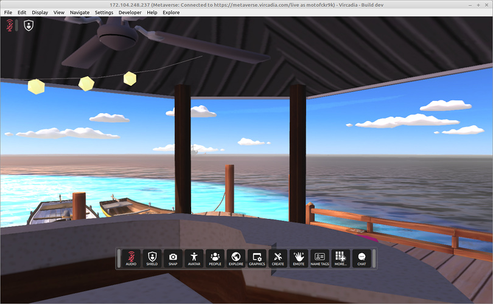

#######
Gallery
#######

This gallery showcases the Vircadia Interface and some past events and locations attended with it.

.. figure:: _images/gallery/el_papa_viejo.jpg
    :alt: Maker meeting 28th September 2020
    :class: inline

    Maker Meeting, 28th September 2020, on the "El Papa Viejo" (meaning "The Old Pope").

.. figure:: _images/gallery/vircadia-snap-by-RyanLi-on-2020-06-12_14-28-47.jpg
    :alt: Startup Asia X 12th June 2020
    :class: inline

    Startup Lab Lagoon Koza booth at Startup Asia X, 12th June 2020.

.. figure:: _images/gallery/vircadia-snap-by-RyanLi-on-2020-06-12_14-52-39.jpg
    :alt: Startup Asia X 12th June 2020
    :class: inline

    Group photo at the end of Startup Asia X, 12th June 2020.

.. figure:: _images/gallery/vircadia-snap-by-RyanLi-on-2020-09-20_02-45-59.jpg
    :alt: Developer Meeting 20th September 2020
    :class: inline

    Dale Glass speaking at the Developer Meeting, 20th September 2020.

.. figure:: _images/gallery/vircadia-snap-by-Revofire-on-2020-08-13_17-21-43.jpg
    :alt: Community Meeting 13th July 2020
    :class: inline

    Mannequin army, 13th July 2020.

.. figure:: _images/gallery/vircadia-snap-by-Revofire-on-2020-08-05_17-46-26.jpg
    :alt: Pictionary 5th July 2020
    :class: inline

    Pictionary in the old Hub, 5th July 2020.

    Vircadia running on Linux Mint 19.3, 29th September 2020.

**See Also**

+ :doc:`Install Vircadia <get-started/install>`
