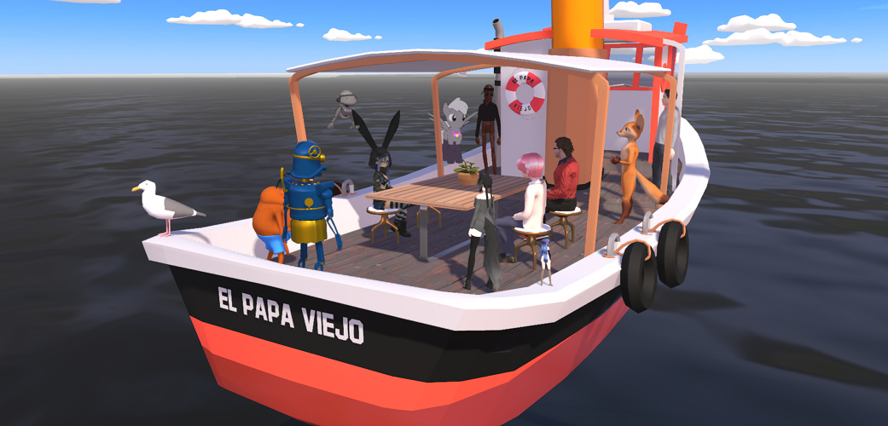
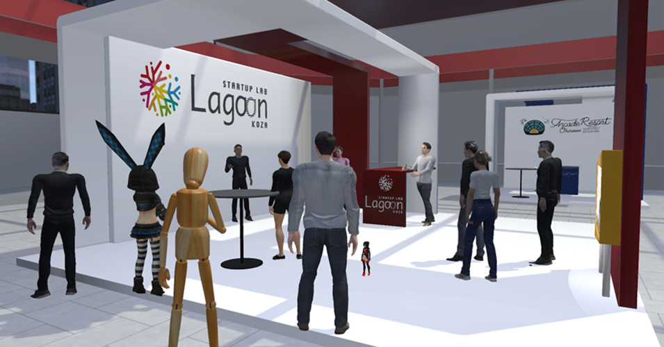
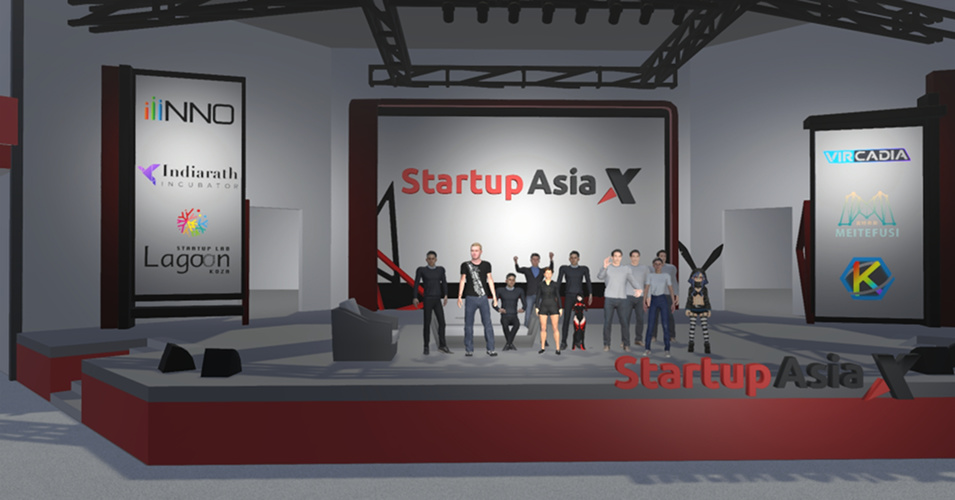
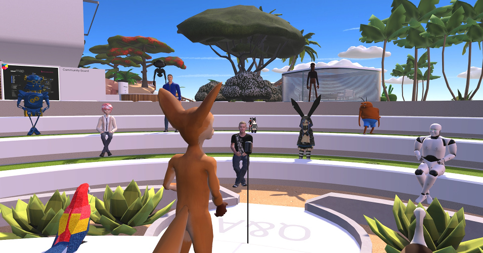
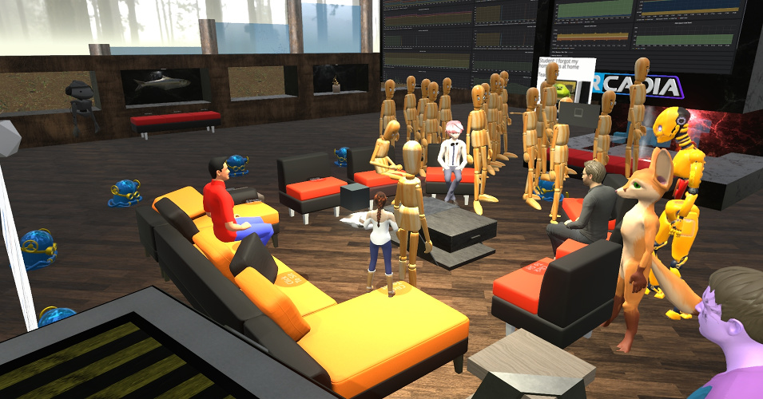
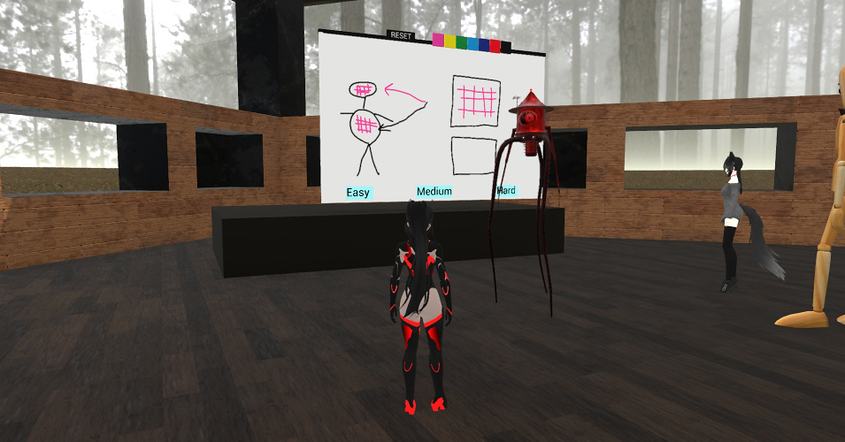

#######
Gallery
#######

Here are some pictures of past events and interface elements.

    Maker meeting 28th September 2020 on the "El Papa Viejo" (meaning "The Big Pope")

    Startup Lab Lagoon Koza booth on Startup Asia X 12th June 2020

    Group photo at the end of Startup Asia X 12th June 2020

    Dale Glass speaking on the Developer meeting 20th September 2020

    Mannequin army 13th July 2020

    Pictionary in the old Hub 5th July 2020

    Dale Glass speaking on the Developer meeting 20th September 2020

**See Also**

+ :doc:`Install Vircadia <get-started/install>`
