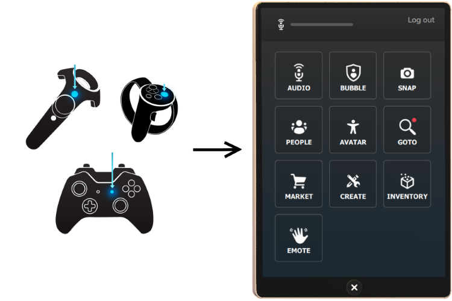
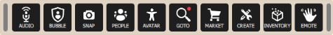

#########################
Adjust Your Settings
#########################

You can adjust various settings in High Fidelity so that it runs to your preferences. Many of these settings are changed using the HUD (in Desktop mode) or Tablet (in VR mode). 

.. contents:: On This Page
    :depth: 2

------------------------
The Tablet and HUD
------------------------

In VR, all of your settings are found in your **Tablet**. The Tablet also gives you easy access to any :doc:`apps that you install <../personalize/install-apps>`. Pull up the tablet by clicking the menu button on your controller.

In Desktop Mode, you have the option to use either the Tablet or a smaller version called the "Heads-up Display" or HUD. It contains the exact same options as the Tablet (settings, apps, etc), but it takes up less space on your screen. To enable the HUD, first enable the **Developer** menu by going to **Settings > Developer Menu**. Then, go to **Developer > UI > Desktop Tablet Becomes Toolbar**. 

------------------------------
Enter or Exit VR Mode
------------------------------

You can enjoy High Fidelity with or with VR equipment such as head mounted displays (HMD), hand controllers and audio headsets. Our Desktop mode contains many of High Fidelity's features such as audio, basic movements and gestures, and the ability to travel to different domains. 

Keep in mind, however, that the most immersive and powerful experience is when you use VR equipment. Only then will you be able to interact with people in 3D, track body movements, and easily engage with the objects around you. Once you have set up your VR equipment, you can easily switch between VR mode and Desktop mode. To switch to VR mode, use one of the following methods: 

1. From the HUD, click **Enter VR**.
2. Click the **Display** menu, then select your VR device. 

To exit from VR mode, remove your headset, click **Exit VR** on the HUD or press ``ESC`` on your keyboard.

------------------------------
Change Your Audio Settings
------------------------------

High Fidelity spatializes audio in real-time based on the location of the listener and the sound sources. A good headset will enhance your experience. You can adjust your audio settings by going to **Audio** on your tablet or HUD. 

+----------------------------+--------------------------------------------------------------------------------------+
| Setting                    | Description                                                                          |
+============================+======================================================================================+
| Mute microphone            | Mute or unmute your microphone.                                                      |
|                            |                                                                                      |
+----------------------------+--------------------------------------------------------------------------------------+
| Warn when muted            | Enable to receive a warning on your screen when your microphone is muted.            |
|                            |                                                                                      |
+----------------------------+--------------------------------------------------------------------------------------+
| Noise reduction            | Enable or disable noise reduction.                                                   |
|                            |                                                                                      |
+----------------------------+--------------------------------------------------------------------------------------+
| Audio level meter          | By default, the audio level meter is visible on the top left corner of your screen.  |
|                            | Uncheck this box to hide the meter.                                                  |
+----------------------------+--------------------------------------------------------------------------------------+
| Push To Talk (T)           | Enable or disable Push To Talk for other users to hear you when your microphone is   |
|                            | muted. When enabled, press and hold ``T`` to talk in desktop mode and press both     |
|                            | triggers on your controllers in VR mode. This feature works only when you are        |
|                            | focused on the Interface window.                                                     |
+----------------------------+--------------------------------------------------------------------------------------+
| Stereo input               | Enable or disable stereo input. Stereo reproduces sound using two or more audio      |
|                            | channels. This means that you will hear sound from various directions, like how you  |
|                            | would in the real world.                                                             |
+----------------------------+--------------------------------------------------------------------------------------+
| Choose Input Device        | Choose the microphone or `input device <#input-devices>`_ of your choice from the    |
|                            | list of devices displayed.                                                           |
+----------------------------+--------------------------------------------------------------------------------------+
| Choose Output Device       | Choose the speakers, headphones, or other `output device <#output-devices>`_ of      |
|                            | your choice from the list of devices displayed.                                      |
+----------------------------+--------------------------------------------------------------------------------------+
| People volume              | Use the slider to increase or decrease the volume of other users in the domain.      |
|                            |                                                                                      |
+----------------------------+--------------------------------------------------------------------------------------+
| Environment volume         | Use the slider to increase or decrease the volume of ambient sound in the domain.    |
|                            | For example, use this option to decrease the sound of background music or special    |
|                            | effects like fireworks.                                                              |
+----------------------------+--------------------------------------------------------------------------------------+
| System Sound volume        | Use the slider to increase or decrease your UI volume like tablet clicks.            |
|                            | Changing this value will not affect the People or Environment volume.                |
+----------------------------+--------------------------------------------------------------------------------------+

^^^^^^^^^^^^^^^^^^^^^^^
Input Devices 
^^^^^^^^^^^^^^^^^^^^^^^

An audio input device is any software or hardware device that accepts an output signal from another device. Examples of audio input devices include:

* A USB microphone
* A microphone headset that is plugged into your computer via the "Mic In" port
* Your sound card’s “Stereo Mix” device

	* Think of these devices as if they were microphones being held up to your speakers while they output sound
	
^^^^^^^^^^^^^^^^^^^^^^
Output Devices
^^^^^^^^^^^^^^^^^^^^^^

An audio output device produces a signal that drives another device’s input. Examples of audio output devices include:

* Desktop computer speakers
* Headphones
* Huge speakers in a movie theater

^^^^^^^^^^^^^^^^^^^^^^^^^^^^^
Acoustic Echo Cancellation 
^^^^^^^^^^^^^^^^^^^^^^^^^^^^^

Acoustic echo is the process by which sounds from your speakers get picked up and transmitted by your microphone, resulting in an echoing effect. This is common when you use High Fidelity with a laptop's built-in microphone and speakers (i.e. an "open mic"), rather than a detached headset.

"Acoustic echo cancellation" is a technology which improves voice quality by preventing the echo that results in open mic setups. By default, Acoustic Echo Cancellation is turned on, and you can turn it off in Settings > Audio.

For best performance with open mic setups, ensure that you:

* Disable any processing and effects on the input and output devices. This includes:

    * On Mac: Turn off 'Ambient noise reduction' (System Preferences > Sound > Input > Use ambient noise reduction)
    * On Windows: Turn off all 'Enhancements' (Control Panel > Sound > Recording tab > click on your device > Properties button > Enhancements tab)

* On Mac devices, set the balance of the output device to either the left or the right (System Preferences > Sound > Output > Balance)
* Lower the microphone's physical gain setting to approximately 3/4 of the maximum
* Lower the speaker's physical volume level to approximately 3/4 of the maximum
* If you are not using your laptop's audio devices, move and point the microphone away from the speakers

The acoustic echo cancellation technology picks up the sounds around you and attempts to identify the echoing sounds as you use it. This means that it will improve and become more accurate over time. So don't despair if you hear a little bit of echoing...it will lessen as the technology learns your voice and the voices of the people around you! 

To speed up this "learning" process, you can:

* Avoid turning your avatar while talking
* Leave your microphone muted while another person talks for 10 seconds at a time

-----------------------------
Set Your Perspective
-----------------------------

You can choose how you view things around you by changing your perspective. To change your perspective: 

* In Desktop mode, go to **View** in the menu on the top left corner. 
* In VR mode, open your Tablet and go to **Menu > View**.

+------------------+---------------------------------------------------------------------------------------------------------+
| Setting          | Description                                                                                             |
+==================+=========================================================================================================+
| First Person     | Select this setting if you want to change your perspective in High Fidelity to first person.            |
|                  | In this view, you will not see yourself, only the environment around you.                               |
|                  |                                                                                                         |
|                  | .. image:: _images/first-person.png                                                                     |
+------------------+---------------------------------------------------------------------------------------------------------+
| Third Person     | Select this setting to change your perspective to third person. In this view, you will see              |
|                  | yourself, as well as the environment around you.                                                        |
|                  |                                                                                                         |
|                  | .. image:: _images/third-person.png                                                                     |
+------------------+---------------------------------------------------------------------------------------------------------+
| Mirror           | Select this to change your perspective to mirror. In this view, you will see yourself and               |
|                  | the space behind you.                                                                                   |
|                  |                                                                                                         |
|                  | .. image:: _images/mirror.png                                                                           |
|                  |                                                                                                         |
|                  | NOTE: You cannot move in mirror mode. It is for viewing only.                                           |
+------------------+---------------------------------------------------------------------------------------------------------+
| Independent Mode | Select this to change what you see through scripting instead of avatar's movements.                     |
+------------------+---------------------------------------------------------------------------------------------------------+
| Entity Mode      | Select this to set your perspective to a specific entity, allowing you to move with entity as it moves. |
+------------------+---------------------------------------------------------------------------------------------------------+

--------------------------------
Other Miscellaneous Settings
--------------------------------

Here are some other settings you may like to change to optimize your experience.

^^^^^^^^^^^^^^^^^^^^^^
General Settings
^^^^^^^^^^^^^^^^^^^^^^

You can modify general settings such user interface and privacy settings in High Fidelity. 

* In Desktop mode, go to **Settings > General** in the menu on the top left corner. 
* In VR mode, open your Tablet and go to **Menu > Settings > General**.

^^^^^^^^^^^^^^^^^^^^^^^^^^^^^
In-World Graphics Settings
^^^^^^^^^^^^^^^^^^^^^^^^^^^^^

You can make changes to the graphics in High Fidelity. 

- In Desktop mode, go to **Settings > Graphics** in the menu on the top left corner. 
- In VR mode, open your Tablet and go to **Menu > Settings > Graphics**.

+--------------+----------------------------------------------------------------------------------------+
| Setting      | Description                                                                            |
+==============+========================================================================================+
| World Detail | You can control the detail visible to you in High Fidelity by moving this slider left  |
|              | to decrease and right to increase.                                                     |
+--------------+----------------------------------------------------------------------------------------+
| Show Shadows | Enable or disable viewing shadows. This setting is enabled by default. If you have a   |
|              | low game rate or are having trouble loading a domain, disabling this option may        |
|              | improve your performance.                                                              |
+--------------+----------------------------------------------------------------------------------------+

^^^^^^^^^^^^^^^^^^^^^^^^^^
Account Security Settings
^^^^^^^^^^^^^^^^^^^^^^^^^^

You can change your account security settings in High Fidelity.

- In Desktop mode, go to **Settings > Security** in the menu on the top left corner. 
- In VR mode, open your Tablet and go to **Menu > Settings > Security**.

+---------------------+----------------------------------------------------------------------------------+
| Setting             | Description                                                                      |
+=====================+==================================================================================+
| Account             | Enable to stay logged in (in the current device) even if you exit High Fidelity. |
+---------------------+----------------------------------------------------------------------------------+
| Secure Transactions | Change your security picture.                                                    |
+---------------------+----------------------------------------------------------------------------------+

**See Also**

+ :doc:`Configure Your Domain Settings <../../host/your-domain/configure-settings>`