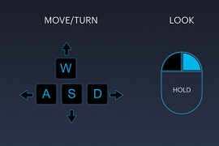
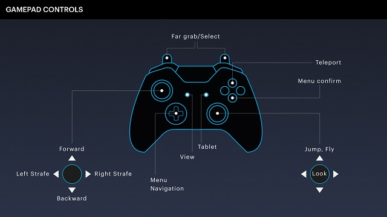

#########################
Explore in Desktop Mode
#########################

Desktop users are restricted to using their keyboard and mouse to do things in High Fidelity. On this page, you can find all of the shortcuts so that you can enjoy your experience in High Fidelity to the fullest.

.. note:: The shortcuts below are for Windows and Linux computers. If you're running on a Mac, use the same commands, substituting the ``Command`` key for the ``Ctrl`` key.

.. contents:: On This Page
    :depth: 2

-------------------------------
Movement Controls
-------------------------------

+------------------------+----------------------------------------------------------------+
| Action                 | Key                                                            |
+========================+================================================================+
| Walk Forward           | ``W`` or ``UP ARROW``                                          |
+------------------------+----------------------------------------------------------------+
| Walk Backward          | ``S`` or ``DOWN ARROW``                                        |
+------------------------+----------------------------------------------------------------+
| Run                    | Hold ``SHIFT`` while using any shortcut to walk                |
+------------------------+----------------------------------------------------------------+
| Side Step to the Left  | ``Q`` or Right Click + ``A``  or ``SHIFT`` + ``LEFT ARROW``    |
+------------------------+----------------------------------------------------------------+
| Side Step to the Right | ``E`` or Right Click + ``D`` or ``SHIFT`` + ``RIGHT ARROW``    |
+------------------------+----------------------------------------------------------------+
| Turn Left              | ``A`` or ``LEFT ARROW``                                        |
+------------------------+----------------------------------------------------------------+
| Turn Right             | ``D`` or ``RIGHT ARROW``                                       |
+------------------------+----------------------------------------------------------------+
| Jump                   | ``SPACE`` or ``PGUP``                                          |
+------------------------+----------------------------------------------------------------+
| Fly                    | Hold ``SPACE`` or ``PGUP``                                     |
+------------------------+----------------------------------------------------------------+
| Fly Down               | ``C`` or ``PGDN``                                              |
+------------------------+----------------------------------------------------------------+

----------------------------
In-World Controls 
----------------------------

+-----------------------------+-----------------------------------------------------------+
| Action                      | Key                                                       |
+=============================+===========================================================+
| Handshake                   | ``X``                                                     |
+-----------------------------+-----------------------------------------------------------+
| Enable Privacy Shield       | ``CTRL`` + ``N``                                          |
+-----------------------------+-----------------------------------------------------------+
| Open Tablet                 | ``TAB`` *(when 'Desktop becomes toolbar' is not checked)* |
+-----------------------------+-----------------------------------------------------------+
| Select item                 | Left Click                                                |
+-----------------------------+-----------------------------------------------------------+
| Grab item                   | Left Click                                                |
+-----------------------------+-----------------------------------------------------------+
| Inspect item                | Right Click                                               |
+-----------------------------+-----------------------------------------------------------+
| Open Browser                | ``CTRL`` + ``B``                                          |
+-----------------------------+-----------------------------------------------------------+
| Toggle 'Away from Keyboard' | ``ESC``                                                   |
+-----------------------------+-----------------------------------------------------------+
| Toggle 'Mute Mic'           | ``CTRL`` + ``M``                                          |
+-----------------------------+-----------------------------------------------------------+
| Toggle 'Show Statistics'    | ``/``                                                     |
+-----------------------------+-----------------------------------------------------------+
| Screenshot                  | ``P``                                                     |
+-----------------------------+-----------------------------------------------------------+
| Push to Talk                | ``T``                                                     |
+-----------------------------+-----------------------------------------------------------+

-----------------------------
Camera Controls  
-----------------------------

+-------------------+-------+
| Action            | Key   |
+===================+=======+
| First Person View | ``1`` |
+-------------------+-------+
| Third Person View | ``3`` |
+-------------------+-------+
| Mirror View       | ``2`` |
+-------------------+-------+
| Take Screenshot   | ``P`` |
+-------------------+-------+

---------------------------
Avatar Sizing Controls
---------------------------

+----------------------+-------+
| Action               | Key   |
+======================+=======+
| Decrease Avatar Size | ``-`` |
+----------------------+-------+
| Increase Avatar Size | ``+`` |
+----------------------+-------+
| Reset Avatar Size    | ``=`` |
+----------------------+-------+

------------------------
Create and Edit Mode
------------------------

These controls work when the **Create** app is open.

+-------------------------------------------+-----------------------------+
| Action                                    | Key                         |
+===========================================+=============================+
| Undo                                      | ``CTRL`` + ``Z``            |
+-------------------------------------------+-----------------------------+
| Redo                                      | ``CTRL`` + ``Y``            |
+-------------------------------------------+-----------------------------+
| Delete Entity                             | ``DEL``                     |
+-------------------------------------------+-----------------------------+
| Focus on Selected Entity                  | ``F``                       |
+-------------------------------------------+-----------------------------+
| Align Grid to Bottom of Selected Entities | ``G``                       |
+-------------------------------------------+-----------------------------+
| Duplicate Entity                          | ``ALT`` + Left Click + Drag |
+-------------------------------------------+-----------------------------+
| Parent Entity                             | ``CTRL`` + ``P``            |
+-------------------------------------------+-----------------------------+
| Unparent Entity                           | ``CTRL`` + ``SHIFT`` + ``P``|
+-------------------------------------------+-----------------------------+
| Copy Entity                               | ``CTRL`` + ``C``            |
+-------------------------------------------+-----------------------------+
| Paste Entity                              | ``CTRL`` + ``V``            |
+-------------------------------------------+-----------------------------+
| Toggle Global/Local Translation           | ``T``                       |
+-------------------------------------------+-----------------------------+

-------------------------
Gamepad
-------------------------

Instead of a keyboard, you can use a gamepad while experiencing High Fidelity in desktop mode. 

