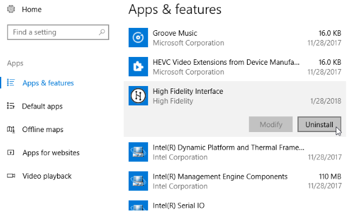
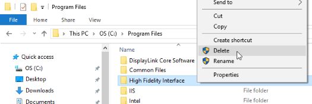

# Install High Fidelity

High Fidelity has two different installers, based on how you use High Fidelity. The _client installer_ comes with everything you need to view and interact with High Fidelity's content and users. However, you are unable to host content using this installer. The _client and sandbox installer_ enables you to [host your own content](../../host), with the option to share it with the world. 

**On This Page:**
* [Minimum System Requirements](#minimum-system-requirements)
* [Client-Only Installer](#client-only-installer)
* [Client and Sandbox Installer](#client-and-sandbox-installer)
* [Perform a Clean Installation](#perform-a-clean-installation)
	* [Windows](#windows-clean-install)
	* [Mac](#mac-clean-install)

## Minimum System Requirements
In order to run High Fidelity in either VR or Desktop mode, ensure that your computer meets these minimum system requirements: 

<table style="border: none;">
	<tr style="border: none;">
		<td style="border: none;">
			<h4>Windows </h4>
			<ul>
				<li>Windows 7 64-bit</li>
				<li>Intel i5-4590 processor</li>
				<li>8GB of RAM</li>
				<li>NVIDIA GTX 970 graphics card <i>or</i>  AMD R9 290 graphics card</li>
		</ul>
		</td>
		<td style="border: none;">
			<h4>Mac</h4>
			<ul>
				<li>OS X Mavericks (version 10.9)</li>
				<li>8GB of RAM </li>
				<li>2017 Macbook Pro 15" with AMD Radeon Pro 560 <i>or</i>  2018 Macbook Pro 15" with AMD Radeon Pro 560X <i>or</i> 2017 iMac Pro</li>
			</ul>
		</td>
	</tr>
	<tr style="border: none;">
		<td style="border: none;">
			<h4>Linux </h4>
			<ul>
				<li>Ubuntu 16.04 64-bit</li>
				<li>8GB of RAM</li>
				<li>Intel i5-4590 processor</li>
				<li>NVIDIA GTX 970 graphics card</li>
			</ul>
		</td>
		<td style="border: none; vertical-align: top;">
			<h4>Android</h4>
			<ul>
				<li>Daydream-enabled Android devices</li>
			</ul>
		</td>
	</tr>
</table>

## Client-Only Installer

You can download the Client-Only installer through Steam or via [High Fidelity's website](https://www.highfidelity.com/download). To install: 

1. Select your platform and download the installer.
2. Run the High Fidelity installer.
3. Follow the prompts and complete the installation.

## Client and Sandbox Installer
If you want to [host content](../../host) in the metaverse, you will need to install the Client + Sandbox version. You can download the Client + Sandbox installer through Steam or [High Fidelity's website](https://www.highfidelity.com/download#sandbox). To install: 

1. Select your platform and download the installer.
2. Run the High Fidelity installer.
3. Follow the prompts and complete the installation.

## Perform a Clean Installation

If you're facing problems when you load Interface and Sandbox, you can try performing a clean install. 

    
Note

    
A clean install removes multiple files and settings that you may need once you install High Fidelity again. Please back-up the following files before a clean install: Favorites, Wearables, Sandbox, and Entities in your Sandbox.

### Windows Clean Install

1. Click on the Start menu and type "Add or Remove Programs" in your Windows search bar.  
2. Uninstall any versions of High Fidelity that are visible (Including any Steam installs).  
3. Once High Fidelity is uninstalled, browse to your %Program Files% directory. Delete all folders related to High Fidelity. If you installed through Steam, these folders will be located at `C:/Program Files(x86)/Steam/steamapps/common`. 
    
    

        
Note

        
The next 3 steps will permanently delete your Sandbox content. If you wish to keep this content, copy %AppData%/Local/High Fidelity/assignment-client to another location on your computer before proceeding. Repeat for %AppData%/Roaming/High Fidelity/assignment-client. 

    

4. Browse to your local %AppData% folder (usually `C:/Users/<your_username>/AppData/Local`). If you do not see the folder, make sure you can view hidden folders. In File Explorer, click View and make sure “Hidden Items” is checked. Delete all folders related to High Fidelity.  
5. Browse to your roaming %AppData% folder (usually `C:/Users/<your_username>/AppData/Roaming`). Delete all folders related to High Fidelity.  
6. Re-install High Fidelity using the steps above. To restore your Sandbox content, copy the `assignment-client` folders you backed up back to their respective locations.  

### Mac Clean Install

1. Open your Applications folder and delete the High Fidelity folder. 
2. Browse to `<username>/.config` and delete the `highfidelity.io` folder. 
3. Open the `~/Library` folder by holding the Option key and clicking the "Go" menu while in the Finder. The Library option should appear in the menu.
4. Browse to `~/Library/Application Support` and delete the High Fidelity folder.
5. Empty the Trash. 
6. Re-install High Fidelity using the steps above. 

**See Also**

+ [Install Your Domain](../../host/your-domain/install-domain.html)