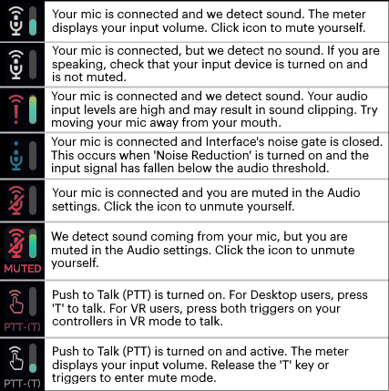

#################################
Set Up Your Audio Devices
#################################

When you log into Vircadia for the first time, we will automatically detect your computer's default audio devices, and use those for Vircadia. Usually, your computer will automatically detect a plugged in headset and you will not need to configure your audio devices any further. 

However, some audio setups do require additional configuration. If you need to change your audio settings, read on to find out more.

.. contents:: On This Page
    :depth: 2

------------------------------------
Audio "At a Glance"
------------------------------------

Your basic audio settings are displayed in the top-left corner of your Interface window. This is called the "Audio Level Meter" and can be turned on or off in your Audio settings (from the Tablet or HUD, click **Audio**). 

----------------------------------------
Change your Input or Output Device
----------------------------------------

Vircadia's 3D spatialized audio is guaranteed to enhance your experience in the metaverse, whether you are in Desktop mode or using VR equipment. By default, we will select the default audio devices that your operating system or headset has detected. If you want to use a different headset or audio setup than the default, you can change your computer's default device. If you need to use a different device for Vircadia than other applications on your computer, then you can change your device in the application.

* An *audio input device* is any device that captures sound and generates a signal that can be accessed by other devices. Examples of audio input devices include a USB microphone or a microphone headset that is plugged into your computer, or your sound card’s "Stereo Mix" or "What U Hear" device (think of these sound card devices as if they were microphones being held up to your speakers while they output sound).
* An *audio output device* is any device that receives information from audio files and converts it into audible sound signals. Examples of audio output devices include your desktop computer speakers, headphones, or huge speakers in a movie theater.

If you are using a headset with a microphone, then your input and output devices will likely be the same device. However, if you are using external speakers or some other open mic setup, then these devices may be different. In these cases, we encourage you to enable `acoustic echo cancellation <#id1>`_ for improved audio quality.

To change your audio devices:

1. From the Tablet or HUD, click **Audio**.
2. Choose your desired input device. 
3. Choose your desired output device. 

^^^^^^^^^^^^^^^^^^^^^^^^^^^^^^^^
Using Bluetooth Headsets
^^^^^^^^^^^^^^^^^^^^^^^^^^^^^^^^

You can use bluetooth headsets, such as AirPods with Vircadia. However, note that there are limitations to using them, and they may not work in all environments. If using WiFi, ensure you’re using a 5Ghz WiFi connection. On a 2.4Ghz connection, you may experience audio breakup and occasional disconnects.

Unfortunately, bluetooth audio devices do not currently support stereo input. Therefore, you have two options:

* Use the bluetooth headset as an output device only, and use another microphone for input. This allows you to take advantage of the stereo audio.
* Use the bluetooth headset's built-in microphone. In this case, other users will only experience mono sound coming from you, rather than the normal stereo audio.

^^^^^^^^^^^^^^^^^^^^^^^^^^^^^^^^^
Acoustic Echo Cancellation 
^^^^^^^^^^^^^^^^^^^^^^^^^^^^^^^^^

Acoustic echo is the process by which sounds from your speakers get picked up and transmitted by your microphone, resulting in an echoing effect. This is common when you use Vircadia with a laptop's built-in microphone and speakers (i.e. an "open mic"), rather than a detached headset.

"Acoustic echo cancellation" is a technology which improves voice quality by preventing the echo that results in open mic setups. By default, acoustic echo cancellation is turned on, and you can turn it off in the **Audio** app.

.. note:: Acoustic echo cancellation will not run when using input devices with high sample rates (greater than 96khz) or more than 2 channels.

For best performance with open mic setups, ensure that you:

* Disable any processing and effects on the input and output devices. This includes:

    * On Mac: Turn off 'Ambient noise reduction' (System Preferences > Sound > Input > Use ambient noise reduction)
    * On Windows: Turn off all 'Enhancements' (Control Panel > Sound > Recording tab > click on your device > Properties button > Enhancements tab)

* On Mac devices, set the balance of the output device to either the left or the right (System Preferences > Sound > Output > Balance)
* Lower the microphone's physical gain setting to approximately 3/4 of the maximum
* Lower the speaker's physical volume level to approximately 3/4 of the maximum
* If you are not using your laptop's audio devices, move and point the microphone away from the speakers

The acoustic echo cancellation technology picks up the sounds around you and attempts to identify the echoing sounds as you use it. This means that it will improve and become more accurate over time. So don't despair if you hear a little bit of echoing...it will lessen as the technology learns your voice and the voices of the people around you! 

To speed up this "learning" process, you can:

* Avoid turning your avatar while talking
* Leave your microphone muted while another person talks for 10 seconds at a time

-----------------------------------------------
Test Your Audio Devices
-----------------------------------------------

Audio is an integral part of social VR experience, so of course, we want to make sure that your devices are working correctly and that everyone can hear you! There's nothing more annoying than walking up to a group of friends in a virtual world, only to realize that they haven't heard a word you said! The good news is that you can test your audio setup to make sure that both your input and output devices are working correctly.

.. note:: The 'Test Your Voice' feature does not automatically mute your voice! We recommend muting yourself prior to checking your voice input if you do not want others to hear your microphone check.

1. From the Tablet or HUD, click **Audio**.
2. Click 'Test Your Voice' to test your input device. Speak into your mic, and the sound will be played right back at you through the selected output device. Make any adjustments to your input device to achieve your desired sound.
3. Click 'Test Your Sound' to test your output device. Adjust the headset and/or application volume until the sound is a comfortable volume. 

--------------------------------------
Adjust In-World Volume
--------------------------------------

There are three different types of “sounds” in Vircadia:

* People: The sound you hear when people in the domain are talking through their microphones
* Environment: The ambient sounds in the domain, running as scripts in the background
* System Sound: The sound your computer makes as you interact with the application window (such as the “clicking” you hear when you hover over an icon)

To change the volume of all of these at once, simply change the volume of your headset or output device.

To change one or more of these sound types independently of the others:

1. From the Tablet or HUD, click **Audio**.
2. Choose 'Desktop' or 'VR' depending on the mode you are in.
3. Scroll down to 'Choose Output Device'.
4. Adjust the sliders to the desired volume levels for each of the sound types.

--------------------------------------
Enable Push to Talk (PTT)
--------------------------------------

‘Push to Talk’ is like having a walkie talkie in your hand. You need to press a button to have others hear you in the environment. When you’re not pressing the button, you are muted and will not be heard.

To turn on ‘Push to Talk’:

1. From the Tablet or HUD, click **Audio**.
2. Choose 'Desktop' or 'VR' depending on the mode you are in.
3. Toggle 'Push to Talk' on. 

In Desktop mode, press and hold the “T” key on your keyboard to talk. When using an HMD in VR mode, press and hold the grip triggers on your controllers to talk. This feature works only when you are focused on the Interface window.

------------------------------------------------
Adjust Vircadia Audio Settings
------------------------------------------------

There are a number of settings you can configure to customize your audio experience in Vircadia. To change these, open your Tablet or HUD and go to **Audio**.

+----------------------------+--------------------------------------------------------------------------------------+
| Setting                    | Description                                                                          |
+============================+======================================================================================+
| Mute microphone            | Mute or unmute your microphone.                                                      |
+----------------------------+--------------------------------------------------------------------------------------+
| HMD Mute Warning (VR)      | Enable to receive a warning when your microphone is muted when wearing a HMD device. |
+----------------------------+--------------------------------------------------------------------------------------+
| Noise reduction            | Enable to turn on noise reduction. This removes outside noise from audio signals.    |
+----------------------------+--------------------------------------------------------------------------------------+
| Audio level meter          | By default, the audio level meter is visible on the top left corner of your screen.  |
|                            | Uncheck this box to hide the meter.                                                  |
+----------------------------+--------------------------------------------------------------------------------------+
| Echo Cancellation          | Enable or disable `acoustic echo cancellation <#id1>`_.                              |
+----------------------------+--------------------------------------------------------------------------------------+
| Stereo input               | Enable or disable stereo input. Stereo reproduces sound using two or more audio      |
|                            | channels. This means that you will hear sound from various directions, like how you  |
|                            | would in the real world.                                                             |
+----------------------------+--------------------------------------------------------------------------------------+

-----------------------------------
Adjust OS Audio Settings
-----------------------------------

Many device settings, such as input levels, boost, gains, and enhancements, cannot be set in Vircadia. These settings can only be adjusted at the operating system level or with a device's external software. If you experience issues with audio that cannot be resolved with any of the above settings, then try adjusting your operating system's device settings:

* **Update the driver software for your audio devices**:

    * On Mac: Apple handles all driver updates on your computer. To check for updates, click on the Apple icon in the top-left corner of the screen and select 'Software Update'.
    * On Windows: Open the **Device Manager** and select the arrow next to **Sound, audio and game controllers**. Right-click on your audio device and select 'Update driver'.
* **Adjust microphone levels and/or boost**: 
    
    * On Mac: Go to **System Preferences > Sound > Input**. 
    * On Windows: Go to **Control Panel > Sound > Recording**. Choose your microphone and click 'Properties'.
* **Adjust other advanced sound settings**:

    * Go to **Control Panel > Sound**
    * Go to **Settings > System > Sound**
    * Go to **Control Panel > Hardware and Sound > Adjust System Volume**
