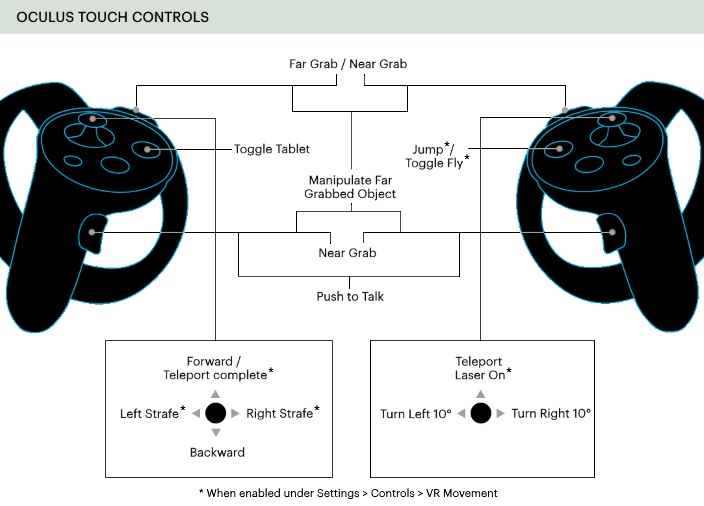
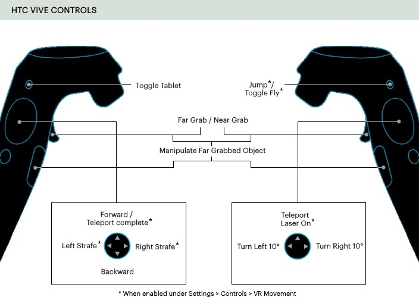
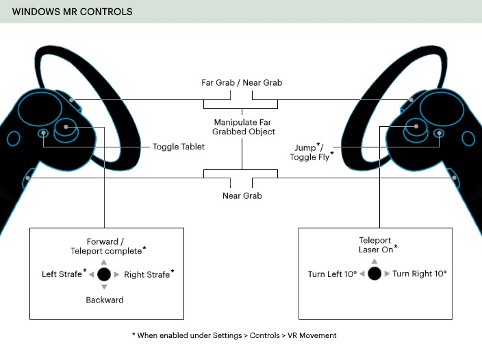

#########################
Use Your VR Equipment
#########################

To get the best and most immersive experience in High Fidelity, we encourage you to use VR equipment, such as the Oculus Rift or HTC Vive. With these HMD devices and hand controllers, you will be able to interact with people in 3D, track body movements, and engage with the objects around you. 

.. contents:: On This Page
    :depth: 2

------------------------
VR Controls
------------------------
                

                

-----------------------------
Change How You Move in VR
-----------------------------

You can change many avatar movement settings in VR such as jumping, flying, and leaning behavior. To do so:

* In Desktop mode, go to **Settings > Controls** in the menu bar.
* In VR mode, open your Tablet and go to **Menu > Settings > Controls**.

+----------------------------+---------------------------------------------------------------------------------+
| Setting                    | Description                                                                     |
+============================+=================================================================================+
| *VR Movement* >            | Enables teleport controls to move seamlessly between positions within a domain. |
| Teleporting                |                                                                                 | 
+----------------------------+---------------------------------------------------------------------------------+
| *VR Movement* >            | Enables walking controls to move within a domain.                               |
| Walking                    |                                                                                 | 
+----------------------------+---------------------------------------------------------------------------------+
| *VR Movement* >            | Enables strafing controls (to walk sideways).                                   |
| Strafing                   |                                                                                 | 
+----------------------------+---------------------------------------------------------------------------------+
| *VR Movement* >            | Enables jump and fly controls.                                                  |
| Jumping and flying         |                                                                                 | 
+----------------------------+---------------------------------------------------------------------------------+
| *VR Movement* >            | This setting controls which direction you move in:                              |
| Movement Direction         |                                                                                 |
|                            | * **HMD-Relative**: Move in the direction your head is pointing.                |
|                            | * **Hand-Relative**: Move in the direction your dominant hand is pointing.      |
|                            | * **Hand-Relative (Leveled)**: Move in the direction your hand is pointing,     |
|                            |   without taking pitch into account.                                            |
+----------------------------+---------------------------------------------------------------------------------+
| *VR Movement* >            | Select 'Left' or 'Right'. Teleport and turn controls move to the controller     |
| Dominant Hand              | in the dominant hand.                                                           |
+----------------------------+---------------------------------------------------------------------------------+
| *VR Movement* >            | This setting controls how you turn in VR:                                       |
| Rotation Mode              |                                                                                 |
|                            | * **Snap turn**: Rotate your avatar sharply to the left or the right.           |
|                            | * **Smooth turn**: Rotate your avatar smoothly as you turn to the left or       |
|                            |   right.                                                                        |
+----------------------------+---------------------------------------------------------------------------------+
| *VR Movement* >            | This setting determines how you control your walking speed:                     |
| Control Scheme Selection   |                                                                                 |
|                            | * **Default**: Your walking speed will remain the same, no matter how far       |
|                            |   forward you push your controller's joystick. Fully pushing the joystick       |
|                            |   forward will make your avatar run.                                            |
|                            | * **Analog**: Your walking speed changes based on how far forward you push      |
|                            |   your controller's joystick. Fully pushing your joystick forward will make     |
|                            |   your avatar run.                                                              |
|                            | * **Analog++**: Your walking speed changes based on how far forward you push    |
|                            |   your controller's joystick. You can use the slider to change the maximum      |
|                            |   walking speed in meters/second. Fully pushing your joystick forward will make |
|                            |   your avatar run.                                                              |
+----------------------------+---------------------------------------------------------------------------------+
| *VR Movement* >            | This setting controls if and when your avatar leans in VR mode.                 |
| Avatar leaning behavior    |                                                                                 |
|                            | * **Auto**: This is the default setting. Your avatar will lean if you are       |
|                            |   standing in the real world.                                                   |
|                            | * **Seated**: Your avatar will not lean if you are sitting in the real world.   |
|                            | * **Standing**: Your avatar will lean if you are sitting in the real world.     |
|                            | * **Disabled**: Your avatar can sit on the floor (experimental).                |
+----------------------------+---------------------------------------------------------------------------------+
| User real world height     | You can change your real world height for better tracking in VR mode.           |
| (in meters)                |                                                                                 |
+----------------------------+---------------------------------------------------------------------------------+

------------------------------------------
Motion Capture Using Vive Trackers
------------------------------------------

You can enhance your High Fidelity experience using full body motion capture (mocap). High Fidelity currently supports mocap using HTC Vive Trackers. 

Vive trackers need to be strapped to the body part you wish to track. You can replace the HMD and hand controllers with trackers if you only need to track the movement of your head and hands. 

You can set up different mocap systems:

+---------------------+--------------------------+---------------------------------------------------------+
| Mocap System        | Equipment Needed         | Recommended Straps                                      |
+=====================+==========================+=========================================================+
| Head                | HMD or 1 Vive Tracker    | Head strap for Vive Tracker                             |
+---------------------+--------------------------+---------------------------------------------------------+
| Hands               | Hand controllers or      | Hand strap for Vive Tracker                             |
|                     | 2 Vive Trackers          |                                                         |
+---------------------+--------------------------+---------------------------------------------------------+
| Head + Hands +      | 2 Vive Trackers + HMD +  | Foot straps                                             |
| Feet                | 2 Hand Controllers       |                                                         |
+---------------------+--------------------------+---------------------------------------------------------+
| Head + Hands +      | 3 Vive Trackers + HMD +  | Hip Strap: Drill a hole in the back of a thick leather  |
| Feet + Hips         | 2 Hand Controllers       | belt and attach the tracker using a 1/4" screw.         |
+---------------------+--------------------------+---------------------------------------------------------+
| Head + Hands +      | 4 Vive Trackers + HMD +  | Chest straps                                            |
| Feet + Hips + Chest | 2 Hand Controllers       |                                                         |
+---------------------+--------------------------+---------------------------------------------------------+
| Head + Hands +      | 5 Vive Trackers + HMD +  | Shoulder straps                                         |
| Feet + Hips +       | 2 Hand Controllers       |                                                         |
| Shoulders           |                          |                                                         |
+---------------------+--------------------------+---------------------------------------------------------+

.. note:: You can replace the HMD and hand controllers with trackers if you only need to track the movement of your head and hands.

.. image:: _images/tracker-placement.jpg

^^^^^^^^^^^^^^^^^^^^^^^^^^^^^^^^
Configure Your Mocap System
^^^^^^^^^^^^^^^^^^^^^^^^^^^^^^^^

1. Strap your Vive trackers to your body as shown in the image.
2. Connect your trackers, HMD, and controllers to SteamVR.
3. In Interface, pull up your HUD or Tablet and go to **Menu > Settings > Calibration**.
4. Configure your mocap system by:

   * Selecting the right device for your head and hands. If you're using a head tracker instead of an HMD, click 'Use HTC Vive Devices in Desktop Mode'.
   * Selecting the body position of any additional trackers. 
   
   .. image:: _images/vive-config.PNG
   
5. Click 'Apply and Calibrate'.
6. Stand in a T-Pose until the timer counts down to zero:

   * Feet together
   * Arms out
   * Head looking straight ahead.
   
7. Check to see that each tracker is tracking the corresponding joint on your avatar. 
8. You can also calibrate your trackers without using your tablet. Once you apply your configuration, stand in a T-Pose and hold the following four buttons together for 1 second: Left Trigger, Right Trigger, Left Menu Button, Right Menu Button. You can press the same buttons together for a second to remove your calibration from the trackers.

.. note:: When you setup your Vive, you choose which way to point the arrow as your reference. During calibration,  it is important that you face the same direction. If you can not remember the arrow's directon, press the Vive System Menu Button and look on the ground for a marker. This is important to make sure your joints are oriented correctly.

^^^^^^^^^^^^^^^^^^^^
Troubleshooting 
^^^^^^^^^^^^^^^^^^^^

+---------------------------------+-------------------------------------------------------------------------------------------+
| Issue                           | Troubleshooting Steps                                                                     |
+=================================+===========================================================================================+
| My calibration failed           | * Check if your trackers are properly connected in SteamVR.                               |
|                                 | * Have you selected the correct configuration in your tablet and do you have enough       |
|                                 |   number of trackers to support that configuration?                                       |
|                                 | * If you are performing and not in HMD, did you select to 'Use HTC Vive in Desktop Mode'? |
|                                 | * Are any of the trackers blinking? If so, they may need to be paired again.              |
|                                 | * Do you have the correct number of dongles plugged in to your computer? You will need    |
|                                 |   one dongle per tracker. If you are performing with all 7, then you may need a USB hub   |
|                                 |   to handle them.                                                                         |
+---------------------------------+-------------------------------------------------------------------------------------------+
| My sensor is jiggling a lot     | Make sure the straps on the sensor are tightened.                                         |
+---------------------------------+-------------------------------------------------------------------------------------------+
| My sensor keeps losing tracking | * If it’s the hip tracker, is your shirt is tucked in and not covering the puck? Also     |
|                                 |   make sure your headphone cord isn’t covering the puck.                                  |
|                                 | * Can the base stations clearly see the tracker?                                          |
|                                 | * Is the signal from the base station conflicting with another Vive setup nearby?         |
|                                 | * Are you clear of reflective surfaces nearby? (such as picture frames, whiteboards,      |
|                                 |   shiny tables).                                                                          |
|                                 | * Is the lighting consistent across the room (minimal outdoor lighting)?                  |
|                                 | * Try restarting SteamVR.                                                                 |
+---------------------------------+-------------------------------------------------------------------------------------------+

.. note:: Remember to charge your trackers when you aren't using them so that you don't have to deal with a low battery tracker negatively impacting your performance.

-------------------------
Gamepad
-------------------------

If your HMD does not come equipped with hand controllers, you can use a gamepad. However, High Fidelity is best experienced with VR equipment or the keyboard in Desktop mode.

.. image:: _images/controls-gamepad.png

**See Also**

+ :doc:`Interact with Your Environment <../interact>`
+ :doc:`Explore in Desktop Mode <desktop>`
