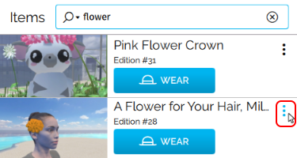
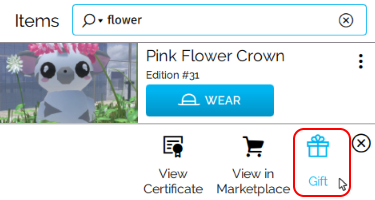
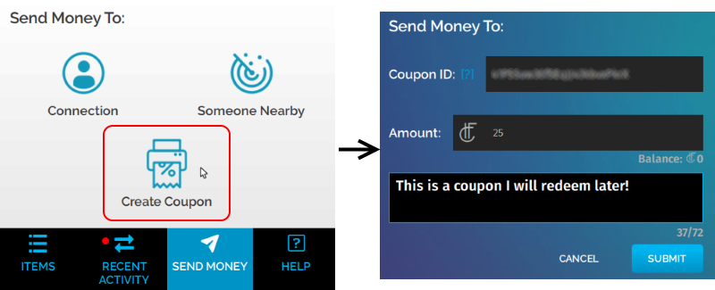

#########################################
Give and Receive Gifts
#########################################

Just like in real life, you can give money or presents to your friends in Vircadia. You may wish to gift an item to a friend, send money to a connection, have a VIP zone in your domain, or play a poker game with your friends. 

With the Commerce API, you can also award money or items using a coupon. A *coupon* is a way to send HFC or items to someone at a later time, even when you are not logged in to Vircadia. For example, you can create a coupon to award the winner of a trivia game 250 HFC, or to give someone a soda when they buy something from a vending machine.

.. contents:: On This Page
    :depth: 2

-----------------------------------------
Send HFC to Others (DISCONTINUED)
-----------------------------------------

This feature was discontinued by High Fidelity and will either be reworked or removed in the future.

To send money to a connection or someone nearby:

#.  In Interface, pull up your tablet or HUD and go to **Inventory**.
#.  In the **Inventory** app, click 'Send Money'. 

3.  Send money to one of your connections or even someone nearby in the same domain.  

	* If you want to send it to one of your connections, click 'Connections; and choose the recipient from the list.
	* If you want to send it to someone nearby, click 'Someone Nearby' and choose your recipient by triggering or clicking on someone nearby to select them.

	 .. image:: _images/nearby.PNG
	 
#.  Add the amount you wish to send. This amount should be less than or equal to your HFC balance. 
#.  You can add an optional public message. Click 'Submit'. 
#.  A window pops up confirming that your money has been sent. 

-----------------------------------------
Send Purchased Items to Others
-----------------------------------------

After you `buy something from the Marketplace <shop.html#shopping-the-marketplace>`_, you can give it to a connection or someone nearby. To do so: 

1.  In Interface, pull up your tablet or HUD and go to **Inventory**.
2.  In the Inventory app, click 'Items'.

3.  Scroll to the item you'd like to give and click on the menu.

4.  Select 'Gift'. 

5.  Send the item to one of your connections or even someone nearby in the same domain. 

	* If you want to send it to one of your connections, click 'Connections' and choose the recipient from the list.
	* If you want to send it to someone nearby, click 'Someone Nearby' and choose your recipient by triggering or clicking on someone nearby to select them. 

	.. image:: _images/nearby.PNG

6.  You can add an optional public message. Click 'Submit'. 
7.  A window pops up confirming that your item has been sent.  

.. note:: When you send an item to another user, it is removed from your **Inventory**.

-----------------------------------------
Create a Coupon (DISCONTINUED)
-----------------------------------------

This feature was discontinued by High Fidelity and will either be reworked or removed in the future.

You can create a coupon when you want to send money or an item to someone at a later time, even when you are not logged in to Vircadia.

.. note:: Currently, you can only use a coupon in a script. You will not be able to redeem a coupon anywhere in Interface. 

1. In Interface, pull up your tablet or HUD and go to **Inventory**.
2. Choose whether you'd like to later send HFC or an item.

	* If you want to send HFC, click 'Send Money'.
	* If you want to send an item, click 'Items' and scroll to the item you'd like to give. Click on the item's menu and choose 'Gift'.

3. Select 'Create Coupon'.
4. Enter an optional public message explaining the purpose of the coupon. 
5. The Tablet will now display a window with the 'Authorization ID' and 'Coupon ID'. Copy both these values on your computer. Click 'Close'.
6. Include the copied values in a :doc:`script where another user receives the HFC or item <../script/transfer-hfc-tutorial>`.

**Example: Use a Coupon to Hold a Raffle**  

Say you want to pre-authorize 10 of your Vircadia Coins to be paid out to a user who wins a raffle that you host. In this example, `curl <https://curl.haxx.se/>`_ is used to perform the redemption. But you can redeem a pre-authorized transfer using any script or tool that can perform `HTTP PUT` requests, such as Vircadia Interface's `request` JavaScript module or a simple PHP form on a website.

1. `Create a Coupon`_ to get an 'Authorization ID' and 'Coupon ID' value pair associated with a 10-HFC Pre-Authorized Money transfer.
2. Copy and paste the 'Authorization ID' and 'Coupon ID' to a text file on your computer.
3. Click 'Close', then 'I'm All Set'.
4. Hold your raffle! In this example, a user with username `steve` has won the raffle.
5. Use the following ``curl`` command from the command line to dispense the money authorized in (1) to username `steve`:
   ``curl -X PUT -d authorization_id="<authorization ID from 1>" -d coupon_id="<coupon ID from 1>" -d username=steve https://highfidelity.com/api/v1/commerce/redeem``

**See Also**

+ :doc:`Bank and Shop <shop>`
+ :doc:`Tutorial: Transfer Money and Items <../script/transfer-hfc-tutorial>`