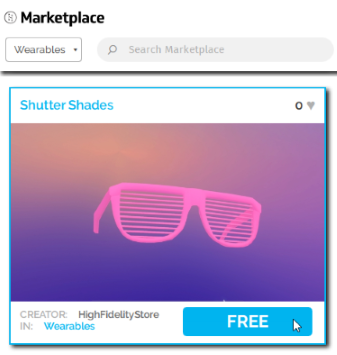

# Put On Wearables

You can customize your avatar's appearance by adding wearables, such as a pirate's hat, a pair of sunglasses, or even a pair of trousers that you designed. Like avatars, you can buy wearables from the Marketplace or use your imagination to create your own. 

**On This Page:**
* [Buy a Wearable from the Marketplace](#buy-a-wearable-from-the-marketplace)
* [Wear Your Own Wearable](#wear-your-own-wearable)

## Buy a Wearable from the Marketplace
We and our users have designed many wearables that are available for your use in the Marketplace.

1. In Interface, pull up your Tablet or HUD and go to **Market**.
2. Search for a specific wearable, or browse all wearables by selecting the 'Wearables' category.
3. Click on any one you like and hit 'Get' (for free items) or 'Buy' (for purchased wearables).
4. After completing your purchase, click 'Wear' to put on your new wearable.

## Wear Your Own Wearable
You can put on a [wearable that you created](../../../create/wearables). All wearable must be hosted in the cloud before they can be used with High Fidelity. Examples of cloud storage options include Amazon S3, Google Cloud Storage, Github, or Microsoft Azure. Alternatively, you can [add your wearable to the Marketplace](../../../sell/add-item/upload-wearable) to sell to other users.

Once you have your wearable's .fbx file, you can upload it.

1. In Interface, pull up your tablet or HUD and click on **Avatar**.
2. In the **Avatar** window, click the hat icon next to 'Wearables'. 
3. Click 'Add custom' at the top of the window.
4. Enter the .fbx file's URL and click 'Confirm'.
5. Select the joint you'd like to use for your wearable. For example, a hat would be on your head, and fairy wings would be on your spine. 
6. Fine tune the placement using the 'Position' and 'Rotation' options.
7. Check 'Is soft' if the item is rigged with your skeleton. This allows the item to move and bend with the avatar as it moves.
8. Click 'Save'.

**See Also**

+ [Create Wearables](../../../create/wearables)
+ [Add Your Wearable to the Marketplace](../../../sell/add-item/upload-wearable)