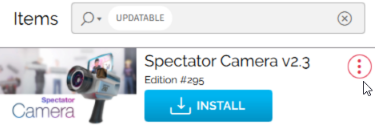
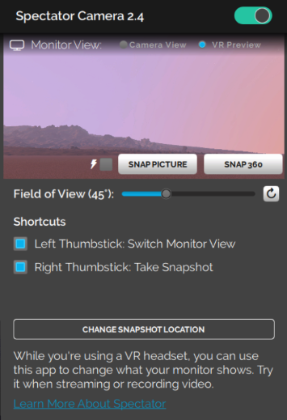
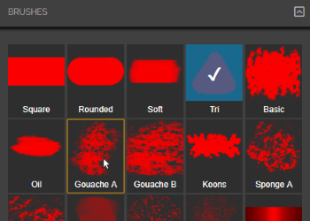
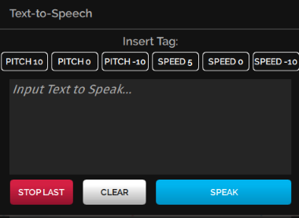

# Install Tablet Apps

You can enhance your experience in High Fidelity by installing tablet apps from the Marketplace. These apps enable you to get more out of High Fidelity. Do you want to record your avatar dancing, take selfies, or finger paint? Or are you looking to livestream to YouTube or make your avatar clap? Our Marketplace has a number of apps that can help you customize your experience in-world. 

If you can't find an app for what you'd like to do, you can [create your own](../../create/applications.html) and upload it to our Marketplace for your personal use or to sell to others.

**On This Page:**

* [Install Tablet Apps](#install-tablet-apps)
* [Update an App](#update-an-app)
* [Our Marketplace Apps](#our-marketplace-apps)
	* [Spectator Cam: Record or Livestream in High Fidelity](#spectator-cam)
	* [Finger Painting](#finger-painting)
	* [Text to Speech](#text-to-speech)

## Install Tablet Apps
We and many users have created tablet apps that are available in High Fidelity's Marketplace. To find and install an app:

1. In Interface, pull up your HUD or Tablet and go to **Market**.
2. Search for a specific app, or browse all apps by selecting the 'Apps, Scripts, & Tools' category.
3. Click the app of your choice to purchase it and hit 'Get' (for free items) or 'Buy' (for purchased apps). Once you've purchased your app, you can view it in the **Inventory** app or 'Recent Activity'. 
4. After completing your purchase, click 'Install App' to start using the app in High Fidelity.
5. Once the app is installed, click 'Open App' to launch. You can also access the app through your HUD or Tablet.

## Update an App
When an app has an update available, a notification will pop up in the top right corner of the Interface when you open High Fidelity. Additionally, a red dot will appear on the **Inventory** icon of your HUD or Tablet to indicate an update is available to download.

To update your app: 
1. In Interface, pull up your HUD or Tablet and go to **Inventory**.
2. In the **Inventory** app, click the notification that says "You have X item updates available."
3. Scroll to the app you'd like to update and click on the menu. 
4. Click the 'Update' button, then 'Update for Free'.

    
Note

    
You can also visit the Item Listing page, where you’ll see an 'Update For Free' button. 

### Additional Notes on Updating
* If you decide not to update an item, the old product will still be valid and listed in **Inventory**.
* Once you update an item, the previous version of the product will no longer be available.
* If you purchased multiple instances of an item, you need to individually update each instance of an item in your **Inventory**.
* When you update a product with the old version already in-world, it will remain intact until it is replaced manually with the updated version. If you attempt to import an entities JSON which contains the old version, the system will ignore the item, and not automatically replace it in-world. It is up to the end-user to replace the old instances with the new.

## Our Marketplace Apps
We've listed some of the apps we created and how you can use them. 

### Spectator Cam
The Spectator Camera is a camera you can use to record or livestream what you and your friends do in High Fidelity. It is only available in HMD mode, and requires a recording software such as [Open Broadcaster Software (OBS)](https://obsproject.com/) to work correctly. Check out their [official overview guide](https://obsproject.com/forum/threads/official-overview-guide.402/) for more details. 

[Use the instructions above](#install-an-app) to install the Spectator Camera app.

    
Note

    
While using the Spectator Camera, Interface's framerate might be affected. This is because Interface is rendering not only what you see, but what the Spectator Camera sees as well. 

To use the Spectator Camera app: 
1. In Interface, pull up your HUD or Tablet and go to **Spectator**. 
2. Turn on your Spectator Cam by moving the slider. You'll see the camera appear in-world. By default, the app's display shows you what you see in VR through your HMD. This is to show you what you're recording without having to take off your HMD. 
3. To record yourself, switch your display from your HMD's view to the camera view. This lets you record videos of yourself, such as your avatar dancing or trying on different wearables. 
4. Enable switching views with your controllers in the **Spectator** app on your HUD or Tablet. 
    * **Rift**: If you're using Oculus Touch controllers, click the left thumbstick to switch views. 
    * **Vive**: If you're using HTC Vive controllers, press on the center of the thumb pad to switch views. 

### Finger Painting 

The Fingerpaint app lets your paint your environment, your own avatar, or even another user's avatar. [Use the instructions above](#install-an-app) to install the Fingerpaint app.

To use the Fingerpaint app: 
1. In Interface, pull up your HUD or Tablet and go to **Body Paint**. 
2. First, click 'Options' to select what you would like to paint on - the world around you, your avatar, or another user's avatar (with their permission).  
3. Click 'Palette' to select a color for your paint. 
4. Click 'Brushes' to select the settings for your brush, such as stroke width, type of brush, and special effects.

### Text to Speech

The Text to Speech app synthesizes the text you type into speech. You can use this app if you don't wish to use your voice, have microphone issues, or have disabilities. 

[Use the instructions above](#install-an-app) to install the Text to Speech app.

    
Note

    
Currently, the Text to Speech app only works on Windows, since it relies on Microsoft's Text-to-Speech API built on Windows.

To use the Text to Speech (TTS) app: 
1. In Interface, pull up your HUD or Tablet and go to **TTS**. 
2. In the app, select the Pitch and Speed of your choice. 
3. Type in the text you'd like your avatar to speak.
4. Hit 'Speak' to hear your text. Hit 'Stop Last' to stop your avatar from speaking.

**See Also**
+ [Create Tablet Apps](../../create/applications.html)