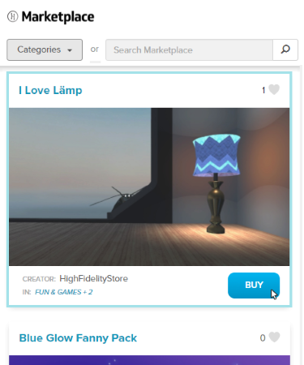

# Bank and Shop

If you want to buy items in High Fidelity, head on over to the Marketplace, where you can purchase more than 300 items built by digital artists and creators from around this world. High Fidelity uses their own cryptocurrency, High Fidelity Coin (HFC) to manage your transactions. 

**On This Page:**
* [Buy High Fidelity Coin](#buy-high-fidelity-coin)
* [Shop the Marketplace](#shop-the-marketplace)
* [Cash Out Your HFC](#cash-out-your-hfc)

## Buy High Fidelity Coin

Currently, you can buy High Fidelity Coins (HFC) using [Ethereum](https://www.ethereum.org/), a blockchain app that trades ETH (Ether). The Bank of High Fidelity manages HFC and we gradually increase the number of coins in circulation as the economy grows. 100 HFC is equal to 1 USD.

To get HFC: 
1. [Book an appointment](https://meetings.hubspot.com/highfidelity/high-fidelity-bank-appointment) at the Bank of High Fidelity.
2. At the time of your appointment, visit the [TradingRoom](https://hifi.place/TradingRoom) domain.
3. We will provide you with a QR code that you can use to send ETH to the Bank of High Fidelity. 
4. Once we receive the ETH amount you sent, we will send you the appropriate amount of HFC to your account based on the current exchange rate. This can take up to one business day. 

You can also receive HFC from gifts from your friends or as prizes at events in High Fidelity.

## Cash Out Your HFC

As you acquire more HFC through Marketplace sales, prizes, or gifts, you may cash out your HFC for USD. The minimum amount of HFC that you cash out is $25 (or 2,500 HFC), and the maximum cashout value is $2000 (or 200,000 HFC) per calendar month. High Fidelity may, at its discretion, issue the occasional exception to the maximum cashout amount.

To cash out HFC: 
1. [Book an appointment](https://meetings.hubspot.com/highfidelity/high-fidelity-bank-appointment) at the Bank of High Fidelity.
2. At the time of your appointment, visit the [TradingRoom](https://hifi.place/TradingRoom) domain to meet with the banker.

The transaction will go through PayPal. USD will be paid to the email account specified via the appointment booking form. Time to payment receipt will be based on PayPal rules and guidelines.

## Shop the Marketplace

The Marketplace contains all types of items to enrich your VR experience, including avatars, buildings, apps, wearables, toys and so much more. Each item will have a cost associated with it - some items are free, while others can be purchased. 

Browse our items in the Marketplace either on [our website](https://highfidelity.com/marketplace) or by using the **Market** App. 

To buy an item: 
1. In Interface, pull up your tablet or HUD and go to **Market**.
2. Browse to the item you want to buy.
3. Click on the item and hit Get (for free items) or Buy (for purchased items).

You can locate all items that you purchase in the **Inventory** App. 

### The Inventory App

The Inventory app provides an interface to manage your transactions, purchases, and HFC. From the Inventory app, you can: 

* View your recent purchases, sales, gifts and other transaction history
* Change avatars, put on wearables and install/update apps
* [Send HFC to your friends or anyone nearby](socialize.html#send-hfc-to-others)

**See Also**
+ [Send HFC to Others](socialize.html#send-hfc-to-others)
+ [Send Purchased Items to Others](socialize.html#send-purchased-items-to-others)
+ [Sell Items on the Marketplace](../sell.html)