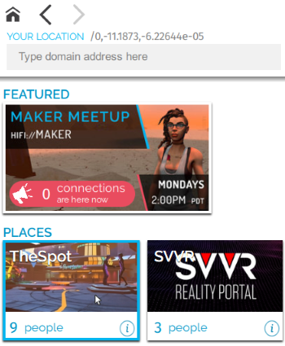

This document is outdated.
FIXME: mentions GoTo app

# Travel Between Worlds

Vircadia is made up of many virtual places that let you participate in activities and interact with the people around you. Many of these places are beautifully detailed worlds that are interesting to explore at any time, while others were built to host events and engage with the people around you.

**On This Page:**
* [GoTo App](#goto-app)
* [Visit a Friend](#visit-a-friend)

## GoTo App
The **GoTo** app lets you travel between different places in the Vircadia metaverse. Many of our places are created by users just like you.

To go and explore new places:
1. In Interface, pull up your tablet or HUD and go to **GoTo**.
2. If you know where you want to go, enter the domain address or place name. As you type, the matching places will show up. Otherwise, browse the open places under 'Featured' and 'Places'.
3. Click on a place name to go to the place. If you have permissions, you will be transported to that location automatically.

   
Note

   
The places that show up in the GoTo menu are user-created domains that are open to the public. However, note that the domain owner has full control over the security of their domain and has the ability to ban specific users from a domain. In the rare circumstance that you have been banned, a place may show up in the GoTo menu, but you will be unable to connect to it if you try to travel there.

The **GoTo** app also shows you a visual feed of snapshots that people have taken and shared in the metaverse. Clicking on a snap will take you directly to the place where the picture was taken.

## Visit a Friend
Once you've [made a friend](socialize.html#make-connections-and-friends), you can see where they are and even teleport directly to them.

1. In Interface, open your tablet or HUD and go to **People**.
2. Click 'Connections' and find the friend you want to visit.
3. Select their name then 'Visit'.

**See Also**
+ [Socialize with Others](socialize)
