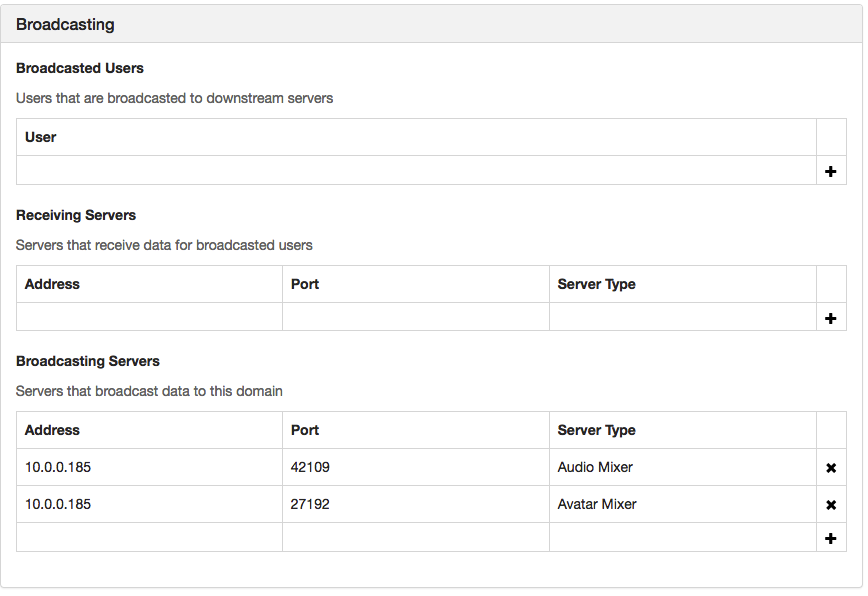
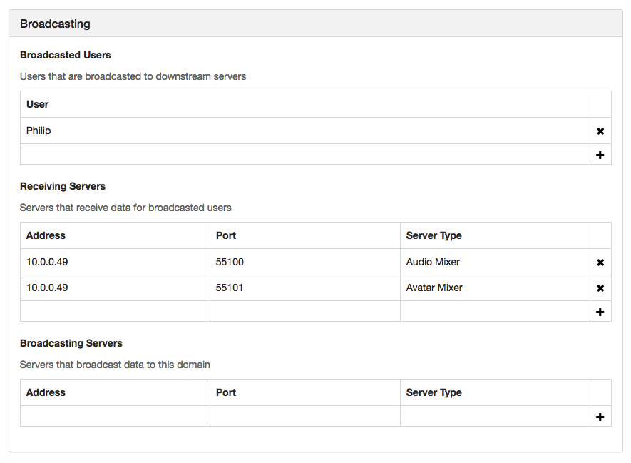

# Broadcast to Other Domains

You can broadcast what's happening in your domain to other domains in High Fidelity. This feature is useful when you want to host an event in your domain, but cannot support the number of users interested in attending it. 

**On This Page:**

+ [Change Audio and Avatar Mixers' Ports](#change-audio-and-avatar-mixers-ports)
+ [Add Broadcasting Server Settings](#add-broadcasting-server-settings)

## Change Audio and Avatar Mixers' Ports

When you broadcast events from your domain, you are transmitting audio and avatar information. For the talk show you want to host, you'll be broadcasting the audio and avatar information of yourself and the users who will be your guests. The users in the receiving domains will be able to see and hear you and your guests. 

Your audio mixer conveys all the audio information in your domain. The avatar mixer contains information about how your avatar is moving in a domain. The ports for these mixers are usually randomly assigned and change every time you modify your domain's server settings. To ensure your broadcasting settings will work, you need to assign specific ports to both mixers. Or they will change every time you save any new domain server settings. 

You can assign specific ports to your mixers using the command prompt (in Windows) or the terminal (in OS X). 

```
// Launch 1 domain server:
./domain-server

// Launch 1 assignment client for each type:
// List of the types:
//     AudioMixerType = 0,
//     AvatarMixerType = 1,
//     AgentType = 2,
//     AssetServerType = 3,
//     MessagesMixerType = 4,
//     EntityScriptServerType = 5,
//     EntityServerType = 6,
// replace $TYPE with the type number of the mixer and $PORT with the port
./assignment-client -t $TYPE -p $PORT
```

## Add Broadcasting Server Settings

Once you assign ports to the mixers, you can add the required broadcasting settings. 

1. Right-click the High Fidelity icon on your system tray, and go to 'Settings'. 
2. In the server settings, scroll down to 'Broadcasting'.
3. Add the server address and ports for the broadcasting server's (your domain's) audio and avatar mixers. 
4. Add the server address and ports for the receiving server's (your domain's) audio and avatar mixers. 
5. Add usernames to broadcast specific users (for example: when hosting a music night, you can broadcast only the band and not the audience). This acts as a whitelist: if you don't add any users, you will broadcast nothing. 

**See Also**

+ [Configure Your Domain Settings](your-domain/configure-settings.html)
+ [Secure Your Domain](secure-domain.html)

  

