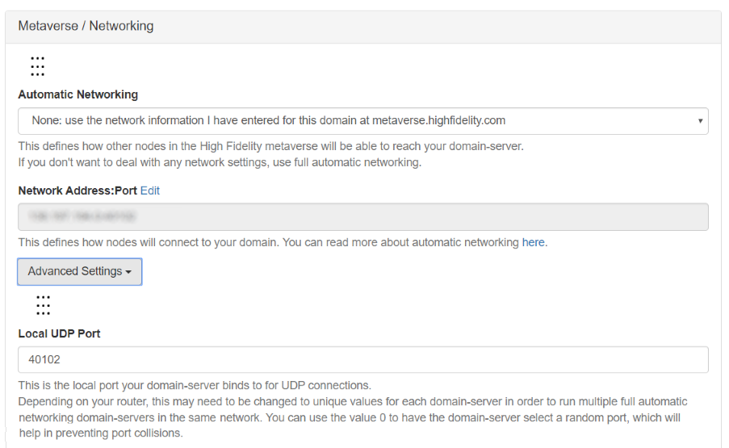
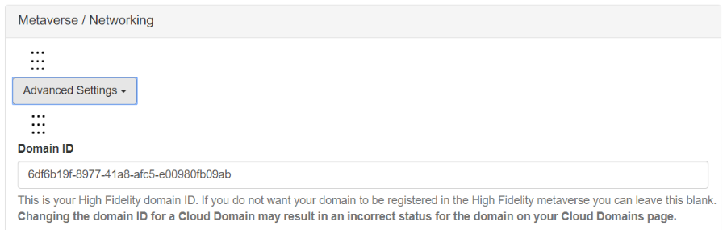
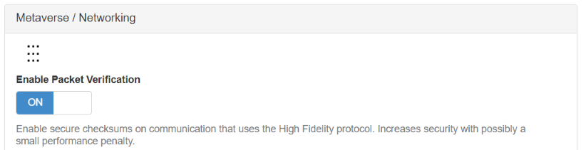

####################################
Define Your Network Settings
####################################

The **Metaverse/Networking** section of the Domain Settings defines all of the network settings for your domain.

.. warning:: Changing any network settings will affect how the Metaverse Server and users will connect with your domain. Before making any changes to the settings, ensure that you have a basic understanding of networking concepts (IP, UDP, ports, etc) as changing these settings can impact visitors or (if you're running a local server) put your system at risk.

.. contents:: On This Page
    :depth: 2

--------------------------------
Linked Metaverse Account
--------------------------------

Every domain can be linked to one Metaverse account, who is the owner of that domain. When you link your account, an OAuth access token is created and grants your account access to modify domain settings, and access groups necessary for domain operations. In addition, you can access your account-specific settings, such as Place names.

The status of your linked Metaverse account is reflected at the top of the Metaverse/Networking section of the domain settings. You can also view your access token on this page (under 'Advanced Options').

.. image:: ../_images/account-status.png

--------------------------------
Automatic Networking
--------------------------------

The automatic networking settings define how other nodes in the metaverse connect to your domain. These nodes include the avatar mixer, audio mixer, entity server, asset server, entity script server and messages mixer. 

Choose from the following automatic networking options:

* **None**: The network address and port displayed will be used to connect your domain. They are never automatically updated, and your domain must be reachable at the address and port you set.
* **IP Only**: Your domain will update the network address displayed to whatever it detects as your current IP address. The port displayed will not be automatically changed, so your domain must be reachable on the specified port. This option is recommended for a local server running on a home network with a dynamically changing public IP address.
* **Full**: Your domain will provide the networking information to Vircadia's servers, so that new clients can connect to it via UDP hole punch without needing to make any changes to NAT or firewall settings. This may not work for all networks.

Depending on the automatic networking method you choose, define the network address and/or port in the fields provided. 

.. note:: If you intend to host multiple domains on the same network and router, be sure to set each domain to a separate UDP port. You can use the value "0" to have your domain select a random port, which will help prevent port collisions.

--------------------------------
Networking Details (Advanced)
--------------------------------

A Vircadia domain reserves a range of four ports to operate on, usually starting at `40100`. (Note that the encrypted ports may not be implemented yet.) These ports are:

- 40100 (+0): (tcp) administrative http connection
- 40101 (+1): (tcp) administrative https (encrypted) connection
- 40102 (+2): (udp) main connection from clients
- 40103 (+3): (udp) main connection from clients (encrypted)

Generally speaking, only port `40102` must be publicly exposed to permit others to connect to a domain.

In addition there are six "assignment clients" that must run in order for the domain to be operational. These clients run alongside the domain server and must be able to connect with any outside user. These clients are:

- **asset-server**: stores object data to download to the user
- **audio-mixer**: controls what each user would hear
- **avatar-mixer**: allows users to see each other
- **entity-script-server**: runs actions inside the domain
- **entity-server**: describes the location of each object in the domain
- **messages-mixer**: passes messages between users in the domain

These assignment clients use UDP connections on a port number assigned by the operating system at launch. These ports will be within the `ephemeral port range <https://en.wikipedia.org/wiki/Ephemeral_port>`_.

--------------------------------
Domain ID
--------------------------------

Each domain on the metaverse is assigned a unique domain ID. The Metaverse server uses this ID to help provide more advanced features to your world such as: allowing you to create Place names, identifying logged in users, and more. 

If you don't want your domain to be registered in the metaverse, leave the Domain ID field blank. 

---------------------------------
Enable Packet Verification
---------------------------------

When 'Enable Packet Verification' is turned on, Vircadia sends secure checksums on communications that use the Vircadia protocols. This increases security in your domain, but may slightly decrease domain performance for your visitors.

