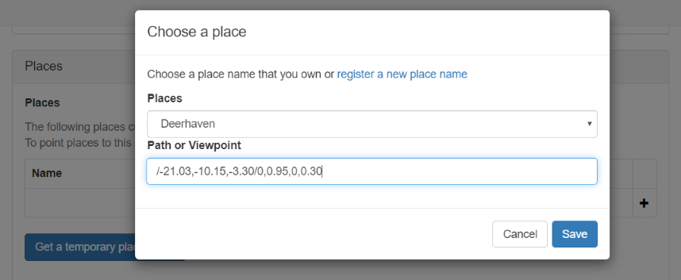
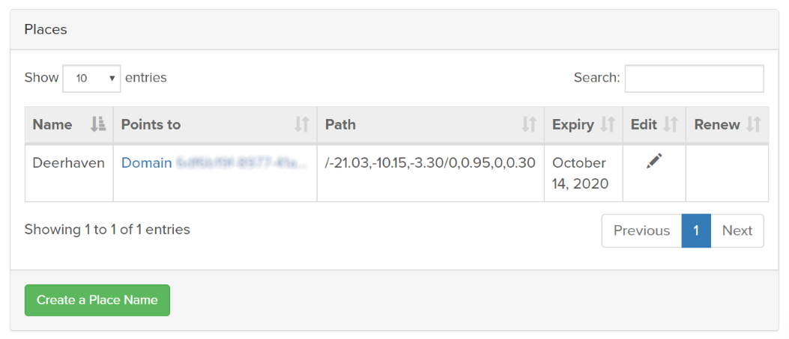

####################################
Set Up a Place Name
####################################

While you can travel to a domain using its IP address, IP addresses are difficult to remember, often change depending on your network setup, and are not very attractive sounding. Telling a friend "Meet me in 20 minutes at IP address ..." just doesn't cut it in a fun, virtual environment.

Place names, on the other hand, make it easy to travel to your domain. They're memorable, and give context to visitors to remember your virtual world. Imagine someone saying "Wow, I had a great time at Deerhaven last night!" and you can smile knowing that they're talking about your domain, Deerhaven.

.. contents:: On This Page
    :depth: 2

-----------------------------
Get a Place Name
-----------------------------

Once acquired, a place name can be transferred freely between any of your domains.

1. Go to https://dashboard.vircadia.com/places to get a place name. If you're not logged in, you will be prompted to do so.
2. Click 'Create Place'.
3. Type in your new Place Name. You can use any place name that has not already been taken; however, please note that Vircadia reserves the right to reject any registration we deem obscene, offensive, or a copyright violation.
4. Click 'Create'.

-----------------------------
Configure Your Place Name
-----------------------------

A place name points to a specific coordinate in the metaverse. Not only does it point to a domain, but it also defines the exact position  in your domain where your visitors will spawn in. There are two different ways to configure your place name settings, and they achieve the same thing.

**Method 1 - Use the Domain Settings**

This sets up your place name directly from your domain settings.

1. Open your domain settings.

    * For cloud hosted domains: Open a browser and enter the URL http://<insert your server's IP address here>:40100/settings. Log in when prompted.
    * For local servers on Windows: Click on the Vircadia icon in the system tray, then click 'Settings'. 
    * For local servers on Mac: Right-click the Vircadia icon on the top menu bar, then click 'Settings'.
    * For any OS: Open a browser and enter the URL http://localhost:40100/settings.
2. Scroll to 'Places'.
3. In the grid, click the ``+`` icon to add a place name to this domain.
4. Choose the place name you want to use from the dropdown list.
5. For 'Path or Viewpoint', enter the coordinates where your visitors will spawn.
6. Click 'Save'.

**Method 2 - Use 'My Places'**

This sets up your place name from your Vircadia account. Before moving forward, make sure you have the `domain ID <network-settings.html#domain-id>`_ of your domain. You will need this to point your place name to your domain. 

1. Go to https://dashboard.vircadia.com/places. If you're not logged in, you will be prompted to do so.
2. Click the 'Edit' icon next to the place name you want to configure.
3. For 'Points to', enter the domain ID of your domain.
4. For 'Path', enter the coordinates where your visitors will spawn.
5. (Optional) Enter a description for your domain. This shows up when a user clicks the info icon if your domain is displayed in the Explore app.
6. (Optional) Upload a preview image of your domain. This shows up when your domain is displayed in the Explore app.
7. Click 'Update Place'.

