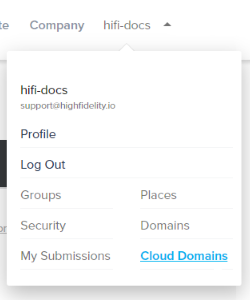
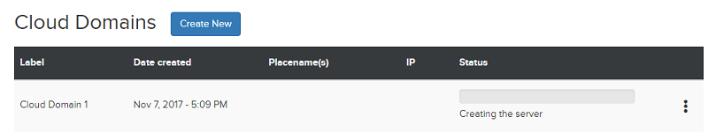
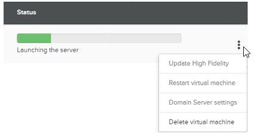

#######################
Host Your Domain
#######################

Depending on your requirements, you can host your domain on your local machine or on cloud servers. We recommend hosting on cloud servers such as Digital Ocean or Amazon EC2 if you want to open your domain to many visitors. 

**On This Page**

* `Host Your Domain on Digital Ocean <#host-your-domain-with-digital-ocean>`_

----------------------------------------
Host Your Domain with Digital Ocean
----------------------------------------

1. Log in or sign up with your High Fidelity username and password on `https://highfidelity.com <https://highfidelity.com>`_.
2. Hover over your username to see the various menu options. Click **Cloud Domains**. You can also go to `https://highfidelity.com/user/cloud_domains <https://highfidelity.com/user/cloud_domains>`_. 

3. You'll be redirected to the Cloud Domains. Click 'Create New' to create a new cloud domain.
4. Before you set up a cloud domain, you need to connect your DigitalOcean account. If you don't have one, you can sign up now.   
5. You will be redirected to the DigitalOcean authorization page. Once you've signed in, choose the virtual machine to host your domain. Select the configuration that best suits your needs, keeping in mind that our recommendations are based on the number of users that will be visiting your domain.
6. Next, select the geographical location where you would like to host your server. 
6. Click 'Launch your cloud domain', and then 'Confirm'.  

You will be redirected to your Cloud Domains page, where you will see the domain server you just created being configured. 

    
The table below outlines the recommended configuration based on numbers of users.  

+-------+---------------------------------------------------+-----------------+
| Users | DigitalOcean Droplet                              | Estimated Price |
+=======+===================================================+=================+
| 10-15 | 8 GB Memory, 4 vCPUs, 80 GB SSD, 5 TB Transfer    | $40/mo          |
+-------+---------------------------------------------------+-----------------+
| 25-30 | 16 GB Memory, 6 vCPUs, 320 GB SSD, 6 TB Transfer  | $80/mo          |
+-------+---------------------------------------------------+-----------------+
| 40-50 | 32 GB Memory, 8 vCPUs, 640 GB SSD, 7 TB Transfer  | $160/mo         |
+-------+---------------------------------------------------+-----------------+
| 160   | 64 GB Memory, 32 vCPUs, 400 GB SSD, 9 TB Transfer | $640/mo         |
+-------+---------------------------------------------------+-----------------+

--------------------------------------
Configure Your Domain Settings
--------------------------------------

You can configure your domain settings by clicking on the three dots on the right corner and selecting 'Domain Server settings' from the drop down. You will be prompted to `configure the basic server settings <../../your-domain/configure-settings#configure-basic-server-settings>`_. 

**See Also**

+ `Configure Your Domain Settings <../../your-domain/configure-settings>`_
