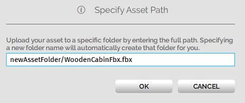
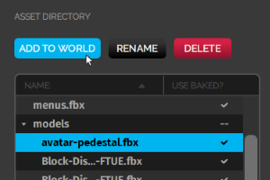
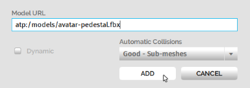

############################
Manage Your Assets
############################

Once you've completed :doc:`setting up your domain <your-domain>`, you can start building content for it. You can add content to your domain using :doc:`our creator tools <../create/tools>` or the Asset Server.

The Asset Server hosts files or assets that can either be added as-is to your domain or that are referenced by existing entities and scripts already in your domain. Your assets are 3D models, audio files for various sound effects, image files for textures and skyboxes, scripts, and more. 

You can host your content on the Asset Server, or use a cloud service such as DigitalOcean Spaces, Amazon S3, or Google Cloud Storage.

.. contents:: On This Page
    :depth: 2

.. note:: Files hosted on the Asset Server are only available in your domain, and cannot be seen in other domains. Therefore, we recommend that you do not upload avatars to the Asset Server since they will not be available in domains other than your own.

------------------------------------
Add an Asset to the Asset Server
------------------------------------

You can add, edit, and remove files from your Asset Server through the Asset Browser in your domain. To add a file from your computer to the Asset Server:

1. In Interface, pull up your HUD or Tablet and go to **Create**. 
2. In the **Create** app, click 'Open This Domain's Asset Server' to view the Asset Browser.
3. Click 'Choose File' in the Asset Browser window. 
4. Browse to your asset file, then click 'Open'. 
5. Enter a folder name to specify a path for your asset. This path should be added before the asset file name ``/asset_filename``. By default, there is no folder created for your asset. However, we recommend that you add folders for each of your assets to help keep your assets organized. 

6. Click 'OK'. Your assets will be added to the Asset Browser under the folder that you specified. 

.. image:: _images/added-asset.png

Once files have been uploaded to your Asset Server, they can be added directly to your domain or referenced by any entities or scripts in your domain using their URLs. To get an asset's URL: 

1. Right-click on the asset in the Asset Browser. 
2. Click 'Copy URL'.

----------------------
Bake an Asset
----------------------

When you upload a model to your domain, you are rendering the following: 

+ Your model's assets.
+ Geometric meshes: A geometric mesh (more commonly known as a polygon mesh) is a collection of vertices, edges, and faces that together define the shape of a model in 3D graphics and modeling.
+ Textures: Textures help in defining high frequency detail, color, or surface textures. 

Loading models in High Fidelity involves real-time rendering (drawcalls), which means images are produced and analyzed in real time. Depending on the complexity of the models, the drawcalls can differ. You can reduce the drawcalls and optimize the rendering process using baking. Baking optimizes the rendering process by compressing the poly meshes and textures in an asset. A baked model loads the smaller meshes first, cutting down on the load time. Baked textures are often larger than the original texture because they contain textures with different resolutions.

In High Fidelity, baking improves the efficiency with which models are stored and transmitted. If you bake your domain content, you will reduce the initial load times for your visitors.

+--------------------------+--------------------------------------------------------------------------------------+
| File Type                | Baking Process                                                                       |
+==========================+======================================================================================+
| 3D models (FBX files     | Baked when uploaded to the Asset Server.                                             |
| with embedded textures)  |                                                                                      |
+--------------------------+--------------------------------------------------------------------------------------+
| Avatars (FBX files with  | Baked when uploaded to the Asset Server. Avatars are usually not uploaded to the     |
| embedded textures)       | Asset Server as they are used in different domains. Avatars uploaded to the Asset    |
|                          | Server can only be baked when their FBX files are embedded with textures.            |
+--------------------------+--------------------------------------------------------------------------------------+
| JavaScript Files         | Baked when uploaded to the Asset Server. Baking a JS file involves removing white    |
|                          | spaces and comments in the script to shrink its size. A baked script is transmitted  |
|                          | and interpreted faster because of its smaller size.                                  |
|                          |                                                                                      |
|                          | A baked JS file will not be very easy to read as all the white spaces and comments   |
|                          | will be removed. If you wish to read and understand any JS files that have been      |
|                          | baked, you will need to use its unbaked version.                                     |
+--------------------------+--------------------------------------------------------------------------------------+

A baked file will have a check mark under the 'Use Baked?' column on the Asset Browser. A file will not bake when:

+ It is an FBX file with external textures. Only FBX files with embedded textures can be baked. This error will show up as a triangular sign under the 'Use Baked?' column.
+ It is a file type that cannot be baked. It is usually depicted by two dashes under the 'Use Baked?' column.

To bake a file again, just uncheck and check 'Use baked version'.

----------------------------------
Add an Asset to Your Domain
----------------------------------

You can add an asset to your domain through the Asset Browser. 

1. In Interface, pull up your HUD or Tablet and go to **Create**.
2. Click 'Open This Domain's Asset Server'.
3. Select the asset you wish to add from the list displayed. 
4. Click 'Add to World'. 

5. In the window that pops up, you can view the asset's URL (Asset Server URL) in the format ``atp:/$FILENAME``, and modify its collision and physics properties. Once you are done with these changes, click 'Add'. 

-------------------------------------
Edit Assets in the Asset Server
-------------------------------------

You can use the Asset Browser to edit the assets in the following ways:

+ Remove assets from your Asset Server by selecting the asset files and clicking 'Delete'.
+ Rename assets by selecting the asset file and clicking 'Rename'.
+ Organize your assets into folders to help you find and reference them quickly.

------------------------------------
Host Assets on DigitalOcean Spaces
------------------------------------

You can host your assets using DigitalOcean Spaces. 

1. Log in to your DigitalOcean account. 
2. Once your account is open, click on 'Spaces' in the menu bar on the left.
3. Click 'Create a Space'. 
4. Choose your region, a unique name for your Space, and manage the public or private access to your Space. Click 'Create a Space'.
4. You will be redirected to a page where you can upload files to your Space. 
6. Click 'Upload Files' to start uploading your digital assets. 
7. Select the files you want to upload and choose if you'd like them to be private or public. Click 'Upload Files'.
8. Your files have now been uploaded to your Space. Hover over a file in the list to copy its URL. You can use this URL to upload assets to your High Fidelity domain. 

..image:: _images/copy-url-do.png

**See Also**

+ `Textures <../create/3d-models/pbr-materials-guide.html#textures>`_
+ :doc:`Create New Entities <../create/entities/create-entities>`
+ :doc:`Creator Tools <../create/tools>`
+ :doc:`Set Up Your Domain <your-domain>`