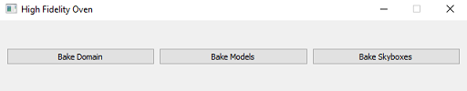
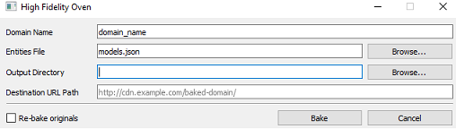

###################################
Bake Your Content Using the Oven
###################################

You can reduce your load times by optimizing your domain content, models, or avatar using Oven, a standalone application created by High Fidelity. This process of optimizing content is called baking. 

.. contents:: On This Page
    :depth: 2

-----------------------------------
Why You Should Bake Your Content
-----------------------------------

Most content (avatars, entities, etc) in High Fidelity references external resources such as textures, models, scripts, and materials. When a user encounters any content in the domain, they need to download the content's resources. Many of these resources are not optimized and can take a while to download. Baking is the process of optimizing these resources to make them easier to transmit, store, and render, reducing load time significantly. 

The Oven is a tool that will help you bake any of the following types of content:

.. + JavaScript Files: Baking a JS file involves removing white spaces and comments in the script to shrink its size.  A baked script is transmitted and interpreted faster because of its smaller size.  A baked JS file will not be very easy to read as all the white spaces and comments will be removed.  If you wish to read and understand any JS files that have been baked, you will need to use its unbaked version.  Baking a script will produce a .baked.js.  *NOTE: Baking of JavaScript files is currently disabled*

+-----------+--------------------------------------------------------------------------------------------------------------+
| Type      | Description                                                                                                  |
+===========+==============================================================================================================+
| Textures  | When you bake a texture, the resulting folder will contain a .texmeta.json file, various                     |
|           | .ktx images, and the original texture. Baking might introduce some compression artifacts, but                |
|           | these are usually minor. Baking a texture produces mipmaps, which allow you to progressively                 |
|           | load textures, and compresses the results. Baking large textures like skyboxes can take a while,             |
|           | but the benefits at runtime for everyone loading the skybox image will be significant. We                    |
|           | support textures in the following formats: BMP, CUR, GIF, ICNS, ICO, JPEG, JPG, PBM, PGM, PNG,               |
|           | PPM, SVG, SVGZ, TGA, TIF, TIFF, WBMP, WEBP, XBM, XPM, EXR                                                    |
+-----------+--------------------------------------------------------------------------------------------------------------+
| Materials | Baking a material will produce a .baked.json file and will also bake all of the textures in the              |
|           | material. Currently, we only support baking a `material entity JSON file <../create/entities/mate            |
|           | rial-entity.html#generate-a-material-entity>`_.                                                              |
+-----------+--------------------------------------------------------------------------------------------------------------+
| 3D Models | Baking a model will produce a `Draco compressed <https://github.com/google/draco>`_ geometric mesh           |
|           | and will also bake all of the materials in the model. The mesh compression can slightly alter the            |
|           | geometry of the original model, but it is usually minor. Your output folder will contain a .baked.fst file,  |
|           | a .baked.fbx file (the original format of your model can be different), and a .baked.json file (materials).  |
|           | Because the baked materials JSON file references the baked texture files, all textures are removed from the  |
|           | .baked.fbx file. This JSON file is referenced in the `materialMap` field in the .baked.fst file. We support  |
|           | the following formats: FBX, OBJ, and FST (that points to a supported type).                                  |
+-----------+--------------------------------------------------------------------------------------------------------------+
| Avatars   | As avatars are 3D models, you can bake avatars with the same results as above. Use the resulting .baked.fst  |
|           | file to `host and wear your baked avatar <../create/avatars/package-avatar.html#host-your-avatar>`_.         |
+-----------+--------------------------------------------------------------------------------------------------------------+

.. note:: You can also `bake content using the Asset Server <manage-assets.html#bake-an-asset>`_. The process for this is different than what we describe here. If you use this method, you will need to store your content on the Asset Server. Using the Asset Server will only bake items that remain in single domain (such as regular entities). It does not bake any items that can travel between domains such as avatars and avatar entities.

--------------
Get the Oven
--------------

The Oven is a standalone application that is packaged with High Fidelity and is available in your High Fidelity folder on your local or virtual machine. To use the Oven:

1. `Download and install <../explore/get-started/install.html#client-and-sandbox-installer>`_ the Client + Sandbox for High Fidelity.
2. After installing, go to the High Fidelity installation folder. Run 'oven.exe'.

The Oven has three baking options:

+ Domain: You can bake all assets present in a domain. 
+ Models: Use this option to bake 3D Models and avatars. 
+ Skybox: Bake skyboxes to improve loading time for all users in a domain.

----------------------------
Bake Your Domain
----------------------------

When you bake an entire domain, the Oven will bake as many assets as it can, swapping out the entity properties for the baked versions of the resources. 

To bake a domain:

1. Run 'oven.exe'.
2. Click 'Bake Domain'.

3. Enter the following information in the fields provided and then click 'Bake'.

+----------------------+------------------------------------------------------------------------------------------------+
| Fields               | Description                                                                                    |
+======================+================================================================================================+
| Domain Name          | Enter your domain's name.                                                                      |
+----------------------+------------------------------------------------------------------------------------------------+
| Entities File        | This field will accept a .json or .json.gz file that contains information on all the assets    |
|                      | in the domain. You can download these from the content archives in domain settings.            |
+----------------------+------------------------------------------------------------------------------------------------+
| Output Directory     | This is where the baked domain and its content will be placed.                                 |
+----------------------+------------------------------------------------------------------------------------------------+
| Destination URL Path | This is where all the absolute resource paths will point to after baking. These can be cloud   |
|                      | services where you store your content,                                                         |
+----------------------+------------------------------------------------------------------------------------------------+
| Re-bake originals    | This checkbox lets you control whether or not to try to re-bake any baked content encountered. |
+----------------------+------------------------------------------------------------------------------------------------+

4. In your 'Output Directory', upload everything in the 'content' folder to the 'Destination URL Path'. This is the step where you upload all baked content to your hosting site to make it available for download. 
5. `Upload the resulting baked JSON file to the domain server <your-domain/configure-settings.html#upload-content>`_. 

""""""""""
Example
""""""""""

Let's bake a domain with the following values:

+ Domain Name: example_domain_name
+ Entities File (.json or .json.gz): 

::

	{
	    "Entities": [
	        {
	            "type": "Model",
	            "dimensions": {
	                "x": 1,
	                "y": 1,
	                "z": 1
	            },
	            "position" : {
	                "x": 0,
	                "y": 0,
	                "z": 0
	            },
	            "modelURL": "https://hifi-content.s3.amazonaws.com/samuel/models/Block-Display-FTUE.fbx"
	        }
	    ],
	    "Version": 119
	}

+ Output Directory: Choose a folder directory to store your baked domain files.
+ Destination URL Path: "http://mywebsite.com/baked-domain/" (This is where we will host our baked content).

The resulting .baked.json file should look like this:

::

	{
	    "Entities": [
	        {
	            "dimensions": {
	                "x": 1,
	                "y": 1,
	                "z": 1
	            },
	            "modelURL": "http://mywebsite.com/baked-domain/Block-Display-FTUE/baked/Block-Display-FTUE.baked.fst",
	            "position": {
	                "x": 0,
	                "y": 0,
	                "z": 0
	            },
	            "type": "Model"
	        }
	    ],
	    "Version": 119
	}

+ Upload your baked content in 'Output Directory > content' to your hosting site. 
+ Upload the resulting models.json.gz file to your domain server. 

---------------------------------
Bake Your 3D Models
---------------------------------

To bake a 3D model:

1. Run 'oven.exe'.
2. Click 'Bake Models'.
3. Enter the following information in the fields provided and then click 'Bake'.

+----------------------+------------------------------------------------------------------------------------------------+
| Fields               | Description                                                                                    |
+======================+================================================================================================+
| Model File(s)        | Enter the file or URL path for your model file(s).                                             |
+----------------------+------------------------------------------------------------------------------------------------+
| Output Directory     | This is where the baked and original content will be placed.                                   |
+----------------------+------------------------------------------------------------------------------------------------+

4. Upload the baked model file(s) to your hosting site. 

---------------------------------
Bake Your Skybox
---------------------------------

To bake a skybox:

1. Run 'oven.exe'.
2. Click 'Bake Skyboxes'.
3. Enter the following information in the fields provided and then click 'Bake'.

+----------------------+------------------------------------------------------------------------------------------------+
| Fields               | Description                                                                                    |
+======================+================================================================================================+
| Skybox File(s)       | Enter the file or URL path for your skybox file(s).                                            |
+----------------------+------------------------------------------------------------------------------------------------+
| Output Directory     | This is where the baked and original content will be placed.                                   |
+----------------------+------------------------------------------------------------------------------------------------+

4. Upload the baked skybox file(s) to your hosting site. 

---------------------------------
Oven Command Line Interface
---------------------------------

You can also use a command line interface instead of the GUI to bake single assets only (not domains). We support the following:

+ i: Path to file that you would like to bake.
+ o: Path to folder that will be used as the output directory.
+ t: Type of asset. The value can be "model" (for any model type) and "material" (for a material JSON description). For textures, the values differ based on the type of texture you want to bake, such as default, strict, albedo, normal, bump, specular, metallic, roughness, gloss, emissive, cube (same as skybox), skybox, ambient, occlusion, scattering, and lightmap.
+ disable-texture-compression: Disables texture compression for any type. Use this only if the texture compression is introducing too many artifacts.

""""""""""""""""""""""""
Examples
""""""""""""""""""""""""
To bake a 3D model through the Oven's command line interface:

1. Open any command line interface and go to the Oven's directory. Then add the following line:

``./oven -i "https://raw.githubusercontent.com/highfidelity/hifi_tests/master/assets/models/geometry/avatars/art3mis/art3mis.fst" -o [folder of your choice] -t model``

To bake a material through the Oven's command line interface:

1. Open any command line interface and go to the Oven's directory. Then add the following line:

``./oven -i "https://hifi-content.s3.amazonaws.com/samuel/materialBake.json" -o [folder of your choice] -t material``

**See Also**

+ :doc:`Bake Your Assets Using the Asset Server <manage-assets>`
+ `Change Your Content Settings <your-domain/configure-settings.html#change-your-content-settings>`_
+ :doc:`PBR Materials Guide <../create/3d-models/pbr-materials-guide>`
+ :doc:`Add a Material Entity <../create/entities/material-entity>`
