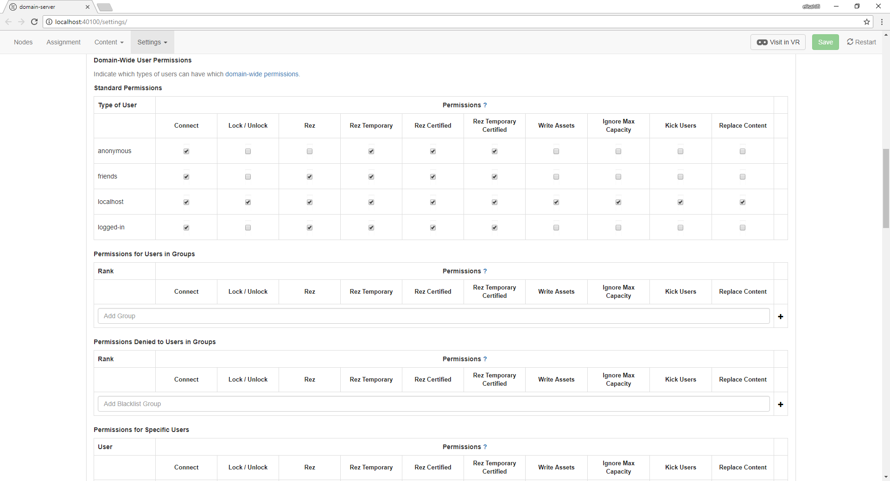
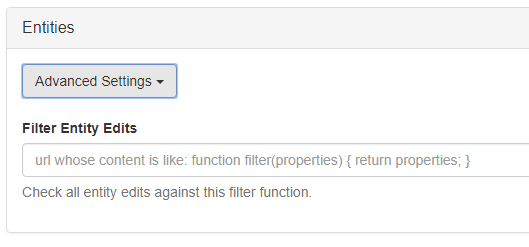
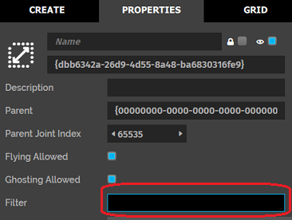

##########################
Secure Your Domain
##########################

You can protect your domain from being modified by other users using the domain server settings. By setting the right permissions and filters, you can ensure that your domain is secure.

.. contents:: On This Page
    :depth: 2

---------------------------------
Secure Your Domain Settings
---------------------------------

Add a username and password to protect your domain settings from being modified by unauthorized users. Anyone who tries to modify your domain settings will need the username and password to make changes. 

1. If you're hosting your domain on a cloud service, open the `cloud settings <https://highfidelity.com/user/cloud_domains>`_. If you're using your local sandbox, open your `local sandbox settings <http://localhost:40100/settings/>`_. 
2. Go to **Settings > Security** and add a username and password under the 'HTTP Username' and 'HTTP Password' fields.

Every time someone tries to access your domain settings, they'll be prompted to enter this username and password.

-------------------------------
Set User Permissions
-------------------------------

You can control the types of users that have access to your domain, and the permissions granted to them. For example, you can set a connection to have access to your domain, but not have permissions to edit your domain content. 

1. If you're hosting your domain on a cloud service, open the `cloud settings <https://highfidelity.com/user/cloud_domains>`_. If you're using your local sandbox, open your `local sandbox settings <http://localhost:40100/settings/>`_. 
2. Go to **Settings > Security** and scroll down to the 'Domain-Wide User Permissions'. The 'Standard Permissions' table allows you to set the type of users and their permissions. 

+-----------+--------------------------------------------------------------------------------------------+
| User Type | Description                                                                                |
+===========+============================================================================================+
| Anonymous | A person who is not logged in and is using an instance of High Fidelity's Interface.       |
|           | This is the default user type for someone who has downloaded Interface for the first       |
|           | time.                                                                                      |
+-----------+--------------------------------------------------------------------------------------------+
| Friends   | A user that you have connected with by shaking hands with their avatar and clicking        |
|           | on the 'Friends' checkbox in your **People** app. Connections are different from           |
|           | Friends. By default, Friends have more permissions in your domains than your Connections.  |
|           | Connections are treated like anonymous users.                                              |
+-----------+--------------------------------------------------------------------------------------------+
| Localhost | A user who is running Interface on the same machine where the server is hosted.            |
|           | Localhost users do not need to be logged in and have permissions that override             |
|           | non-user-specific permissions.                                                             |
+-----------+--------------------------------------------------------------------------------------------+
| Logged In | A user that is logged into their High Fidelity account while using Interface. They         |
|           | do not need to be a Friend or a Connection to have server rights. Permissions that         |
|           | are granted to a specific user override all other permissions.                             |
+-----------+--------------------------------------------------------------------------------------------+
  
+-------------------------+------------------------------------------------------------------------------+
| Permissions             | Definition                                                                   |
+=========================+==============================================================================+
| Connect                 | A user is allowed to enter your domain.                                      |
+-------------------------+------------------------------------------------------------------------------+
| Lock/Unlock             | A user can lock entities to prevent them from being modified. They can       |
|                         | also unlock entities to enable editing.                                      |
+-------------------------+------------------------------------------------------------------------------+
| Rez                     | A user can create (or rez) entities for an unlimited amount of time.         |
|                         | They will also have full access to the **Create** app.                       |
+-------------------------+------------------------------------------------------------------------------+
| Rez Temporary           | A user can temporarily create entities that have a default lifetime of 1     |
|                         | hour. They will still have full access to the **Create** app.                |
+-------------------------+------------------------------------------------------------------------------+
| Rez Certified           | A user can create pre-approved entities and scripts from the Marketplace     |
|                         | for an unlimited amount of time.                                             |
+-------------------------+------------------------------------------------------------------------------+
| Rez Temporary Certified | A user can create pre-approved entities or scripts from the Marketplace      |
|                         | with a set lifetime that also defaults to 1 hour.                            |
+-------------------------+------------------------------------------------------------------------------+
| Write Assets            | A user can :doc:`add assets <manage-assets>` (models, audio,                 |
|                         | or other files) to your asset server (your domain's file storage space).     |
+-------------------------+------------------------------------------------------------------------------+
| Ignore Max Capacity     | A user can enter a domain even when it has hit the specified capacity limit. |
+-------------------------+------------------------------------------------------------------------------+
| Kick Users              | A user is allowed to remove other users from a domain.                       |
+-------------------------+------------------------------------------------------------------------------+
| Replace Content         | A user can change the entire content set of a domain.                        |
+-------------------------+------------------------------------------------------------------------------+

3. If you want to grant permissions only to specific users, you can do so under the 'Permissions for Specific Users' table. Add their usernames and check the required permissions. 
4. You can set permissions for user groups and lists as well. Groups and lists can be created through the `groups registration page <https://highfidelity.com/user/groups>`_.

+-------+-------------------------------+------------------------------------+--------------------------------------+
| Type  | Description                   | Features                           | Permissions                          |
+=======+===============================+====================================+======================================+
| Group | This is a collection of       | You can assign ranks to different  | Granting/taking away permissions to  |
|       | users that voluntarily join.  | users in a group and grant them    | a group or list will copy those      |
|       | Users join groups by          | permissions such as editing the    | permission rights to the users in    |
|       | invitation.                   | group, editing group members, or   | the group even if you are not        |
|       |                               | editing the rank of another        | friends with them.                   |
|       |                               | lower ranked member.               |                                      |
+-------+-------------------------------+------------------------------------+--------------------------------------+
| List  | This is a collection of       | The list details are visible to    | Granting/taking away permissions to  |
|       | users who have been added     | and can be edited only by users    | a group or list will copy those      |
|       | to a list for the purpose     | with the right permissions.        | permission rights to the users in    |
|       | of whitelisting or            |                                    | the group even if you are not        |
|       | blacklisting them.            |                                    | friends with them.                   |
+-------+-------------------------------+------------------------------------+--------------------------------------+

-------------------------------------
Protect Your Domain's Content
-------------------------------------

Entity-specific permissions prevent users from changing or removing your domain content. You can do this by locking individual entities in your domain, or adding entity filters in your domain settings. 

^^^^^^^^^^^^^^^^^^^^^^^^^^^^^^^^^^^^^
Lock an Entity in Your Domain
^^^^^^^^^^^^^^^^^^^^^^^^^^^^^^^^^^^^^

When you lock an entity, you are preventing it from being modified by anyone who doesn't have lock/unlock permissions in your domain. This means that if a user cannot unlock an entity, they cannot modify a locked entity. 

1. In Interface, pull up your HUD or Tablet and go to **Create**.
2. Add a box entity by clicking on the 'Cube' icon. 
3. Switch to the “List” submenu to search for your newly created entity using the filter bar.
4. You can disable editing, deleting, or moving the entity by choosing the lock icon from this menu or the “Properties” submenu. 
5. Click the 'Lock' icon again to unlock the entity and make it editable.

.. note:: Anyone with connect permissions can make edits to your domain if they are not locked. Using filters is the only way to prevent unwanted edits.

^^^^^^^^^^^^^^^^^^^^^^^^^^^^^
Set an Entity Filter
^^^^^^^^^^^^^^^^^^^^^^^^^^^^^

Entity filters are specialized JavaScript functions that prevent unwanted modifications to entities in your domain. They can be applied to a whole server or to specific zones within a domain. 

Entity filters apply to all users who do not have lock/unlock permissions. You can use filters to request the original properties of an entity to compare them to new values. You can then approve the new values. 

**Protect All Entities in a Domain**

1. Write a script for an entity filter. Host the script on a cloud service.
2. If you're hosting your domain on a cloud service, open the `cloud settings <https://highfidelity.com/user/cloud_domains>`_. If you're using your local sandbox, open your `local sandbox settings <http://localhost:40100/settings/>`_. 
3. Go to **Content > Entities** and add the URL for your script. 

**Protect All Entities in a Zone**

You can add these scripts to a specific zone in your domain as well. 

1. In Interface, pull up your HUD or Tablet and go to **Create**.
2. Find your zone entity, and click 'Properties'.
3. Add the script's URL in the 'Filter' field. 

"""""""""""""""""""""""""""""""""""""
Examples of Entity Filters
"""""""""""""""""""""""""""""""""""""

1. Prevent all entities from being deleted from your domain:

    .. code:: javascript

    	// prevent-all-deletes.js by Brad Hefta-Gaub
    	(function() {
        	function filter() { 
            	return false; // all deletes are blocked
        	}
        	filter.wantsToFilterAdd = false; // don't run on adds
        	filter.wantsToFilterEdit = false; // don't run on edits
        	filter.wantsToFilterPhysics = false; // don't run on physics
        	filter.wantsToFilterDelete = true; // do run on deletes
        	filter;
    	});
  

2. Prevent specific entities from being modified or deleted from your domain: 

    .. code::

    	// prevent-add-delete-or-edit-of-entities-with-name-of-zone.js by Brad Hefta-Gaub
    	(function() {
        	function filter(properties, type) {	
            	var ENTITY_ID = "{the ID of the entity that you want to protect}";
            	if (type === Entities.DELETE_FILTER_TYPE) {
                	if (properties.id === ENTITY_ID) { return false; }
            	}
            	return properties;
        	}
        	filter.wantsToFilterDelete = true; // do run on deletes
        	filter;
    	});

3. Allow changes only to entities' basic physics properties:

    .. code::

    	// allow physics, reject all other changes including adds and deletes
    	(function() {
        	function filter() { 
            	return false;
        	}
        	filter.wantsToFilterAdd = true; // run on adds
        	filter.wantsToFilterEdit = true; // run on edits
        	filter.wantsToFilterPhysics = false; // don't run on physics
        	filter.wantsToFilterDelete = true; // do run on deletes
        	filter;
    	});

4. Reject any type of change to your domain and protect all entities:

    .. code::

    	function filter(properties, filterType, originalProperties) {
        	// doesn't matter here if rejectAll is set to true
    	}
    	// If reject all is true.  Any of the filterType changes won't go through
    	filter.rejectAll = true; // default false

**See Also**

+ :doc:`Configure Your Domain Settings <your-domain/configure-settings>`
+ :doc:`Backup and Restore Your Domain <backup-restore-domain>`