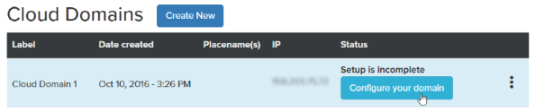

###############################
Host a Domain with DigitalOcean
###############################

Hosting your domain with a cloud service, such as DigitalOcean, removes the need to set up, maintain, and secure a hosting server. For large domains with lots of visitors, it also eliminates the need to invest in high-end hardware and network capabilities. 

High Fidelity has a partnership with DigitalOcean so that we can provide you with hosting services. All you need to do is create a new cloud domain, and configure your permissions and settings - let us do the rest!

.. contents:: On This Page
    :depth: 2

------------------------------------
Create a New Cloud Domain
------------------------------------

When you create a new cloud domain directly from High Fidelity, we do a lot of the "behind the scenes" work for you. All you need to do is log in to High Fidelity, sign up and/or log in to a DigitalOcean account, and choose the specs for your droplet. A DigitalOcean droplet is simply a scalable virtual machine that we use to host your domain.

To create a new cloud domain:

1. Log in to your High Fidelity account at https://highfidelity.com.
2. Hover over your username, and click 'Cloud Domains'.
3. Click 'Create New'.
4. At this step, you must log in to your DigitalOcean account and verify that billing information is set up with DigitalOcean. 

    * If you do not have a DigitalOcean account, follow Step 1 and click the button 'Sign Up for DigitalOcean'. Through DigitalOcean's website, sign up for a new account, verify your account, and set up billing information. Once you've signed up for an account, you can close out of DigitalOcean's website.
    * If you already have a DigitalOcean account, we strongly encourage you to log into your account on DigitalOcean's website and verify that your billing information is set up correctly. **If you do not have accurate billing information in your DigitalOcean account, all new cloud domains creation attempts will silently fail.**
    * After you have signed up for a DigitalOcean account and/or verified your billing information, follow Step 2 and click 'Connect your DigitalOcean Account' to link your High Fidelity and DigitalOcean accounts.
5. Choose the DigitalOcean droplet you would like to host. Prices per month vary based on the specifications for the virtual machine. Depending on the number of users you expect in your domain, we recommend:

    +-------+--------+----------+----------+----------+---------+
    | Users | Memory | VCPUs    | Transfer | SSD Disk | Price   |
    +=======+========+==========+==========+==========+=========+
    | 2-3   | 2GB    | 1 vCPU   | 2TB      | 50GB     | $10/mo  |
    +-------+--------+----------+----------+----------+---------+
    | 5-6   | 2GB    | 2 vCPU   | 3TB      | 60GB     | $15/mo  |
    +-------+--------+----------+----------+----------+---------+
    | 10-15 | 8GB    | 4 vCPU   | 5TB      | 160GB    | $40/mo  |
    +-------+--------+----------+----------+----------+---------+
    | 25-30 | 16GB   | 6 vCPU   | 6TB      | 320GB    | $80/mo  |
    +-------+--------+----------+----------+----------+---------+
    | 40-50 | 32GB   | 8 vCPU   | 7TB      | 640GB    | $160/mo |
    +-------+--------+----------+----------+----------+---------+
    | 160   | 48GB   | 12 vCPU  | 8TB      | 960GB    | $240/mo |
    +-------+--------+----------+----------+----------+---------+
    
6. Choose the geographical location for your droplet. Ideally, this is a server nearby you and your domain's visitors.
7. Click 'Launch your cloud domain', then accept the billing notification. 

At this point, High Fidelity will not only create your DigitalOcean droplet, but we will also create and register a domain for you on the metaverse. Once the status bar goes away, your domain is set up and ready to go. Feel free to test it out by visiting it via its IP address! 

.. note:: On the Cloud Domains webpage, the status may say "Setup is incomplete". Note that *the set up did not fail in any way* and at this point, you have a fully functional, running domain. This message is there to remind you that there are additional configuration settings you may wish to customize, such as user permissions or place names. To learn more about configuration, continue to the next section.

-----------------------------
Configure Your Domain
-----------------------------

After you create a new cloud domain (remember, the "Create New Domain" button creates both a DigitalOcean droplet *and* a domain on the metaverse), you have the option to configure its settings. At a minimum, we strongly encourage you to set up basic permissions and define how people will be able to get to your domain. 

This process assumes that you are configuring a domain that you just created.

1. On the Cloud Domains page, locate your new cloud domain and click 'Configure your domain'. If you don't see the button, click the menu (3 dots), then choose 'Configure your server'.
2. This opens the **Setup Wizard (Domain Server Settings)**. Note that the Wizard only opens the first time you go to the domain settings. 
3. **Step 1: Identify place name**: Your place name is how users will visit your domain in the metaverse. By default, all cloud domains are accessed by their IP address. Custom place names can be purchased on a subscription basis, and are renewed yearly. :doc:`Learn how to purchase a custom place name for your domain<../configure-settings/place-setting>`. 
4. **Step 2: Set up basic permissions**: By default, you are the only person with any sort of access to your domain (and you are automatically given administor privileges). If you would like to extend administor privileges to other users, then add their High Fidelity usernames here. In addition, choose who will be able to connect or rez items in your domain. :doc:`Learn about setting user permissions <../configure-settings/permission-settings>`.
5. **Step 3: Set up server settings authentication**: Because your domain settings are stored on a remote server, we want to ensure that they are protected. To do so, we require that you set up a unique username and password. In order to access your domain settings, you will need to enter this username and password. :doc:`Learn about securing your domain settings <../configure-settings/authentication-setting>`.

    .. note:: This username and password is not connected in any way to your High Fidelity account, and is used only to access the settings for this specific cloud domain. 
6. Click **Finish** to close the Setup Wizard. 

Now, your domain is officially part of the expanding metaverse. 

------------------------
What's Next?
------------------------

.. rst-class:: list-table

+-----------------------------------------------+--------------------------------------+-----------------------------------------------+
| Visit Your Domain                             | Personalize Your Content             | Configure More Settings                       |
+===============================================+======================================+===============================================+
| * `Go visit your domain using the GoTo app    | * `Create a unique content set and   | * `Purchase a custom place name <../configure |
|   <../../explore/travel.html#goto-app>`_      |   upload it to your domain           |   -settings/place-setting.html>`_             |
| * `Invite people to your domain <../invite-us |   <../add-content.html>`_            | * `Set additional user permissions <../config |
|   ers.html>`_                                 | * `Browse environments in the        |   ure-settings/permission-settings.html>`_    |
| * :doc:`Meet new people and explore other     |   Marketplace and select the perfect | * `Adjust audio settings <../configure-settin |
|   domains <../../explore/socialize>`          |   content set for your VR world      |   gs/audio-settings.html>`_                   |
|                                               |   <../add-content/marketplace-enviro | * `Backup your domain's content <../maintain- |
|                                               |   nment.html>`_                      |   domain/backup-domain.html>`_                |
|                                               |                                      | * `Update for new High Fidelity releases      |
|                                               |                                      |   <../maintain-domain/update-software.html>`_ |
|                                               |                                      | * And more...                                 |
+-----------------------------------------------+--------------------------------------+-----------------------------------------------+

