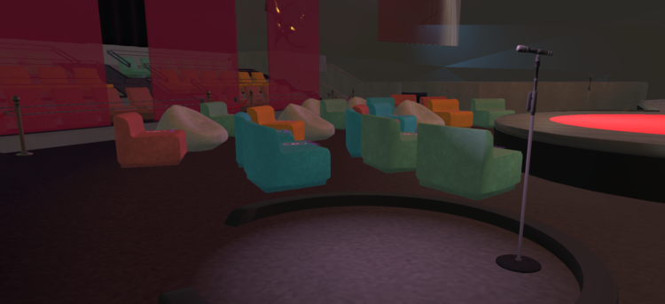
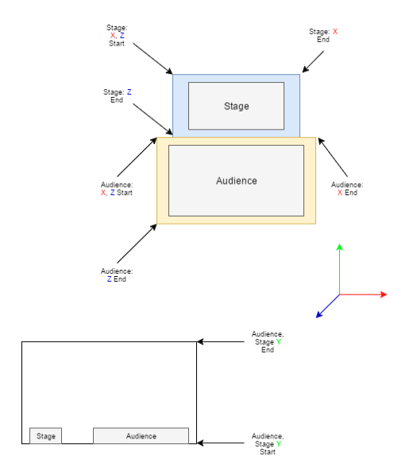

# Tutorial: Set Up A Theater Domain

This tutorial will walk you through creating and setting up a domain with a customizable theater that meets your needs. At the end of this tutorial, you’ll be able to:

- Set up a server and connect it to a domain.
- Add a theater environment.
- Configure audio server settings for a large audience.
- Manage server access and edit privileges.

**On This Page:**

+ [Zaru: High Fidelity's Customizable Theater](#zaru-high-fidelitys-customizable-theater)
+ [Add the Theater to Your Domain](#add-the-theater-to-your-domain)
+ [Modify Your Server Settings](#modify-your-server-settings)
+ [Additional Server Settings](#additional-server-settings)

## Zaru: High Fidelity's Customizable Theater

Zaru is your personal theater for any of your virtual reality event needs. While you’re free to create your own theater or environment for hosting events, we created Zaru as an easy starting point for you to host events. Zaru has a wide variety of features geared towards hosting an event:

- Seating for up to 100 avatars.
- Customizable environment tools.
- Audio attenuation settings that keep the audience quiet and focus on your performers at center stage.

## Add the Theater to Your Domain

You can import the entire Zaru theater, as well as the ground, zoning lights, and models, to your domain. Once you have a copy of the objects in your domain, you can customize them to personalize your theater.

Import Zaru to your domain:

1. Enable both the Advanced and Developer menus.
2. Copy and paste the contents of [ZaruTheater.json](https://hifi-content.s3.amazonaws.com/liv/production/ZaruTheater.json) and save it to your computer.
3. Go to **Edit > Import Entities** and select the JSON file that you just saved.

When you import the JSON file, you’ll get a zone for the theater, all of the necessary models for the theater itself, lights, and a builder grid base. These are all separate, so take care if you relocate objects to align everything the way you want.

The Zaru theater file contains a specific zone called SKY/Inside, which has a set of properties for the interior of the theater. You can change settings in here to specify some permissions for users, including whether or not they are given the ability to fly.

## Modify Your Server Settings

### Attenuation Settings

When you host events in the theater environment, you’ll probably have performers or presenters on stage and you’ll want to update the audio in the environment accordingly. High Fidelity supports audio settings in the form of attenuation zones. These zones can be used to create different volume levels for people around your domain. For our theater, we want audio from the stage to be louder and prioritized over the audience audio, so that people in the back of the theater can hear, and so that the audience doesn’t talk over whoever is on stage.

Find the location of where your stage, audience, and microphones are in your domain. Make a note of the coordinates on the corners of each area where you want to change the attenuation settings - you’ll need to update these in the server settings of your domain.

Find your avatar’s coordinates by:

1. Opening up the console (CTRL + ALT + J).
2. Typing `JSON.stringify(MyAvatar.position)`.
3. Or by hitting the "/" button and reading the "position" in the middle column. 

Audio Zones are defined by a start and end coordinate value for each of the three axes in-world. An example of how you might choose to define your zones is illustrated in the diagram below. In the sample, the X and Z values are defined along their respective axes, and the Y start and end would be the value of the floor and ceiling. To add audio zones to the Microphone stands in Zaru, create a smaller region within the audience.

We've made a handy tool for audio zone bounding boxes you can find [here](https://hifi-content.s3.amazonaws.com/liv/getCoords/getCoords.js).

The way to use it is to create a cube and size and align it to where you want the boundaries of the audio zone to be. Run the script, click on the cube. The x,y,z coordinates will appear in the scripts window. Use those to define the zones in the domain settings page.

Once you have the coordinates of your audio zones:

1. Open the server settings page for your domain.
2. Click **Settings > Audio Environment**.
3. Define the audio zones that you mapped out earlier. You can keep this simple, and map only the stage and audience, or assign zones for the lobby, wings, microphones, etc.
4. Set Attenuation Zone combinations based on the locations you decided on, setting sources that you’d like to be loud to everyone to `0`.

If you are having trouble with your Audio Zones check for the following:
1. For the start to end positions, place them generally in lowest to highest order.  
2. Make sure the audio zones don't cross each other's paths, but try to make the differences between them small. 
3. If you aren't in an audio zone, the default attenuation will take hold that you can adjust as well.  If you want to make sure the audience can't be heard while the speaker is talking, pay attention to accidently crossing those areas. 
4. To change how people in the same zone talk to each other, use the same zone for the speaker and the listener and adjust accordingly.
5. Make sure you think about how each zone should interact with the other zones.  Stage to Audience, Stage to Mic1, Stage to Stage, Mic1 to Stage, Audience to Stage, Audience to Audience, etc...

Save your audio settings and test them until you find a combination that works for you. Other audio settings that you may want to experiment with are:

- **Noise muting threshold**: You can customize how loud someone can get before they are muted
- **Reverb settings**: For custom decay and reverberation of audio in specific zones

### Access Control

You can set custom access controls depending on the type of events you plan on hosting in your space. If the event is limited to certain people, you’ll want to create an access list in your server settings to add specific user accounts.

The People Access List (PAL) is a handy tool for moderating your event once it has begun. You can use the PAL by selecting the People tab and viewing everyone in the domain. Admins of your domain have additional silence and ban permissions to remove ill-behaving visitors. You can also manage blocked users on your server settings page.

## Configure a Place Name

To authenticate and make your domain easier for users to find, you can purchase a [place name](place-name.html) that connects to your domain.

## Additional Server Settings

In addition to security and audio settings, there are several other tools you can use to plan your events. You can:

- Set avatar scaling to prevent people from making avatar sizes outside of a set range.
- Maximum user capacity and fallback location if there are a limited number of people who you want to be able to host at a time.
- Places/Paths: You can customize an exact location that you want people to spawn into your theater by specifying the location under ‘Paths’. The /path is the default, but you can customize paths (ex: /stage to spawn on stage, /audience for audience members) to move to different locations.

**See Also**

+ [Configure Your Domain Settings](your-domain/configure-settings.html)
+ [Add a Place Name](place-name.html)