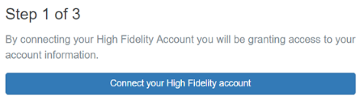
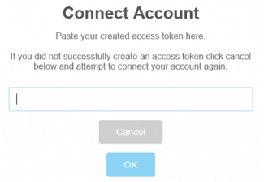
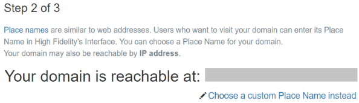
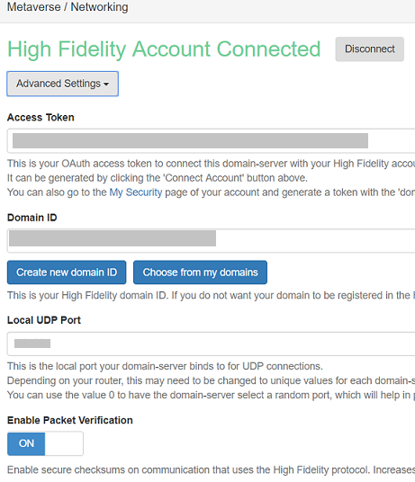
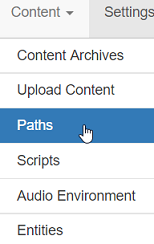

####################################
Configure Your Domain Settings
####################################

While you can use the sandbox as is, we recommend that you configure your domain settings to ensure that it is secure and serves your needs. 

.. contents:: On This Page
    :depth: 3

--------------------------------------
Configure Basic Server Settings
--------------------------------------

You can configure your domain's basic server settings to control how your domain is accessed and the permissions granted to different types of users. To open your settings, do one of the following: 

* Right-click the High Fidelity icon on your system tray (Windows) or top menu bar (OS X), then click 'Settings'.
* With your Sandbox running, open `http://localhost:40100/settings <http://localhost:40100/settings>`_ in a browser.

^^^^^^^^^^^^^^^^^^^^^^^^^
Setup Wizard
^^^^^^^^^^^^^^^^^^^^^^^^^

The first time you open your settings, your browser will open a Setup Wizard to help you configure your basic server settings. Click 'Skip Wizard' to close the wizard and manually configure your settings.

1. In Step 1 of the wizard, you can connect your domain to your High Fidelity account. You do not need to connect your domain to your High Fidelity account and can click 'Skip' and proceed to the next step. If you wish to connect to your account, click 'Connect your High Fidelity account'. 

   1. Log in to High Fidelity in the tab that opens. 
   2. Click 'Create Token'. 
   3. Copy your new token.
   4. In the pop-up window on the settings page, paste the token and click 'OK' to connect your account. 

   
2. In Step 2 of the wizard, you can change your domain's place name, which is name people will use to get to your domain. Place names are randomly generated. For a fee, you can choose to `customize your place name <../place-name.html#purchase-a-place-name>`_ so that it more accurately describes your domain.

3. In Step 3 of the wizard, you can set user permissions for your domain. In this step, you can add yourself and other users as administrators of your domain. You can also grant or deny specific users the ability to connect to your domain or rez content. ALl of these permissions can be changed later, as you :doc:`secure your domain <../secure-domain>`. 
4. Click 'Finish'. You will be redirected to the 'Domain Settings' page. 

^^^^^^^^^^^^^^^^^^^^^^^^^^^^
Domain Server Settings
^^^^^^^^^^^^^^^^^^^^^^^^^^^^

If this is not the first time you've opened your domain settings, you will not see the Setup Wizard. Instead, you can manually configure all of your domain settings. 

For example, the 'Metaverse/Networking' section defines all of the network settings for your domain. Here, you can disconnect your High Fidelity account, view your access token, create a new domain ID, change your UDP port, and Enable Packet Verification. 

.. note:: If you modify your domain settings, you need to save and restart for the new settings to be reflected. Click 'Save', and then 'Restart' once you're done with your modifications. This saves your settings and restarts your domain server.

^^^^^^^^^^^^^^^^^^^^^^^^^^^^
Firewall Settings
^^^^^^^^^^^^^^^^^^^^^^^^^^^^

Ensure that your firewall settings allow you to run High Fidelity and let other users visit your domain.

1. In your domain server settings, set the Local UDP port value. 'Local UDP Port' is the port that needs to be opened for High Fidelity to let users into your local sandbox. The default value for this port is '40102'.
2. Open the same port in the firewall settings for your machine.
3. Add ``interface.exe`` and ``domain-server.exe`` to your firewall settings in your OS.

^^^^^^^^^^^^^^^^^^^^^^
View Your Logs
^^^^^^^^^^^^^^^^^^^^^^

Your logs lists the different events relevant to your High Fidelity domain. These can help you troubleshoot any issues with your domain and understand how the different parts of your domain communicate with each other. To view these:

1. Right-click the High Fidelity icon on your system tray or top menu bar. 
2. Select 'View Logs'.

A window pops up showing your domain server's logs. 

---------------------------------------
Add a Description For Your Domain
---------------------------------------

1. Open your `domain settings <http://localhost:40100/settings/>`_. 
2. Under the Description section, click 'Advanced Settings' and add the following:

   1. Description: A description of your domain in less than 256 characters.
   2. Maturity: A maturity rating for your domain. You can choose **Everyone**, **Teen(13+)**, **Mature(17+)**, and **Adult(18+)**.
   3. Hosts: Add users who have permission to show your domain to other users. 
   4. Tags: Common categories under which your domain falls.

--------------------------------------
Change Your Content Settings
--------------------------------------

Your content settings define the behavior of the content (or entities) in your domain. To get to the content settings, open your `domain settings <http://localhost:40100/settings/>`_, then click on the 'Content' menu. This section describes the types of content settings you can define: 

* `Content Archives`_
* `Upload Content`_
* `Paths`_
* `Scripts`_
* `Audio Environment`_

^^^^^^^^^^^^^^^^^^^^^^^
Content Archives
^^^^^^^^^^^^^^^^^^^^^^^

Your domain server regularly backs up the content in your domain, with archives that include all the entities in your domain. The 'Content Archives' section lets you restore your domain to a previous version or to share your archive and settings with other users. 

Each archive has a menu that you can access by clicking the three dots to the right of the archive name. Here, you can:  

+-------------------+------------------------------------------------------------------------+
| Action            | Description                                                            |
+===================+========================================================================+
| Restore from here | Reset the domain to a saved state or archive.                          |
+-------------------+------------------------------------------------------------------------+
| Download          | Compress all of the content in your domain to a downloadable ZIP file. |
+-------------------+------------------------------------------------------------------------+
| Delete            | Remove the archive from the saved archives list.                       |
+-------------------+------------------------------------------------------------------------+

To create a content archive manually, click 'Generate New Archive' under the list of automatic content archives. 

^^^^^^^^^^^^^^^^^^^^
Upload Content
^^^^^^^^^^^^^^^^^^^^

You can upload content stored on your computer to your domain. Typically, you will use this option to load a content archive into your own domain, replacing all of its existing content. To do this: 

1. Click 'Choose File' and locate the ZIP file that contains your content archive. 
2. Click 'Upload Content' to upload a content archive.

^^^^^^^^^^^^^^^^^^^^
Paths
^^^^^^^^^^^^^^^^^^^^

A *path* is an exact location within your domain. By default, you have one path automatically assigned: the path "/" is the entry point where a user appears when they enter your domain. From the 'Paths' section, you can change the location of this default path, or add new ones to set multiple viewpoints within your domain. 

Each path that you define has a set of coordinates, alongside a rotation to define the direction that clients will look when they go to that path. 

To set a new path: 

1. In your domain, move your avatar to the point where you wish to have users appear. 
2. Go to **Navigate > Copy Path to Clipboard**. The path will be represented using 3D coordinates with orientation information, for example ``/-8.10251e-07,-11.1818,1.79641e-05/0,-0.708837,0,0.705372``. This type of path is tedious to approximate and enter manually, making 'Copy Path to Clipboard' the more practical method of defining a path.
3. Open your `cloud domain settings <https://highfidelity.com/user/cloud_domains>`_ if you're hosting it on a cloud service. Or, use `http://localhost:40100/settings <http://localhost:40100/settings>`_ for a local sandbox. Click 'Content' and go to 'Paths' on the drop down menu. 

4. Click the plus sign to add a new path. Paste your copied path under 'Viewpoint'.
5. Click 'Save' at the top of the page.

To appear at a specific viewpoint in your domain, clients will enter the domain_name/path. For example, if a user is going to ``example-domain`` and enters it by typing in ``example-domain/taco``, they will appear with the direction and rotation of the ``/taco`` path.

^^^^^^^^^^^^^^^^^^^
Scripts
^^^^^^^^^^^^^^^^^^^

The 'Scripts' section loads all of the :doc:`assignment client scripts <../../script/assignment-client-scripts>` that you've written for your domain. 

To add a script: 

1. Click the plus sign next to an empty row in the 'Persistent Scripts' table. 
2. Enter the URL to your script, the number of instances, and the pool. 
3. Click 'Save' at the top of the page. 

.. note:: Scripts are cached. If the content on the URL host changes, you may want to use some cache-defeating trick, such as specifying a URL with query parameter such as http://whatever.com/path/file.js?version=17*

^^^^^^^^^^^^^^^^^^^^^^^^^
Audio Environment
^^^^^^^^^^^^^^^^^^^^^^^^^

Your audio settings are perhaps one of the most important things that define someone's experience in your domain. Because of this, you will need to configure exactly how sound in transmitted and received throughout your domain. Here are some of the audio settings you can configure: 

+--------------------------+---------------------------------------------------------------------------------------+
| Setting                  | Description                                                                           |
+==========================+=======================================================================================+
| Attenuation              | This determines how much quieter sounds get over a distance. The default domain       |
|                          | attenuation is the amount of noise reduction that is enabled across the domain        |
|                          | environment. High Fidelity domains default to a distance attenuation curve            |
|                          | roughly like the real world. If you see two avatars talking in the distance, you      |
|                          | can hear them, but not very well. If you approach them, they become more audible      |
|                          | in a manner that approximates what you're likely to be used to. If the default        |
|                          | attenuation is ``0``, no matter how far away a sound source is, it still plays        |
|                          | at full volume. Likewise, the default attenuation for a domain can be set very        |
|                          | high (to a max value of 1), making only things very near to you audible.              |
+--------------------------+---------------------------------------------------------------------------------------+
| Zones                    | By setting a zone, you can specify 3D boundaries for audio environments that          |
|                          | aren't applied to the whole domain.                                                   |
+--------------------------+---------------------------------------------------------------------------------------+
| Attenuation Coefficients | These determine how sound is transmitted between zones. When the attenuation          |
|                          | coefficient is ``0``, there is no volume attenuation with someone in another          |
|                          | zone; at ``1``, you won't be able to hear someone in another zone.                    |
+--------------------------+---------------------------------------------------------------------------------------+
| Reverb Settings          | These settings enable echo-like effects in your domain. It can give the effect        |
|                          | of sounding like you are in a large empty room, deep inside a large cave, or          |
|                          | inside a tiny room like a tiled shower. The 'Reverb Decay Time' defines how long      |
|                          | you can hear an echo after the initial sound. 'Wet/Dry Mix' sets the percentage       |
|                          | mix of the reverb tail relative to the original "dry" signal. Levels between          |
|                          | 5-25% will generally give you useful results. For a very thick reverb, you might      |
|                          | try a value as high as 50% where the reverb is nearly as loud as the original signal. |
+--------------------------+---------------------------------------------------------------------------------------+

**Example: Building a Stage**

You can add audio settings for a stage in your domain. This stage is used for performances and events. 

1. Create two new zones, call them "Stage" and "Audience".
2. Set the 'Attenuation Coefficients' to zero with Stage as the source and Audience as the listener. That way, anyone in Audience will hear anyone on Stage at maximum volume. 
3. If you want to minimize people in the audience hearing one another in the Audience zone, set up another 'Attenuation Coefficients' pair with Audience as both source and listener, and set the distance attenuation very high--e.g., to 1.0. That way, you'll only hear people very close to you like your friend on your right, but won't hear the guy coughing 10 rows back.

**See Also**

+ :doc:`Secure Your Domain <../secure-domain>`
+ :doc:`Broadcast to Other Domains <../broadcast-domain>`
+ :doc:`Backup and Restore Your Domain <../backup-restore-domain>`
