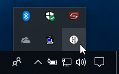
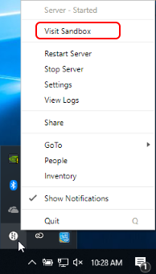

# Install Your Domain

High Fidelity has a local sandbox that you can download and start using as your home domain. This sandbox is hosted on your local machine's server. 

**On This Page:**

+ [Install Your Sandbox](#install-your-sandbox)
+ [Visit Your Sandbox](#visit-your-sandbox)

## Install Your Sandbox

You can install the sandbox if your system meets the [minimum requirements](../../explore/get-started/install.html#minimum-system-requirements). To install the sandbox:

1. Go to [High Fidelity's website](https://www.highfidelity.com/download#sandbox) and download the 'Client + Sandbox' installer.
2. Run the High Fidelity installer.
3. Follow the prompts and complete the installation.

## Visit Your Sandbox

Once you download and install the sandbox, you can access it in your system tray (Windows) or in the top menu bar (OS X). 

To visit your sandbox:

1. Right-click the High Fidelity icon in your system tray or top menu bar. 
2. On the menu that opens, click 'Visit Sandbox'. 

**See Also**
+ [Install High Fidelity](../../explore/get-started/install.html)

