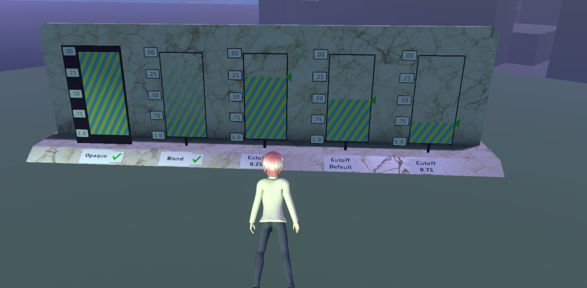

# Alpha 0.86.0 K2.0 Release Notes

This version of Vircadia (codename "Athena") is compatible with the v0.86.0 protocol. This version was released on April 3rd, 2020.

## Interface

The numbers at the end of each item are the PR numbers in the Vircadia [GitHub repo](https://github.com/vircadia/vircadia/pulls?utf8=%E2%9C%93&q=milestone%3Av0860-k2).

### General

* Settings > Entity Script / QML Whitelist added. Loading third-party QML now works correctly, provided that the file is added to the whitelist. (#1, #6, #7, #16, #65, #112)
* The ability for the Metaverse API (Grid Server) URL to be changed by script via settings has been added. No UI toggle has been added yet. (#33)
* Added full desktop chat UI with local, domain, and inter-domain capabilities. Not in a VR usable state yet. (#12, #13, #69, #88, #107, #111, #135, #170)
* Serverless JSON domains can now be loaded over HTTP. This means you can create a domain, export it to JSON, then upload it to a webserver to be visited in the Interface. (#160)
* Beta default scripts feature added where if you check Developer > Scripting > Enable Beta Default Scripts then you get the latest versions for some scripts via their respective online deployments. (#135, #192)
* Users can now set thumbnails that show in the Avatar app. (#145)
* Add SL-like camera inspect function (hold Alt key) as default functionality. (#64, #188)
* Add clicking/triggering on an avatar shows a temporary nametag. (#179)
* Add an "Explore" app as a temporary go-to, along with associated "Explore" menu in Interface. These will be replaced by a modern implementation upon or after the Metaverse API (Grid Server) completion. (#190, #199, #205, #236)
* Relabeled the old "goto" app's icon as "Old Goto". (#240)
* Add a "More" app that lists and installs community-made scripts and apps directly from a [GitHub repo](https://github.com/vircadia/community-apps). (#187)
* This takes longer than you might expect: Tons of revisions to brand/debrand, update links, docs, rehost, etc. in the Interface by various contributors. Thank you! (#9, #11, #19, #23, #34, #37, #38, #40, #44, #47, #50, #58, #70, #71, #75, #85, #89, #91, #99, #100, #105, #116, #177, #219)

### Graphics

* Procedural vertex shader support added. (#15)
* Procedural shaders no longer require an environment variable to be activated. Instead, use Developer > Render > Enable Procedural Materials. (#10)
* Add support for GLTF alphaModes. (#15)
* Fix opacityMapModes for GLTF. (#15)

* Add support to allow Material entities to specify face culling method, support GLTF doubleSided property. (#15)
* Fix wearables not disappearing with avatar. (#15)

### Technicals

* Updated CMake's SDL2 file to build correctly on Windows and Linux. (#3, #20, #21)
* Fix audio failure due to missing VR. (#31)
* VideoDecodeStats folder added to .gitignore. (#2)
* Fix crash on secondary camera usage. (#32)
* Fix QMetaObject::invokeMethod crash when trying to bind menu. (#39)
* Add experimental Ubuntu 19.10 build support. (#53)
* VCPKG modernization. (#53)
* Fix Linux Building with `export HIFI_MEMORY_DEBUGGING=1`. (#54)
* Fix avatar walk speed per avatar scaling. (#55)
* Fix CMake build failing due to Public Key on VCPKG. (#56)
* Fix thousands of 'is too small to hold all values' warnings on Linux. (#58)
* Added Opus Audio Codec support. (#86)
* Fix running scripts in Interface from being cleared occasionally. (#162)
* Always display vertical scrollbar in Settings dialogs that scroll. (#113)
* GitHub CI work-in-progress. (#51)
* Added ArrayBuffer support to websockets. (#66)
* Fix Clara.io type error issue. (#67)
* Added RPM and Deb build scripts for server. (#101)
* Make default copy constructors explicit. (#104)
* Fix updated TBB library hash in vcpkg portfile. (#222)

## Server

The numbers at the end of each item are the PR numbers in the Vircadia [GitHub repo](https://github.com/vircadia/vircadia/pulls?utf8=%E2%9C%93&q=milestone%3Av0860-k2).

### General

* Added environment variables to change domain server ports. (#15)
* Fix server log spam `///`. (#175)

## Documentation

### User Docs

The numbers at the end of each item are the PR numbers in the Vircadia-Docs-Sphinx [GitHub repo](https://github.com/vircadia/vircadia-docs-sphinx).

* Added initial shader documentation that can be found under Create > Materials, or [here](https://docs.vircadia.com/create/materials/procedural-shaders.html). (#17)
* Various other updates and fixes to the main documentation. (#1, #2, #3, #4, #5, #9, #10, #12)

### API Docs

The API docs are generated by from the software source [GitHub repo](https://github.com/vircadia/vircadia/pulls?utf8=%E2%9C%93&q=milestone%3Av0860-k2).
Additionally, the latest deployment source can be viewed [here](https://github.com/vircadia/vircadia-api-docs).

* Added night theme, on by default, for the API docs. (#115, #118, #119, #140)
* Fix browsing JSDocs from file system in the Edge browser. (#148)
* Fix sidebar not showing on first load for API Docs. (#237)

## Extra Applications

### Explore App (Interim Version)

The numbers at the end of each item are the PR numbers in the Decentralized GoTo [GitHub repo](https://github.com/vircadia/Decentralized_GoTo_Experimental). This app is temporary and created under the name of "Explore" app. The Explore app name and icon will be used again for the "Decentralized GoTo" successor.

* Get button's label and icon working. (Thanks Aitolda for the new icon graphic!) (#1)
* Many commits directly to master not put into PRs by Kalila L. found [here](https://github.com/vircadia/Decentralized_GoTo_Experimental/commits/master) between February 24th & March 12th, 2020.

### Community Apps

The numbers at the end of each item are the PR numbers in the Community Apps [GitHub repo](https://github.com/vircadia/community-apps).

* Spectator Camera fixed. (#1)
* Fix "More" app not stopping or restarting correctly. (#5)
* Add VR Grab Scale app created by Basinsky to the repo. (#6)
* Optimizations to the search feature and many code optimizations. (#9)
* Many commits directly to master not put into PRs by Kalila L. & Keb Helion found [here](https://github.com/vircadia/Decentralized_GoTo_Experimental/commits/master) between February 26th & March 16th, 2020.
