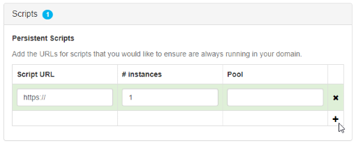

# Assignment Client Scripts

Assignment Client (AC) scripts (also known as "persistent scripts") run persistently in a domain and aren't affected by other scripts. These scripts run on an assignment client separate from the Interface, so the script will continue to run until you either remove the script from the domain or you shut down the domain entirely.

With AC scripts, you can do things like coordinate actions between entities and avatars, and add virtual pets to greet visitors to your domain.

**On This Page**
* [Add an AC Script](#add-an-ac-script)
* [Example of an AC Script](#example-of-an-ac-script)

## Add an AC Script
Once you've written and hosted your script, you need to add it to a domain, either your own or one where you have permissions to run an AC script.

1. Open your 'Domain Administration Panel'. If you are on a local sandbox, open it by clicking on the High Fidelity icon in the taskbar notifications and 'click Settings'.
2. From the menu, go to **Content > Scripts**.
3. In the Persistent Scripts section, click **+** and paste the URL to your script under 'Script URL'. 

4. At the top of the page, click 'Save and Restart'. Now, every time you enter that domain, the AC script will be running.

## Example of an AC Script

The following script counts the number of entities found in a domain using High Fidelity's [EntityViewer](https://apidocs.vircadia.dev/EntityViewer.html).

```javascript
var SEARCH_CENTER = {x: 0, y: -10, z: 0};
var SEARCH_RADIUS = 100;

var isInitialized = false;
var timeout = 1000;

var update = function(deltaTime) {
    if (!isInitialized) {
        if (Entities.serversExist() && Entities.canRez()) {
            EntityViewer.setPosition(SEARCH_CENTER);
            EntityViewer.setCenterRadius(SEARCH_RADIUS);
            EntityViewer.queryOctree();

            Script.setTimeout(function(){
                var foundEntities = Entities.findEntities(SEARCH_CENTER, SEARCH_RADIUS).length;

                print("AC Script found: " + foundEntities + " entities within " + SEARCH_RADIUS + "m of " + JSON.stringify(SEARCH_CENTER));
    
            }, timeout);
         
            isInitialized = true;
            Script.update.disconnect(update);
        }
    }
};

Script.update.connect(update);
```

**See Also**

+ [Configure Your Domain Settings](../host/configure-settings.html)
+ [Get Started with Scripting](get-started-with-scripting.html)
+ [Write Your Own Scripts](write-scripts.html)