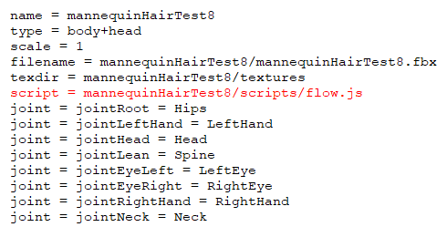

# Avatar Scripts

Avatar scripts are bound to an avatar. This means that they run when a user puts on a specific avatar. Likewise, avatar scripts stop running when the avatar is removed or changed. Other users in the domain will be able to see the script in action, but they will not be able to run the script themselves.	

With avatar scripts, you can do things like make your hair flow or create particle clouds around your avatar.

**On This Page**

* [Add an Avatar Script](#add-an-avatar-script)
* [Example of an Avatar Script](#example-of-an-avatar-script)

## Add an Avatar Script
There are two different ways you can add an avatar script to your FST file: either by using our Package Model tool or by manually adding the script.

<div class="admonition note">
    <p class="admonition-title">Note</p>
    <p>You cannot add scripts to avatars you have purchased from the Marketplace. You can add scripts to custom avatars only. </p>
</div>

To add an avatar script using the Package Model tools: 
1. Create a folder called `scripts` in the same location as your FBX file.
2. Copy your avatar script into this new folder.
3. In Interface, go to **Edit > Package Model as .fst**
4. For 'Script Directory', enter the path to the `scripts` folder you created above. 

To add an avatar script manually:  
1. Open the FST file for your avatar in the text editor of your choice.  
2. Add a line telling the avatar where to find the script file using the syntax `script = [SCRIPT URL]`.

You can add multiple scripts to your avatar by adding multiple `script = url` lines.

## Example of an Avatar Script

The following script makes your avatar throw balls when its right hand moves. 

```javascript
function(){
    var triggerDistance = 0.0;
    var TRIGGER_THRESHOLD = 0.9;
    var LOAD_THRESHOLD = 0.6
    var init = false;
    var rightHandIndex = MyAvatar.getJointIndex("RightHand");
    var rightArmIndex = MyAvatar.getJointIndex("RightArm");
    var distance = 0.0;
    var triggered = false;
    function fireBall(position, speed) {
        var baseID = Entities.addEntity({
            type: "Sphere",
            color: { blue: 128, green: 128, red: 20 },
            dimensions: { x: 0.1, y: 0.1, z: 0.1 },
            position: position,
            dynamic: true,
            collisionless: false,
            lifetime: 10,
            gravity: speed,
            userData: "{ \"grabbableKey\": { \"grabbable\": true, \"kinematic\": false } }"
        }); 
        Entities.editEntity(baseID, { velocity: speed });
    }
    Script.update.connect(function() {
        rightHandPos = MyAvatar.getJointPosition(rightHandIndex);
        rightArmPos = MyAvatar.getJointPosition(rightArmIndex);
        fireDir = Vec3.subtract(rightHandPos, rightArmPos);
        var distance = Vec3.length(fireDir);
        triggerDistance = distance > triggerDistance ? distance : triggerDistance;
        if (!triggered) {
            if (distance < LOAD_THRESHOLD * triggerDistance) {
                triggered = true;
            }
        } else if (distance > TRIGGER_THRESHOLD * triggerDistance) {
            triggered = false;
            fireBall(rightHandPos, Vec3.normalize(fireDir));
        }     
    });
    MyAvatar.scaleChanged.connect(function () {
        triggerDistance = 0.0;
    });
})()
```

This example script uses the [MyAvatar](https://apidocs.vircadia.dev/MyAvatar.html) namespace to determine if your avatar's hand moves. Upon detecting movement, the script makes your avatar launch balls. It also uses some other namespaces such as [Entities](https://apidocs.vircadia.dev/Entities.html) (to create the ball you will launch) and [Vec3](https://apidocs.vircadia.dev/Vec3.html) (to determine the right positions and distances). Add it to your avatar to see how it works.

**See Also**

- [Get Started with Scripting](get-started-with-scripting)
- [Write Your Own Scripts](write-scripts)
- [API Reference](https://apidocs.vircadia.dev)
