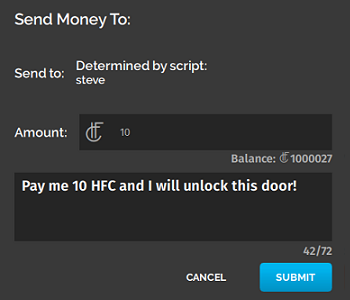
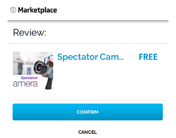
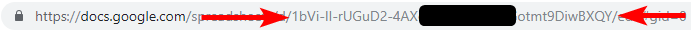

# Tutorial: Transfer Money and Items

While you can [transfer money and items using the Inventory app](../explore/socialize.html#give-and-receive-gifts), sometimes you may want to use scripting to help automate your gifting process. This page will walk you through some examples that programmatically transfers money and items using the High Fidelity Commerce APIs.

<div class="admonition note">
    <p class="admonition-title">Note</p>
    <p>Experimental API Notice: The High Fidelity Commerce APIs introduced in this document are <strong>Experimental APIs</strong> and thus are subject to the following:</p>
    <ol>
        <li>Commerce APIs on the High Fidelity Metaverse may be modified or removed at any time <em>until Beta Release 81</em>;</li>
        <li>The Commerce APIs referenced in this document and related examples are subject to change or removal without notice <em>until Beta Release 81</em>;</li>
        <li>Upon release of Beta 81, changes to the High Fidelity Commerce APIs will be subject to the standard API deprecation process.</li>
    </ol>
</div>

**On This Page:**

+ [Transfer Money to Someone](#transfer-money-to-someone)
+ [Transfer Marketplace Items](#transfer-marketplace-items)
+ [Purchase Marketplace Items](#purchase-marketplace-items)
+ [Verify Your Inventory](#verify-your-inventory)
+ [Add a Tip Jar](#add-a-tip-jar)
+ [Create a VIP Access Zone](#create-a-vip-access-zone)
+ [Add a Slot Machine Game](#add-a-slot-machine-game)

## Transfer Money to Someone
To transfer money to someone, you need to use an entity script or client script to open an end-user's tablet to the "Send Money" screen. The script must specify a recipient and an amount of HFC. It can specify a message to the user if desired.

```
var tablet = Tablet.getTablet("com.highfidelity.interface.tablet.system");
tablet.loadQMLSource("hifi/commerce/common/sendAsset/SendAsset.qml");
tablet.sendToQml({method: 'updateSendAssetQML',
	assetCertID: "",
    amount: "10",
    username: "steve",
    message: "Pay me 10 HFC and I will unlock this door!"
});
```


## Transfer Marketplace Items
To transfer Marketplace items to someone, you need to use an entity script or client script to open an end-user's tablet to the "Send Item" screen. The script must specify a recipient and an item's Certificate ID. The user running the script must own the specified item Certificate ID. Optionally, the script can specify a message to the user if desired.

```
var tablet = Tablet.getTablet("com.highfidelity.interface.tablet.system");
tablet.loadQMLSource("hifi/commerce/common/sendAsset/SendAsset.qml");
tablet.sendToQml({method: 'updateSendAssetQML',
	assetCertID: "ABCDEFGHIJKLMNOPQRSTUVWXYZ1234567890", // This is a fake Certificate ID!
    amount: "1", // Amount will always be "1" regardless of what is specified here
    username: "steve",
    message: "Send me the item you've previously bought!"
});
```


## Purchase Marketplace Items
To purchase a Marketplace item for yourself, you need to use an entity script or client script to open an end-user's tablet to the "Marketplace Checkout" screen. The script must specify the Marketplace Item ID.

```
var tablet = Tablet.getTablet("com.highfidelity.interface.tablet.system");
tablet.loadQMLSource("hifi/commerce/checkout/Checkout.qml");
tablet.sendToQml({method: 'updateCheckoutQMLItemID', params: {itemId: "399921f6-bf26-4bba-8654-75d1b30f9442"}});
```


## Verify Your Inventory
If a script has the proper credentials, it can check a user's Recent Activity and Inventory on their behalf. You can use this to verify that another user has sent you money, sent you an item, or purchased your item from the Marketplace.

This feature in used in the tutorial to [create a VIP zone](#tutorial-create-a-vip-access-zone). 

## Add a Tip Jar
In this example, we walk through creating an entity that, when clicked, will prompt a user to send you 10 HFC. This tutorial uses a [client entity script](client-entity-scripts) to transfer money.

Here are the steps for this tutorial: 
+ [Create a "Tip Jar" in Your Domain](#create-a-tip-jar-in-your-domain)
+ [Write an Entity Script for the Tip Jar](#write-an-entity-script-for-the-tip-jar)
+ [Add the Entity Script to the Tip Jar](#add-the-entity-script-to-the-tip-jar)

<div class="admonition note">
    <p class="admonition-title">Note</p>
    <p>To create this content, you'll need access to a High Fidelity domain that you own and where you have full permissions. Examples of such a domain include your private Sandbox or a DigitalOcean domain.</p>
</div>

### Prerequisites
Consider getting familiar with the following concepts before starting this tutorial:
* [Create New Entities](../create/entities.html)
* [Get Started with Scripting](get-started-with-scripting.html)
* [Asset Server](../host/manage-assets.html)

### Create a Tip Jar in Your Domain
You need a jar that accepts money. In this simple example, we will use a cube entity as our tip jar. Create your tip jar in the **Create** app:

1. In Interface, pull up your HUD or Tablet and go to **Create**.
2. Click the cube icon to create a cube entity.
3. Move the Tip Jar to where you want it.

### Write an Entity Script for the Tip Jar
We need to write a script to put on the Tip Jar entity or cube. When a user clicks the cube, a message will prompt them to pay a specified username (you) 10 HFC. The message will be, "Here's a 10 HFC tip for doing a cool thing!".

[Click here](https://s3.amazonaws.com/hifi-docs-scripts/tipJar.js) to download a pre-made "Tip Jar" entity script. Follow along with the comments in the code to understand what it's doing!

### Add the Entity Script to the Tip Jar
You'll have to add the [entity script](https://s3.amazonaws.com/hifi-docs-scripts/tipJar.js) to the Tip Jar cube entity. 
1. Change the `DESTINATION_USERNAME` variable in `tipJar.js` to match your username.
2. Upload the `tipJar.js` script to your domain's ATP server. 
	* In Interface, go to **Edit > Asset Browser > Choose File**. 
	* Right-click the script file, then select 'Copy URL'.
3. In Interface, pull up your HUD or Tablet and go to **Create**.
4. In the 'Entity List', select the Tip Jar cube entity.
5. In the entity's 'Properties', scroll down to 'Script' and paste the URL you copied, into the text box. Press Enter.
5. Lock the entity so nobody can change its attributes.

Close the **Create** app and click on the Tip Jar cube entity. A window pops up, prompting you to pay 10 HFC to the username specified in the script.

## Create a VIP Access Zone
In this example, we walk through creating an exclusive VIP zone that is accessible only to paid VIPs. This tutorial uses a [client entity script](client-entity-scripts.html) to transfer money and an [assignment client script](assignment-client-scripts.html) to verify payments. 

Here are the steps for this tutorial: 

+ [Place a VIP Zone in Your Domain](#place-a-vip-zone-in-your-domain)
+ [Write an Entity Script for the VIP Zone](#write-an-entity-script-for-the-vip-zone)
+ [Add the Entity Script to the VIP Zone](#add-the-entity-script-to-the-vip-zone)
+ [Obtain the Auth Token](#obtain-the-auth-token)
+ [Write an Authenticated AC Script](#write-an-authenticated-ac-script)
+ [Run the AC Script in Your Domain](#run-the-ac-script-in-your-domain)
+ [Optional: Create a Box to Accept Payments](#optional-create-a-box-to-accept-payments)

<div class="admonition note">
    <p class="admonition-title">Note</p>
    <p>To create this content, you'll need access to a High Fidelity domain that you own and where you have full permissions. Examples of such a domain include your private Sandbox or a DigitalOcean domain.</p>
</div>

### Prerequisites
Consider getting familiar with the following concepts before starting this tutorial:
* [Create New Entities](../create/entities.html)
* [Get Started with Scripting](get-started-with-scripting.html)
* [Asset Server](../host/manage-assets.html)

### Place a VIP Zone in Your Domain
You need an area (or zone) in your domain that will be designated the "VIP Zone". Only users who have paid you 10 HFC in the current server session have access to enter this zone. If the server restarts, users will have to pay for VIP status again.

1. In Interface, pull up your HUD or Tablet and go to **Create**.
2. Click the 'Zone' icon to create a zone entity.
3. Move the zone to where you want it.

### Write an Entity Script for the VIP Zone
We need to write an entity script to put on the VIP Zone. This script will check to see whether the user entering the zone is a VIP or a domain admin. If they aren't, the script will remove them from the zone. In addition, the script will change change a user's status to VIP if they pay 10 HFC. 

[Click here](https://s3.amazonaws.com/hifi-docs-scripts/vipZoneEntityScript.js) to download a pre-made "VIP Zone" entity script. Follow along with the comments in the code to understand what it's doing!

<div class="admonition note">
    <p class="admonition-title">Note</p>
    <p>All users who load the VIP Zone entity will be individually running this script as if it were a client script.</p>
</div> 

### Add the Entity Script to the VIP Zone
To add the [entity script](https://s3.amazonaws.com/hifi-docs-scripts/vipZoneEntityScript.js) to the VIP zone:
1. Upload the [`vipZoneEntityScript.js`](https://s3.amazonaws.com/hifi-docs-scripts/vipZoneEntityScript.js) script to your domain's ATP server. 
	* In Interface, go to **Edit > Asset Browser > Choose File**. 
	* Right-click the script file, then click 'Copy URL'.
2. In Interface, pull up your HUD or Tablet and go to **Create**.
3. In the 'Entity List', select the 'VIP Zone' entity.
3. In the entity's 'Properties', scroll down to 'Script' and paste the URL you copied into the text box. Press Enter.
4. Lock the zone entity so nobody can change its attributes.

### Obtain the Auth Token
You need to get a High Fidelity authentication token that has the `commerce` scope. You will use this token while writing an Assignment Client (AC) script to check your Recent Activity for recent transactions of 10 HFC made in your domain.

To obtain this auth token:
1. Go to https://highfidelity.com/user/tokens/new.
2. Name the token something memorable.
3. Select the `commerce` scope.
4. Click 'Create Token'.
5. Copy and save the token.

### Write an Authenticated AC Script
Now, write an [Assignment Client (AC) script](assignment-client-scripts.html) containing the authentication token you copied and saved. This AC script checks your Recent Activity for recent transactions of 10 HFC made in your domain.

[Click here](https://s3.amazonaws.com/hifi-docs-scripts/vipZoneACScript.js) to download a pre-made "VIP Zone" AC script. Follow along with the comments in the code to understand what it's doing!

### Run the AC Script in Your Domain
To run the above AC script in your domain from ATP:
1. Set `HIFI_COMMERCE_TOKEN` to the token you saved in the `vipZoneACScript.js` script. 
2. Upload your `vipZoneACScript.js` script to your domain's ATP server. In Interface, go to **Edit > Asset Browser > Choose File**. Right-click and select 'Copy URL'.
3. Navigate to the Domain Settings page of your domain (for a local sandbox, this is http://localhost:40100/). 
4. Click 'Content' at the top of the page, then scroll to the 'Scripts' section.
5. Under 'Persistent Scripts', click the `+` button on the right column.
6. Under 'Script URL', paste the ATP URL you copied.
7. Click 'Save and restart' at the top right of the page.

### (Optional) Create a Box to Accept Payments
This step is optional as it doesn't matter how a user sends you 10 HFC to earn VIP status. For example, if a user (in Interface) went to **Inventory > Send Money > Nearby** to send you 10 HFC while you were in your domain, they would still get "VIP status".

However, to make it easier to people to pay you, you can create an box that collects payment. Simply follow the directions to [create a tip jar](#create-a-tip-jar) above. You should now have a working "VIP Zone" in your domain. Only users with VIP status can enter this "VIP Zone". You should also have a "Tip Cube" in your domain that helps users pay you HFC to become VIPs.

## Add a Slot Machine Game
In this example, we walk through creating a slot machine game that pays out HFC. Players will pay you (the domain owner) 1 HFC to start playing, and the slot machine will pay out 25 HFC if the payer wins. This tutorial uses [coupons](../explore/socialize.html#create-a-coupon) to reserve HFC ahead of time, [client entity scripts](client-entity-scripts.html) to control the mechanics of the slot machine, and an [assignment client script](assignment-client-scripts.html) to handle the slot machine game logic. 

Here are the steps for this tutorial: 
* [Create a Slot Machine in Your Domain](#create-a-slot-machine-in-your-domain)
* [Create a Coupon to Authorize Winnings](#create-a-coupon-to-authorize-winnings)
* [Add the Coupon Credentials to a Database](#add-the-coupon-credentials-to-a-database)
* [Allow Users to Start the Slot Machine](#allow-users-to-start-the-slot-machine)
* [Add the Entity Script to the Slot Machine](#add-the-entity-script-to-the-slot-machine)
* [Allow Users to Pull the Reels](#allow-users-to-pull-the-reels)
* [Obtain Auth Token](#obtain-auth-token)
* [Write a Game Logic AC Script](#write-a-game-logic-ac-script)
* [Run the AC Script on Your Domain](#run-the-ac-script-on-your-domain)

<div class="admonition note">
    <p class="admonition-title">Note</p>
    <p>To create this content, you'll need access to a High Fidelity domain that you own and where you have full permissions. Examples of such a domain include your private Sandbox or a DigitalOcean domain. You will also need a <a href="https://www.google.com">Google</a> account for access to Google Sheets.</p>
</div>

### Prerequisites
Consider getting familiar with the following concepts before starting this tutorial:
* [Create New Entities](../create/entities.html)
* [Get Started with Scripting](get-started-with-scripting.html)

### Create a Slot Machine in Your Domain
You need a slot machine that your users can play. You can [create your own](../create/entities/create-entities.html) or use the one that we created for you. 

To use the one that already exists:
1. Download the following JSON: [basicSlotMachine_noScripts.json](https://s3.amazonaws.com/hifi-docs-scripts/basicSlotMachine_noScripts.json)
2. In Interface, pull up your tablet or HUD and go to **Create**.
3. In the **Create** Tools app, click 'Import Entities'. Browse to and select `basicSlotMachine_noScripts.json`.

You should now see a slot machine entity in your domain. This example entity consists of:
* Three "reels" (red, green, and blue cubes).
* A "spin arm" that players will use to start the game.
* A "play text" text entity that will display the game status to players.
* A "pay-in text" text entity that will instruct users to add credits to the slot machine.

### Create a Coupon to Authorize Winnings
By creating a coupon, you are authorizing High Fidelity to take out funds from your account even if you are not present in the domain. Follow these instructions to [create a coupon](../explore/socialize.html#create-a-coupon). Copy the Authorization ID and the Coupon ID.

### Add the Coupon Credentials to a Database
Later, you will write an Assignment Client (AC) script for the Slot Machine game logic, including payout logic. When the Slot Machine pays out, it needs to know the Authorization IDs and Coupon IDs associated with your pre-authorized payout funds. 

In this step, you will put the "Authorization ID" and "Coupon ID" into some sort of database. Here, we use a Google Sheet to store the data, and a Google Script to access the data in the Sheet.

**To create the Google sheet:**

1. Log into [Google Sheets](https://docs.google.com/spreadsheets/u/0/), and create a new spreadsheet. Give it a filename you want, such as "Slot Machine Payouts".
2. Name the current sheet "Authorizations" using the arrow on the tab at the bottom left of the screen.
3. Give the header row (the first row) the following labels in this order:
    * Used
    * HFC
    * Authorization ID
    * Coupon ID
4. In the second row, under the HFC column, put `25`.
5. In the second row, under the 'Authorization ID' column, paste your saved Authorization ID.
6. In the second row, under the 'Coupon ID' column, paste your saved Coupon ID.

**To create the Google script**

1. At the top of the Google Sheets window, click **Tools > Script editor**.
2. Name your currently untitled project "Slot Machine Authorization Handler".
3. Copy and paste the contents of [this example GS script](https://s3.amazonaws.com/hifi-docs-scripts/slotMachineAuthHandler.gs.txt) into the Script Editor.
4. Change `var SPREADSHEET_ID` to match the Spreadsheet ID of your spreadsheet above.
    * The Spreadsheet ID is embedded in the URL of the Google Sheets page and is visible in the following screenshot (part of the URL is blocked out for privacy purposes).
        
5. Save the script, using whatever filename you wish.
6. Click 'Publish', then 'Deploy as Web App...'
7. Follow Google's instructions to deploy your script as a web app. Ensure you set 'Who has access to the app' to 'Anyone, even anonymous'. When finished, copy the URL you're given at the end of the process and save it somewhere you'll remember for later. The web app URL will look something like `https://script.google.com/macros/s/ABCDEFGHIJKLMNOP_QRSTUVWXYZ1984373/exec`

<div class="admonition note">
    <p class="admonition-title">Note</p>
    <p>Make sure you keep the web app URL and the Google Sheet URL <strong>private</strong>, or your authorization data will be visible to anyone with access to the sheet.</p>
</div>

### Allow Users to Start the Slot Machine
You need to provide your users with a way to add slot machine play credits. You can do this by adding a [client entity script](client-entity-scripts) to the Slot Machine entity.

This script will display a message "1 Slot Machine Play Credit" when they click the text or border around the text on the slot machine. They can pay the specified user (you) 1 HFC to play.

[Click here](https://s3.amazonaws.com/hifi-docs-scripts/addCreditsButton.js) to download a pre-made "Add Credits" entity script. Follow along with the comments in the code to understand what it's doing!

### Add the Entity Script to the Slot Machine
To add the [entity script](https://s3.amazonaws.com/hifi-docs-scripts/addCreditsButton.js) to the slot machine:
1. Change the `DESTINATION_USERNAME` to your username in `addCreditsButton.js`.
2. Upload the `addCreditsButton.js` script to your domain's ATP server. In Interface, go to **Edit > Asset Browser > Choose File**. Right-click the script file, then click 'Copy URL'.
3. In Interface, use the **Create** app to select the 'Click Here to Add Credits' text entity on the Slot Machine entity.
4. In the entity's 'Properties' tab, scroll down to 'Script' and paste the URL you copied in step 2 into the text box. Press Enter.
5. Lock the entity so nobody can change its attributes.
6. In Interface, use the **Create** app to select the border entity around the 'Click Here to Add Credits' button on the Slot Machine entity.
7. In the entity's 'Properties' tab, scroll down to 'Script' and paste the URL you copied in step 2  into the text box. Press Enter.
8. Lock the entity so nobody can change its attributes.

### Allow Users to Pull the Reels
Next, you need to provide your users with a way to start the slot machine's reels. Here, we will write an entity script to put on the slot machine's Spin Lever. This script will send a message to an Assignment Client (AC) script to kick off the rest of the game logic.

[Click here](https://s3.amazonaws.com/hifi-docs-scripts/slotMachineSpinLever.js) to download a pre-made "Spin Lever" entity script. Follow along with the comments in the code to understand what it's doing!

To add the entity script to the reels: 
1. Upload the `slotMachineSpinLever.js` script to your domain's ATP server. In Interface, go to **Edit > Asset Browser > Choose File**. Right-click the script file, then click 'Copy URL'.
2. In Interface, use the **Create** app to select the red Spin Lever sphere entity on the Slot Machine entity.
3. In the entity's 'Properties' tab, scroll down to 'Script' and paste the URL from step 1 into the text box. Press Enter.
4. Lock the entity so nobody can change its attributes.

### Obtain Auth Token
You'll have to get a High Fidelity authentication token that has the `commerce_ro` scope. You will use this token while writing an Assignment Client (AC) script to check your Recent Activity for recent transactions of 1 HFC made in your domain with a specific memo ("1 Slot Machine Play Credit").

To get this auth token:
1. Go to https://highfidelity.com/user/tokens/new.
2. Name the token something memorable.
3. Select the `commerce_ro` scope.
4. Click 'Create Token'.
5. Copy and save the token.

### Write a Game Logic AC Script
Now, write an AC Script that will handle the slot machine game logic, including:
* Knowing when to start a new spin.
* Knowing whether a user who attempted to spin has paid.
* Changing the slot machine reel colors during a spin.
* Checking the end state of the reels to determine win/loss.
* Paying out pre-authorized funds.

[Click here](https://s3.amazonaws.com/hifi-docs-scripts/slotMachineACScript.js) to download a pre-made "Slot Machine" entity server script. This script is quite long and is arguably the most important element of this project! Follow along with the comments in the code to understand what it's doing.

### Run the AC Script on Your Domain

To run the AC script on your domain from ATP:
1. Change your `slotMachineACScript.js` as follows:
    1. Set `HIFI_COMMERCE_TOKEN` to your HiFi `commerce_ro` token.
    2. Set `SLOT_MACHINE_REEL_1_ID` to the Entity ID of the leftmost slot machine reel.
    3. Set `SLOT_MACHINE_REEL_2_ID` to the Entity ID of the middle slot machine reel.
    4. Set `SLOT_MACHINE_REEL_3_ID` to the Entity ID of the rightmost slot machine reel.
    5. Set `SLOT_MACHINE_PLAY_TEXT_ID` to the Entity ID of the "Play Text" text entity right below the slot machine reels.
    6. Set `GOOGLE_SHEET_AUTH_SCRIPT` to the URL of the Google Script Web App created earlier.
    7. Set `SLOT_MACHINE_AREA` to the coordinates around which the slot machine entity will be placed.
        *See the comments in the code for more details about why this is necessary.*
2. Upload your `slotMachineACScript.js` script to your domain's ATP server. In Interface, go to **Edit > Asset Browser > Choose File**. Right-click the script file, then click 'Copy URL'.
3. Navigate to the Domain Settings page of your domain (for a local sandbox, this is http://localhost:40100/).
4. Click 'Content' at the top of the page, then scroll to the 'Scripts' section.
5. Under 'Persistent Scripts', click the `+` button on the right column
6. Under 'Script URL', paste the ATP URL from step 2.
7. Click 'Save and restart' at the top right of the page

You should now have a basic but fully working slot machine in your domain, that you and anyone else in your domain can play.

<div class="admonition note">
    <p class="admonition-title">Note</p>
    <p>In this example, a user could change the colors of the unlocked reels to match just before the game ends, and thus force a payout. This example does not cover anti-cheat or anti-tampering methods for securing your slot machine or funds!</p>
</div>

**See Also**

- [Get Started with Scripting](get-started-with-scripting.html)
- [Write Your Own Scripts](write-scripts.html)
- [API Reference](https://apidocs.highfidelity.com)
- [Create a Coupon](../explore/socialize.html#create-a-coupon)