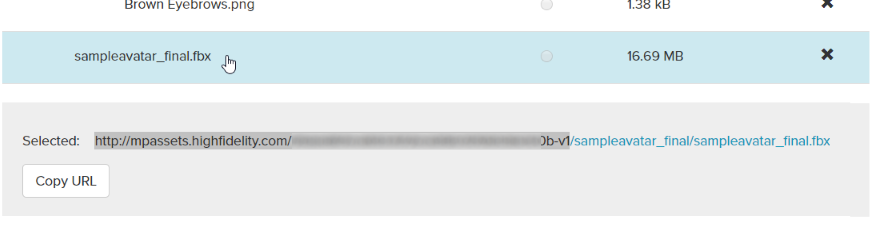
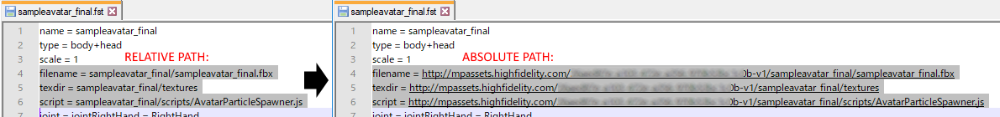
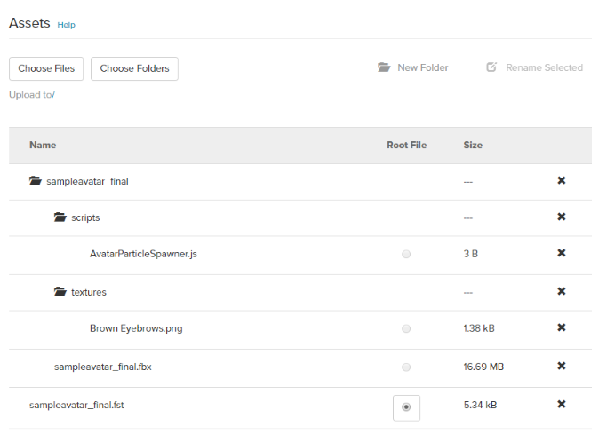

# Add Your Avatar

Once you [create an avatar](../../create/avatars/create-avatars.html), it should contain the following files:
* An FST file
* An FBX file
* Scripts folder (optional)
* Textures folder

You will need to upload all these files to the Marketplace. 

**On This Page**
* [Add Your Avatar's Files](#add-your-avatars-files)
* [Find Your Avatar's URL](#find-your-avatars-url)

## Add Your Avatar's Files

1. Go to [https://highfidelity.com/marketplace/items/new](https://highfidelity.com/marketplace/items/new) to create a new item. If you're not logged in, you will be prompted to do so.
2. Enter your avatar's name and select your category as 'Avatars'. You can add the metadata now or later. 
3. Click 'Save Draft'. 
4. Scroll down to the 'Assets' section. 
5. Click 'Choose Folder' and navigate to where your avatar is saved on your computer. Select the folder that contains your FBX file, click 'Upload' twice and wait for it to upload.
6. Click on the uploaded FBX file, and copy the Marketplace path including the unique hash for your avatar. Do not copy your folder name or the name of the file. 
7. Open your FST file in the text editor of your choice. (Note that the FST file is a local file on your computer)
8. Locate the relative path references to the FBX file, textures directory, and script file(s). Replace these with the absolute path references of the uploaded content. 
    
    

        
Note

        
Absolute paths are entire URLs that generally begin with 'https://' and contain a website address, such as 'https://website.com/resources/scripts/interact.js'. Relative paths drop the beginning of the path and only specify how to get to a resource from the location of the script. Relative paths usually look something like '/resources/scripts/interact.js'.

    

9. Return to your avatar submission on the Marketplace.
10. In the 'Assets' section, click 'Choose Files' and navigate to where your avatar is saved on your computer. Select your updated FST file, click 'Open' and wait for it to upload.
    

        
Note

        
Be sure you do not have any files or folders selected in the asset viewer so that the uploaded file goes to the right place. Any selected files and folders will be highlighted blue.

    

11. Click the FST file as your root file in the Asset Viewer.  
12. Save your submission. 
    

At this time, we recommend that you test your avatar using the [Marketplace Item Tester](../../create/tools.html#marketplace-item-tester). If your avatar re-imports into High Fidelity without any issues, it is now ready to be uploaded to the Marketplace.

## Find Your Avatar's URL

Now you are ready to use your avatar! To locate the URL for your avatar:

1. Go to [https://highfidelity.com/marketplace](https://highfidelity.com/marketplace). If you're not logged in, you will be prompted to do so.
2. Click on your user name, then on 'My Items'.
3. Locate your avatar in Draft mode and click on it. 
4. Click 'Edit'.
5. Scroll down to the Assets section.
6. Click on the FST file. Below it, click the 'Copy URL' button.

This is the URL you will use when you [change your avatar](../../explore/personalize/change-avatar.html) in High Fidelity.

If you wish to sell your avatar on the Marketplace, be sure to fill out your metadata. You can format your item's description using [Markdown](../../sell/markdown-guide.html) syntax. Click "Submit for Review" to be verified and certified on the Marketplace.

**See Also**

+ [Create Your Own Avatar](../../create/avatars/create-avatars.html)
+ [Change Your Avatar](../../explore/personalize/change-avatar.html)
+ [Marketplace Submission Rules](../submission-rules.html)