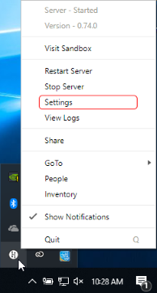
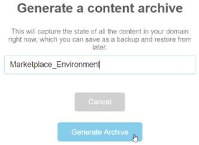

# Upload Your Environment

Before uploading your environment to the Marketplace, make sure that you created the environment in a domain where you have access to the administration panel. Keep in mind that _all_ content in the domain will be included in your upload. Once your domain is set up, you are ready to upload your environment.

1. Open your 'Domain Administration Panel'. If you are on a local sandbox, open it by clicking on the High Fidelity icon in the taskbar notifications and 'click Settings'. 
2. Click on 'Content'.
3. In the Content Archives section, click 'Generate New Archive'.
4. Enter a name for your archive and click 'Generate Archive'. It will appear just below the 'Generate New Archive' button. 
5. Click the 'Actions' button, then select 'Download'. 
6. Go to [https://highfidelity.com/marketplace/items/new](https://highfidelity.com/marketplace/items/new) to create a new item. If you're not logged in, you will be prompted to do so.
7. Enter a name for your environment.
8. Under Categories, select 'Environments'.
9. Click 'Save Draft'. 
10. Scroll down to the 'Assets' section. 
11. Click 'Choose Files' and navigate to where your environment download is saved on your computer. Select the ZIP file, click 'Open' and wait for it to upload.
12. Save your submission.

If you wish to sell your environment on the Marketplace, be sure to fill out your metadata. You can format your item's description using [Markdown](../../sell/markdown-guide.html) syntax. Click "Submit for Review" to be verified and certified on the Marketplace. 

**See Also**

+ [Configure Your Domain Settings](../../host/your-domain/configure-settings.html)
+ [Backup Your Domain](../../host/backup-restore-domain.html#backup-your-domain.html)
+ [Marketplace Submission Rules](../submission-rules.html)