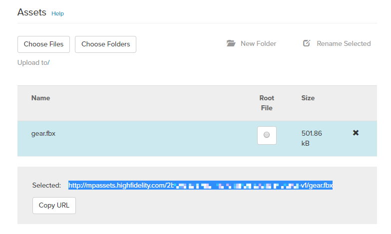
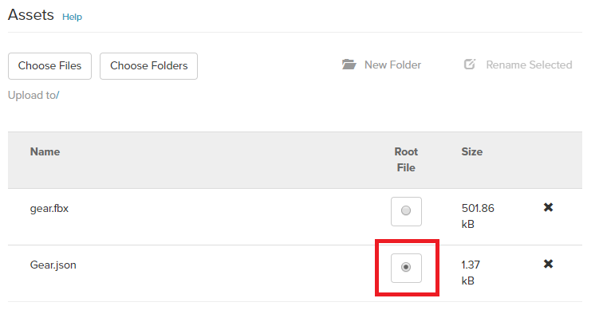

# Add Your 3D Model

Once you've [created your 3D model](../../create/3d-models/get-model.html#create-your-own-3d-model), you need to add the item and its assets in the Marketplace. At a minimum, your model will need the following assets:

* FBX file
* JSON file

You will need to upload these files to the Marketplace, along with any supporting files, such as textures. 

**On This Page**
* [Prepare Your FBX File](#prepare-your-fbx-file)
* [Add Your 3D Model Assets](#add-your-3d-model-assets)
* [Generate Your Item's JSON File](#generate-your-items-json-file)
* [Upload Your Item's JSON File](#upload-your-items-json-file)

### Prepare Your FBX File

1. Export your file as an FBX file from your 3D modeling program. Do not export it as a default file type such as .mb or .blend.
2. If supported by your 3D modeling software, embed your textures into your FBX file to keep the process simpler.
3. As a practice and to catch any errors, re-import your FBX back into a new scene and check that it still looks right. Look for things like missing textures or normals, and smoothing issues. You may need to tweak your export settings if the re-imported model does not look right.

    
Note

    
If you intend to upload and sell your 3D model to the Marketplace, you need to set your base material color to white (some apps default to grey). This ensures that the model renders correctly for all users and that it will be accepted into our Marketplace.

### Add Your 3D Model Assets
If your model could be re-imported without any issues, it is now ready to be uploaded to High Fidelity. 

1. Go to [https://highfidelity.com/marketplace/items/new](https://highfidelity.com/marketplace/items/new) to create a new item. If you're not logged in, you will be prompted to do so. 
2. Enter your model's name and select your category. You can add the metadata now or later. 
3. Click 'Save Draft'. 
4. Scroll down to the 'Assets' section. 
5. If your 3D model contains only an FBX file, click 'Choose Files' and navigate to where your 3D model has been saved on your computer. Upload your FBX file. If your 3D model contains multiple files like scripts or textures, click 'Choose Folder' and navigate to where your 3D model has been saved on your computer. Upload all related folders, including your FBX file. 
6. Click your uploaded FBX file and copy the new Marketplace URL for the FBX file. 

At this time, we recommend that you test your item using the [Marketplace Item Tester](../../create/tools.html#marketplace-item-tester). If your model re-imports into High Fidelity without any issues, it is now ready to be uploaded to the Marketplace.

### Generate Your Item's JSON File

1. In Interface, pull up your tablet or HUD and select **Create**.
2. In the **Create** app, click on the 'Model' icon to import your 3D model. 
3. Enter the URL you copied in step 6. You can only do this in a domain where you have the permission to add an entity.
2. Once your model appears before your avatar, check it and make any adjustments needed. Look for missing textures or normals, smoothing issues, issues with the scale of the model, and rotation problems. Make any changes in your 3D modeling software. Once your model looks as expected in High Fidelity, you are now ready to export your model data into a JSON file. Keep in mind that different types of software render models differently.
3. Back in the **Create** Tools app, find your model in the Entity List. While holding the <kbd class="keyboard">CTRL</kbd>, select any other files that are are associated with your item.
4. Click 'Export Selection' and enter a name for your JSON. This JSON file contains information on how High Fidelity can access your item and its files, and needs to contain a reference to your item's location. 
5. Open your JSON file in a text editor and check if the variable `modelURL` contains your FBX file's Marketplace URL. If it doesn't, you can edit it and paste the correct URL. 

### Upload Your Item's JSON File
1. In High Fidelity, verify that your model looks correct. Open the **Create** Tools app, then click 'Import Entities (.JSON)' and navigate to your model's JSON file. 
2. Go to [https://highfidelity.com/marketplace](https://highfidelity.com/marketplace). If you're not logged in, you will be prompted to do so.
3. Click on your user name, then on 'My Items'.
4. Locate your 3D model in Draft mode and click on it. 
5. Click 'Edit'.
6. In the 'Assets' section, click 'Choose Files' and navigate to where your model's JSON file is saved on your computer. Select your JSON file, click 'Open' and wait for it to upload.
Click the JSON file as your root file in the Asset Viewer. 
8. Save your submission.

If you wish to sell your 3D model on the Marketplace, be sure to fill out your metadata. You can format your item's description using [Markdown](../../sell/markdown-guide.html) syntax. Click "Submit for Review" to be verified and certified on the Marketplace.

**See Also**

+ [Import Your 3D Model](../../create/3d-models/import-model.html)
+ [Introduction to Materials, Textures, and Shading](../../create/3d-models/pbr-materials-guide.html#introduction-to-materials-textures-and-shading)
+ [Marketplace Submission Rules](../submission-rules.html)