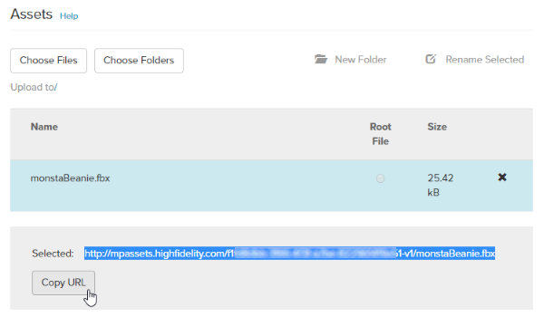
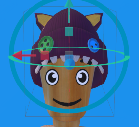

# Add Your Wearable

Once you've [created your wearable](../../create/wearables.html), you need to add the item and its assets in the Marketplace. At a minimum, your wearable will need the following assets:

* FBX file
* JSON file

You will need to upload these files to the Marketplace, along with any supporting files, such as textures. 

**On This Page**
* [Prepare Your FBX File](#prepare-your-fbx-file)
* [Add Your Assets](#add-your-assets)
* [Generate the JSON File for Your Wearable](#generate-the-json-file-for-your-wearable)
* [Upload Your Wearable's JSON File](#upload-your-wearables-json-file)

### Prepare Your FBX File

1. Export your file as an FBX file from your 3D modeling program. Do not export it as a default file type such as .mb or .blend.
2. If supported by your 3D modeling software, embed your textures into your FBX file to keep the process simpler.
3. As a practice and to catch any errors, re-import your FBX back into a new scene and check that it still looks right. Look for things like missing textures or normals, and smoothing issues. You may need to tweak your export settings if the re-imported model does not look right.

### Add Your Assets
If your wearable could be re-imported without any issues, it is now ready to be uploaded to High Fidelity. 

1. Go to [https://highfidelity.com/marketplace/items/new](https://highfidelity.com/marketplace/items/new) to create a new item. If you're not logged in, you will be prompted to do so. 
2. Enter a name for your wearable and set the category to 'Wearable'. You can add the metadata now or later. 
3. Click 'Save Draft'. 
4. Scroll down to the 'Assets' section. 
5. If your wearable contains only an FBX file, click 'Choose Files' and navigate to where your model has been saved on your computer. Upload your FBX file. If your wearable contains multiple files like scripts or textures, click 'Choose Folder' and navigate to where your model has been saved on your computer. Upload all related folders, including your FBX file. 
6. Click your uploaded FBX file and copy the new Marketplace URL for the FBX file. 

### Generate the JSON File for Your Wearable

1. In Interface, pull up your tablet or HUD and click on **Avatar**.
2. In the **Avatar** window, click the hat icon next to 'Wearables'.
3. Click 'Add custom' at the top of the window.
4. Select the joint you'd like to use for your wearable. For example, a hat would be on your head, and fairy wings would be on your spine.
5. Click 'Save'. 
6. Using the [**Create** app](../../create/tools.html#the-create-app), make any adjustments to your wearable. For example, you can give your wearable more depth, height or angle it differently.
    

        
Note

        
If you're creating a wearable to add to the Marketplace, make sure it will fit the default wooden mannequin avatar (unless you are specifically making it to go with a very specific base avatar model). This will ensure that the wearable will work with most avatars in High Fidelity.  

    

    
    
7. Back in the **Create** app, find your model in the 'Entity List' and click on it. 
8. Click 'Export Selection' and enter a name for your JSON. This JSON file contains information on how High Fidelity can access your item and its files, and needs to contain a reference to your item's location. 
9. Open your JSON file in a text editor and check if the variable `modelURL` contains your FBX file's Marketplace URL. If it doesn't, you can edit it and paste the correct URL. 

### Upload Your Wearable's JSON File
1. Go to [https://highfidelity.com/marketplace](https://highfidelity.com/marketplace). If you're not logged in, you will be prompted to do so.
2. Click on your user name, then on 'My Items'.
3. Locate your wearable in Draft mode and click on it. 
4. Click 'Edit'.
5. In the 'Assets' section, click 'Choose Files' and navigate to where your wearable's JSON file is saved on your computer. Select your JSON file, click 'Open' and wait for it to upload.
Click the JSON file as your root file in the Asset Viewer. 
7. Save your submission.

If you wish to sell your wearable on the Marketplace, be sure to fill out your metadata. You can format your item's description using [Markdown](../../sell/markdown-guide.html) syntax. Click "Submit for Review" to be verified and certified on the Marketplace.

**See Also**

+ [Wearables](../../create/wearables.html)
+ [3D Models](../../create/3d-models.html)
+ [Marketplace Submission Rules](../submission-rules.html)