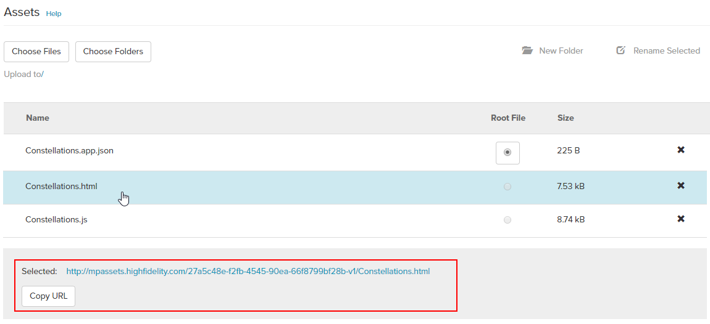
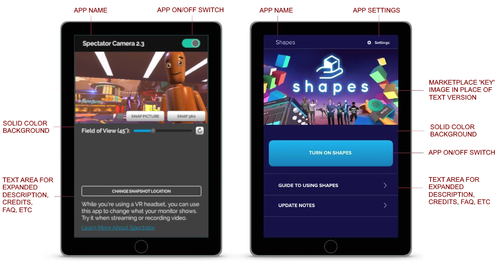

# Certified App Design Guidelines

Before submitting an app, make sure it follows our certified app guidelines below:

* [A certified app requires 5 files: JSON, JavaScript, HTML, and two SVG ](#1-a-certified-app-consists-of-at-least-five-files)
* [A certified app must have a button that appears on the tablet or HUD](#2-a-certified-app-has-a-button-that-appears-on-the-tablet-in-vr)
* [A certified app must display a full screen UI in VR and a window in Desktop](#3-the-app-must-display-a-full-screen-ui-in-vr-and-a-window-in-de)
* [The UI for the certified app should explain how the app works](#4-the-ui-for-the-certified-app-should-explain-how-the-app-works)
* [A certified app must handle quitting gracefully](#5-when-a-user-closes-the-app-ui-you-must-close-the-app-gracefull)

## Guideline Details

##### 1. A certified app consists of at least five files: 
* A JSON file that points to the location of your app, named <code>*.app.json</code> 
* A JavaScript file, <code>*.js</code> which contains the script(s) for your app 
* An HTML page, <code>*.html</code> that defines the UI for your app
* an SVG or PNG image to display on the app button when the app is active, usually named <code>appName-a.svg</code>
* an SVG or PNG image to display on the app button when the app is inactive, usually named <code>appName-i.svg</code>

The app.json file has two required properties: "scriptURL" (whose value must be the URL of the uploaded JavaScript file), and "homeURL" (whose value must be the URL to the uploaded HTML file) using explicit paths created upon upload of the files to the Marketplace. 

Here is an example of the app.json file. You will need to replace the zeros with the path to your Marketplace item:
```
{
    "scriptURL": "http://mpassets.highfidelity.com/000000000000-v1/script.js",
    "homeURL": "http://mpassets.highfidelity.com/000000000000-v1/ui.html"
}
```

To find the URL to your Marketplace bucket, follow these steps:

1. First, upload a draft of your app to the Marketplace.
2. Click on the app.json file on the Edit screen and the URL will be displayed at the bottom of the screen.


##### 2. A certified app has a button that appears on the tablet in VR, or the app bar in desktop mode. 
The button of the app must: 
- display an icon
- display the name of the certified app.

##### 3. The app must display a full screen UI in VR and a window in Desktop.
When the user opens the app with the button on the tablet or HUD, you must display a full screen UI in VR and a standard sized window display on the desktop. Use the AppUI module to automatically add your app's button to the tablet or HUD and wire up handlers. 

Below is an example of how to do this in your JavaScript file:

``` 
(function () { 
// BEGIN LOCAL_SCOPE
var AppUi = Script.require('appUi');

function onOpened() {
    console.log(“hello world!”);
}

var ui;
function startup() {
    ui = new AppUi({
        buttonName: "APP-NAME", // The name of your app
        home: Script.resolvePath("app.html"), // The home screen appears when clicking the app button
        graphicsDirectory: Script.resolvePath("./"), // Where your button icons are located
        onOpened: onOpened // See the simple function above
    });
}
startup();
}()); 
// END LOCAL_SCOPE
```
If you want your app to do something specific when it is opened, you can use the AppUI module’s onOpened functionality. For example, you could:
- Query a server to get a response and determine what to show on the UI
- Start displaying a 3D interface separate from the tablet 
- Determine the display mode (VR/Desktop) and change things to show on the UI

Here's an example of using the `onOpened `functionality:

```
(function () { 
// BEGIN LOCAL_SCOPE
var AppUi = Script.require('appUi');

function onOpened() {
    console.log(“hello world!”);
}

var ui;
function startup() {
    ui = new AppUi({
        buttonName: "APP-NAME", // The name of your app
        home: Script.resolvePath("app.html"), // The home screen that appears when clicking the app button
        graphicsDirectory: Script.resolvePath("./"), // Where your button icons are located
        onOpened: onOpened // See the simple function above
    });
}
startup();
}()); 
// END LOCAL_SCOPE
```

##### 4. The UI for the certified app should explain how the app works. 
You should provide text on how the app works, and use familiar UI elements that a user knows how to interact with (such as buttons, scroll bars, and links).

Here are some examples of a good app UI:



##### 5. When a user closes the app UI, you must close the app gracefully. 

To close the app, you have two options:
1.  Stop the active functionality of the certified app.
    * If the app had 3D interfaces on user’s hand, they go away.
    * If the app was enhancing or modified the client using a script (e.g. Spectator Camera), that functionality will end.
2. Continue running some or all of the functions of the certified app.
    * If the app wants to persist the 3D interfaces on a user’s hand, it can keep them turned on.
    * If the app wants to keep enhancing or modifying the client using a script, it can keep doing that.

If you choose to stop all functionality (option 1), then the certified app needs to provide an affordance for the user to suspend the functionality of the certified app. For example, you will need to:
1. Turn off the 3D user interfaces. This can be achieved either by providing that functionality in the 3D user interface, or surfacing a button in the UI of the certified app that achieves the same function.
2. Stop the script from modifying or enhancing the client. This can be achieved by surfacing a button in the UI of the certified app.

**See Also**

+ [Write Your Own Scripts](../script/write-scripts.html)

  